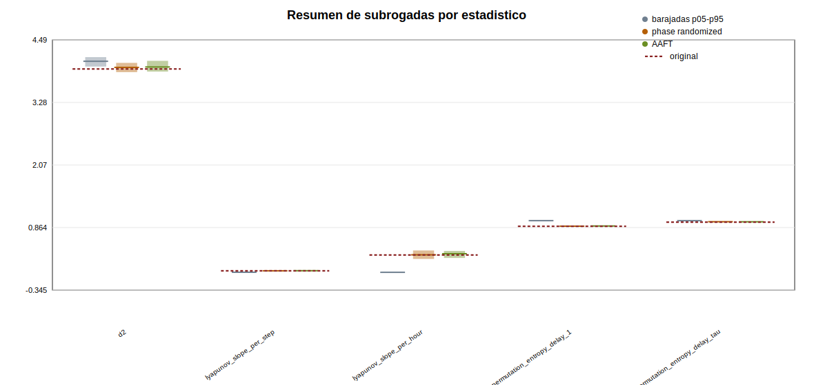
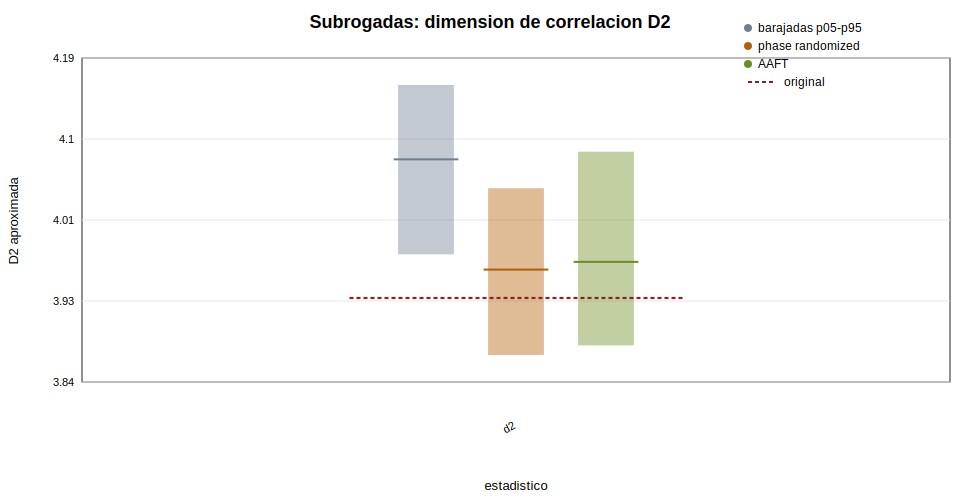
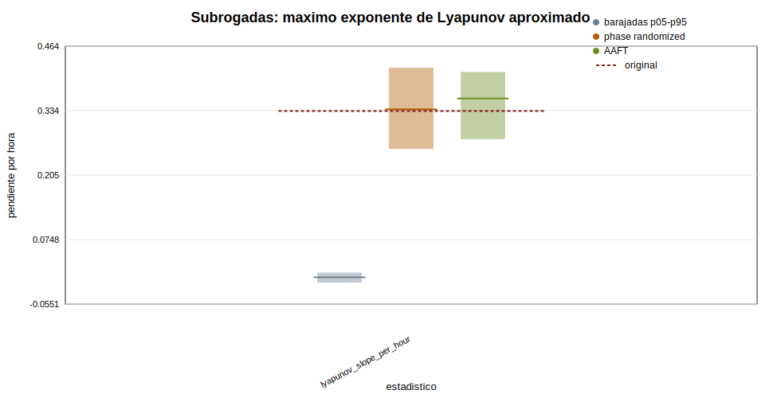
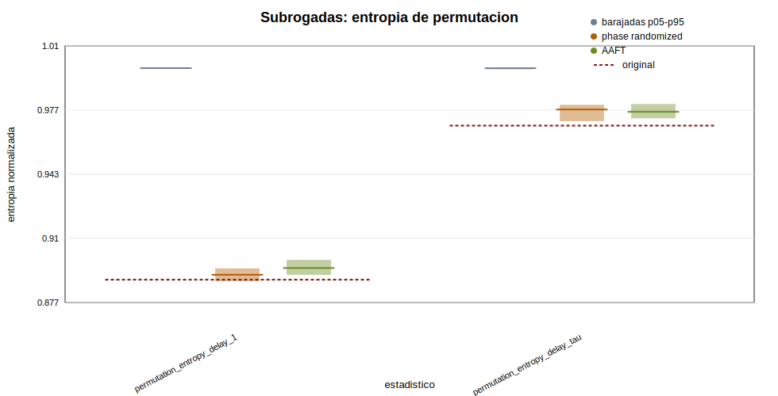
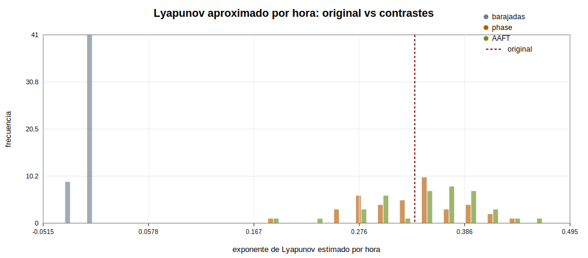
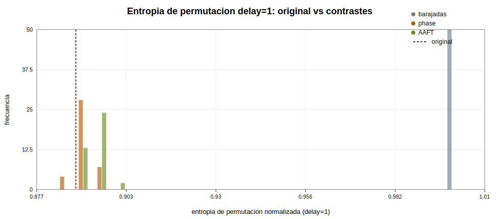
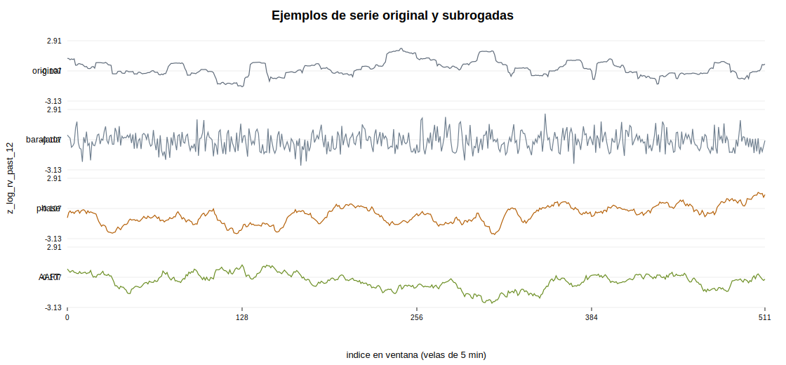

# Fase 10 - Contrastes con barajado y datos subrogados

## Objetivo

Esta fase compara `z_log_rv_past_12` con series artificiales que conservan unas propiedades y destruyen otras. No es una prueba directa de caos; sirve para comprobar si los estadisticos de fase 9 pueden explicarse por la distribucion marginal, la dependencia lineal o una posible estructura no lineal adicional.

Conviene destacar que esta fase se ha aplicado sobre una ventana representativa del tramo de entrenamiento, no sobre toda la muestra completa. Por tanto, los resultados deben interpretarse como evidencia local dentro de dicha ventana. Esta decisión se debe tanto al coste computacional de los contrastes como a la necesidad de mantener comparabilidad con las fases previas de reconstrucción y cuantificación.

## Datos y parametros

| series | window_start_time | window_end_time | window_size | tau | m | theiler_window | n_shuffled | n_phase_randomized | n_aaft | random_seed |
| --- | --- | --- | --- | --- | --- | --- | --- | --- | --- | --- |
| z_log_rv_past_12 | 2024-09-16 18:40:00 | 2024-10-15 05:15:00 | 8192 | 137 | 5 | 685 | 50 | 39 | 39 | 20260602 |

Los estadisticos se calculan sobre una ventana contigua del entrenamiento. Para que la ejecucion sea viable en Python puro, D2 usa una submuestra de 700 vectores y Rosenstein usa 550 puntos de referencia dentro de un bloque continuo.

## Estadisticos usados

- `d2`: dimension de correlacion aproximada por Grassberger-Procaccia.
- `lyapunov_slope_per_step` y `lyapunov_slope_per_hour`: pendiente Rosenstein aproximada.
- `permutation_entropy_delay_1`: entropia ordinal de corto retardo.
- `permutation_entropy_delay_tau`: entropia ordinal con el retardo de fase 8.

## Contraste con series barajadas

La serie barajada conserva exactamente los valores observados, pero destruye el orden temporal. Si la original queda fuera del rango habitual de las barajadas, el estadistico depende del orden temporal.

| group | statistic | original | mean | std | p05 | median | p95 | S | empirical_p_value | n_success | n_failures |
| --- | --- | --- | --- | --- | --- | --- | --- | --- | --- | --- | --- |
| shuffled | d2 | 3.93038 | 4.07127 | 0.05795 | 3.97726 | 4.07927 | 4.1591 | 2.43128 | 0.0196078 | 50 | 0 |
| shuffled | lyapunov_slope_per_step | 0.0278227 | -7.74409e-05 | 0.000515406 | -0.000983238 | -0.000100223 | 0.000704688 | 54.1324 | 0.0196078 | 50 | 0 |
| shuffled | lyapunov_slope_per_hour | 0.333873 | -0.000929291 | 0.00618487 | -0.0117989 | -0.00120268 | 0.00845625 | 54.1324 | 0.0196078 | 50 | 0 |
| shuffled | permutation_entropy_delay_1 | 0.888682 | 0.998567 | 0.000234094 | 0.998261 | 0.998526 | 0.998963 | 469.41 | 0.0196078 | 50 | 0 |
| shuffled | permutation_entropy_delay_tau | 0.968691 | 0.998481 | 0.000262017 | 0.998024 | 0.998489 | 0.998867 | 113.696 | 0.0196078 | 50 | 0 |

La serie original queda fuera del rango de las barajadas en todos los estadisticos principales, con p=0.01961. Esto indica que el orden temporal de la serie contiene informacion relevante para esos estadisticos, pero no implica necesariamente caos determinista.

## Contraste con phase randomization

Las subrogadas phase-randomized conservan aproximadamente el espectro lineal/amplitudes de Fourier, pero aleatorizan fases. Si la original se parece a ellas, parte de la estructura puede explicarse por dependencia lineal; si difiere claramente, hay indicios de estructura adicional.

| group | statistic | original | mean | std | p05 | median | p95 | S | empirical_p_value | n_success | n_failures |
| --- | --- | --- | --- | --- | --- | --- | --- | --- | --- | --- | --- |
| phase_randomized | d2 | 3.93038 | 3.95698 | 0.0571625 | 3.86915 | 3.9609 | 4.04828 | 0.465383 | 0.675 | 39 | 0 |
| phase_randomized | lyapunov_slope_per_step | 0.0278227 | 0.027576 | 0.00452806 | 0.0214378 | 0.0281058 | 0.0350895 | 0.0544965 | 1 | 39 | 0 |
| phase_randomized | lyapunov_slope_per_hour | 0.333873 | 0.330911 | 0.0543367 | 0.257254 | 0.33727 | 0.421074 | 0.0544965 | 1 | 39 | 0 |
| phase_randomized | permutation_entropy_delay_1 | 0.888682 | 0.891316 | 0.00225486 | 0.887914 | 0.891244 | 0.894509 | 1.16857 | 0.2 | 39 | 0 |
| phase_randomized | permutation_entropy_delay_tau | 0.968691 | 0.97642 | 0.00297206 | 0.971016 | 0.977073 | 0.979509 | 2.60052 | 0.05 | 39 | 0 |

D2 y Rosenstein no diferencian realmente la original de las phase-randomized. Eso significa que buena parte de lo que parecia estructura dinamica puede estar explicada por la estructura lineal/espectral de la serie.

## Contraste con AAFT

AAFT intenta conservar aproximadamente la distribucion marginal y la estructura lineal. Es mas exigente que el barajado simple. En esta fase se ejecuta como aproximacion AAFT de una iteracion, no como IAAFT.

| group | statistic | original | mean | std | p05 | median | p95 | S | empirical_p_value | n_success | n_failures |
| --- | --- | --- | --- | --- | --- | --- | --- | --- | --- | --- | --- |
| aaft | d2 | 3.93038 | 3.97353 | 0.0668138 | 3.87944 | 3.96916 | 4.08749 | 0.645856 | 0.525 | 39 | 0 |
| aaft | lyapunov_slope_per_step | 0.0278227 | 0.0291172 | 0.00448133 | 0.0231107 | 0.0299186 | 0.0343719 | 0.288872 | 0.75 | 39 | 0 |
| aaft | lyapunov_slope_per_hour | 0.333873 | 0.349407 | 0.0537759 | 0.277328 | 0.359023 | 0.412463 | 0.288872 | 0.75 | 39 | 0 |
| aaft | permutation_entropy_delay_1 | 0.888682 | 0.894928 | 0.00248591 | 0.891187 | 0.894752 | 0.899014 | 2.51273 | 0.025 | 39 | 0 |
| aaft | permutation_entropy_delay_tau | 0.968691 | 0.976124 | 0.00281866 | 0.972469 | 0.97585 | 0.979915 | 2.6371 | 0.05 | 39 | 0 |

La señal mas interesante esta en la entropia ordinal, sobre todo delay=1. Pero D2 y Rosenstein siguen sin separarse de manera fuerte.

Conclusion: hay estructura temporal no trivial, pero no evidencia fuerte de dinamica determinista no lineal de baja dimension.

## Figuras

La figura compacta anterior resume todos los estadisticos, pero mezcla escalas distintas. Para interpretar las cajas sin compresion visual, se anaden las versiones separadas por familia de metrica.

La original queda muy lejos de las barajadas, pero cerca de phase-randomized/AAFT. Esta figura apoya perfectamente la lectura prudente.

Aqui se aprecia mejor que la entropia de permutacion diferencia mas la original, especialmente frente a AAFT.

## Resumen comparativo

| group | statistic | original | mean | std | p05 | median | p95 | S | empirical_p_value | n_success | n_failures |
| --- | --- | --- | --- | --- | --- | --- | --- | --- | --- | --- | --- |
| shuffled | d2 | 3.93038 | 4.07127 | 0.05795 | 3.97726 | 4.07927 | 4.1591 | 2.43128 | 0.0196078 | 50 | 0 |
| shuffled | lyapunov_slope_per_step | 0.0278227 | -7.74409e-05 | 0.000515406 | -0.000983238 | -0.000100223 | 0.000704688 | 54.1324 | 0.0196078 | 50 | 0 |
| shuffled | lyapunov_slope_per_hour | 0.333873 | -0.000929291 | 0.00618487 | -0.0117989 | -0.00120268 | 0.00845625 | 54.1324 | 0.0196078 | 50 | 0 |
| shuffled | permutation_entropy_delay_1 | 0.888682 | 0.998567 | 0.000234094 | 0.998261 | 0.998526 | 0.998963 | 469.41 | 0.0196078 | 50 | 0 |
| shuffled | permutation_entropy_delay_tau | 0.968691 | 0.998481 | 0.000262017 | 0.998024 | 0.998489 | 0.998867 | 113.696 | 0.0196078 | 50 | 0 |
| phase_randomized | d2 | 3.93038 | 3.95698 | 0.0571625 | 3.86915 | 3.9609 | 4.04828 | 0.465383 | 0.675 | 39 | 0 |
| phase_randomized | lyapunov_slope_per_step | 0.0278227 | 0.027576 | 0.00452806 | 0.0214378 | 0.0281058 | 0.0350895 | 0.0544965 | 1 | 39 | 0 |
| phase_randomized | lyapunov_slope_per_hour | 0.333873 | 0.330911 | 0.0543367 | 0.257254 | 0.33727 | 0.421074 | 0.0544965 | 1 | 39 | 0 |
| phase_randomized | permutation_entropy_delay_1 | 0.888682 | 0.891316 | 0.00225486 | 0.887914 | 0.891244 | 0.894509 | 1.16857 | 0.2 | 39 | 0 |
| phase_randomized | permutation_entropy_delay_tau | 0.968691 | 0.97642 | 0.00297206 | 0.971016 | 0.977073 | 0.979509 | 2.60052 | 0.05 | 39 | 0 |
| aaft | d2 | 3.93038 | 3.97353 | 0.0668138 | 3.87944 | 3.96916 | 4.08749 | 0.645856 | 0.525 | 39 | 0 |
| aaft | lyapunov_slope_per_step | 0.0278227 | 0.0291172 | 0.00448133 | 0.0231107 | 0.0299186 | 0.0343719 | 0.288872 | 0.75 | 39 | 0 |
| aaft | lyapunov_slope_per_hour | 0.333873 | 0.349407 | 0.0537759 | 0.277328 | 0.359023 | 0.412463 | 0.288872 | 0.75 | 39 | 0 |
| aaft | permutation_entropy_delay_1 | 0.888682 | 0.894928 | 0.00248591 | 0.891187 | 0.894752 | 0.899014 | 2.51273 | 0.025 | 39 | 0 |
| aaft | permutation_entropy_delay_tau | 0.968691 | 0.976124 | 0.00281866 | 0.972469 | 0.97585 | 0.979915 | 2.6371 | 0.05 | 39 | 0 |

## Respuesta a los criterios finales

1. Frente a una permutacion aleatoria, si: la original queda fuera del rango tipico de barajadas en todos los estadisticos principales (por ejemplo PE delay=1 con p=0.01961).
2. Frente a subrogadas que preservan estructura lineal, la respuesta es mixta: D2 y Rosenstein no se separan de forma clara de phase-randomized/AAFT (Lyapunov/h phase p=1), mientras que la entropia ordinal si muestra separacion frente a AAFT (PE delay=1 p=0.025).
3. Los resultados de fase 9 siguen siendo relevantes como evidencia de estructura temporal, pero los subrogados sugieren que parte de esa estructura puede explicarse por dependencia lineal/espectral.
4. Si tiene sentido pasar a prediccion local: los contrastes apoyan que hay estructura temporal explotable, pero la mejora predictiva debe validarse empiricamente contra baselines.

## Limitaciones

- D2 y Rosenstein son aproximados y usan submuestras internas.
- Phase randomization y AAFT son implementaciones de libreria estandar.
- AAFT conserva la distribucion marginal de forma aproximada, pero no es IAAFT.
- La no estacionariedad financiera puede afectar todos los contrastes.
- Ningun resultado permite afirmar caos determinista.

## Conclusion

La serie original se diferencia claramente de las barajadas cuando se miran entropia ordinal de corto plazo (S=469) y Rosenstein por hora (S=54.1). Frente a phase-randomized, los contrastes son mas exigentes: PE delay=1 tiene S=1.17 y Lyapunov/h S=0.0545. Frente a AAFT, PE delay=1 tiene S=2.51 y Lyapunov/h S=0.289. La lectura prudente es que los estadisticos de fase 9 no se explican solo por una permutacion aleatoria. Sin embargo, D2 y Rosenstein se parecen mucho a phase-randomized y AAFT, por lo que esos indicadores no aportan evidencia fuerte de no linealidad adicional. La senal mas diferenciada frente a subrogadas exigentes aparece en la entropia ordinal, especialmente frente a AAFT. Tiene sentido pasar a la fase de prediccion local, pero sin convertir estos contrastes en una afirmacion de caos.

La comparación con datos barajados confirma que la estructura temporal de la serie es relevante. Sin embargo, la comparación con subrogados phase-randomized y AAFT muestra que una parte importante de los estadísticos observados puede reproducirse preservando propiedades lineales y distribucionales de la serie. Por tanto, los resultados no constituyen una prueba de caos determinista, sino una evidencia prudente de estructura temporal no trivial compatible con la continuación hacia predicción local en el espacio reconstruido.
