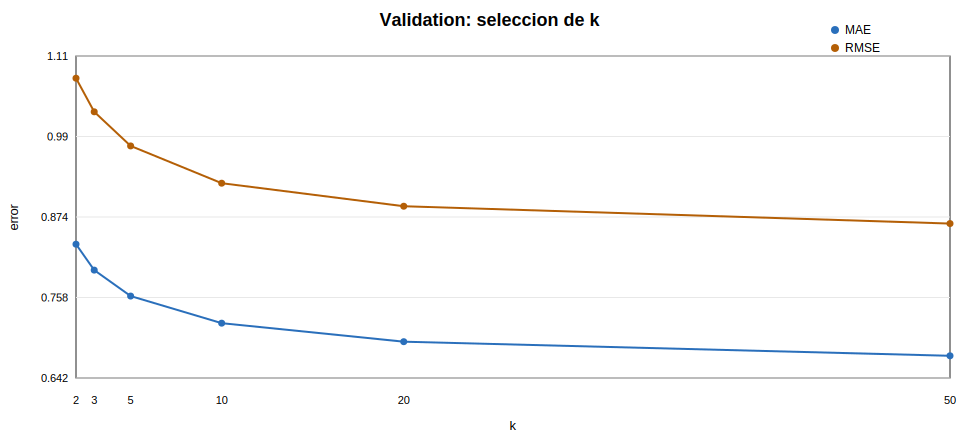
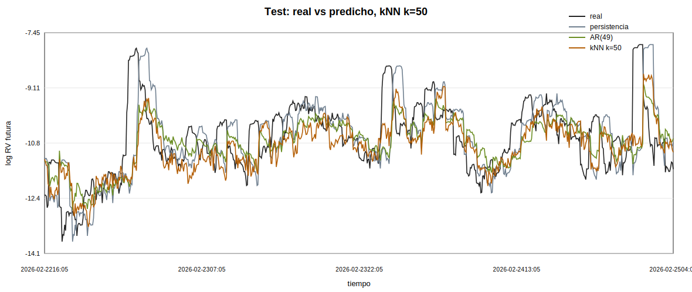
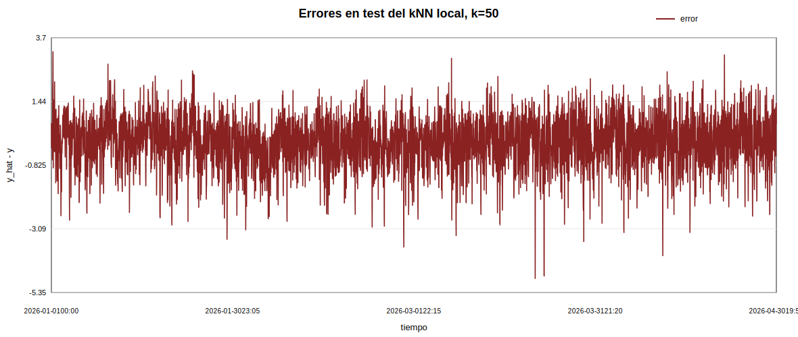
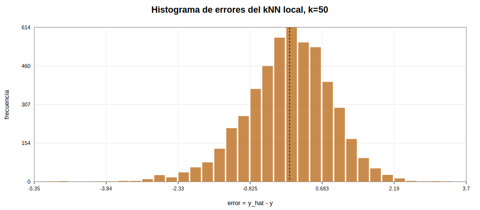
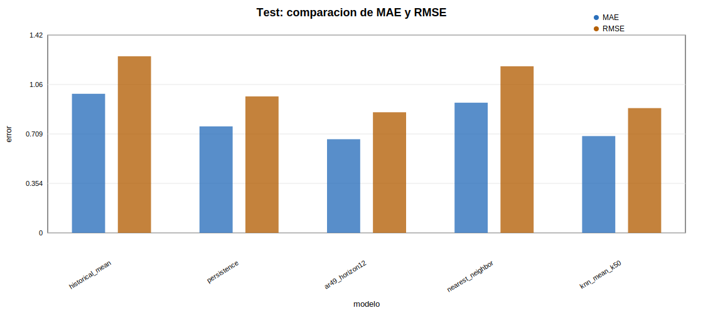

# Fase 11 - Prediccion local en el espacio de estados

## Objetivo

Esta fase evalua si la reconstruccion del espacio de estados de `log_rv_past_12` aporta capacidad predictiva sobre `log_rv_future_12`. La prueba es predictiva y empirica: no se interpreta como demostracion de caos.

## Datos y alineacion temporal

Se usa `X_t=[z_t,z_(t-tau),...,z_(t-(m-1)tau)]` con tau=137 y m=5. La estandarizacion de `log_rv_past_12` usa solo media y desviacion tipica del train. El target se mantiene en escala logaritmica original: `y_t=log_rv_future_12`.

La comprobacion de alineacion confirma que `log_rv_future_12(t)` coincide numericamente con `log_rv_past_12(t+12)` salvo diferencias de redondeo: max_abs_diff=0.

Para evitar leakage, validation busca vecinos solo en train. Test busca vecinos solo en train+validation. Ademas, cada candidato debe cumplir `candidate_index + 12 <= query_index` y se excluye si cae dentro de la ventana de Theiler (685 retardos).

## Split temporal

| split | row_start_time | row_end_time | row_n | embedding_start_time | embedding_end_time | embedding_n | evaluation_n |
| --- | --- | --- | --- | --- | --- | --- | --- |
| train | 2024-01-02 00:00:00 | 2025-06-30 23:55:00 | 157248 | 2024-01-03 21:40:00 | 2025-06-30 23:55:00 | 156700 | 0 |
| validation | 2025-07-01 00:00:00 | 2025-12-31 23:55:00 | 52992 | 2025-07-01 00:00:00 | 2025-12-31 23:55:00 | 52992 | 5000 |
| test | 2026-01-01 00:00:00 | 2026-04-30 19:55:00 | 34512 | 2026-01-01 00:00:00 | 2026-04-30 19:55:00 | 34512 | 5000 |

No se usa shuffle. Por coste computacional en Python puro, validation y test se evaluan sobre una submuestra temporal equiespaciada de hasta 5000 estados por split; las librerias de vecinos usan todos los candidatos historicos permitidos.

## Modelos comparados

- Media historica de train conocida al comienzo de validation.
- Persistencia: `y_hat_t = log_rv_past_12(t)`.
- AR(49) de fase 6, usado como referencia lineal auxiliar con forecast recursivo a 12 velas.
- Vecino mas proximo en el espacio reconstruido.
- Media de k vecinos, con k elegido en validation entre [2, 3, 5, 10, 20, 50].

## Seleccion de k

| k | n | mae | mse | rmse | r2_oos | bias_yhat_minus_y | error_std |
| --- | --- | --- | --- | --- | --- | --- | --- |
| 2 | 5000 | 0.834563 | 1.15326 | 1.0739 | 0.312028 | 0.119851 | 1.0673 |
| 3 | 5000 | 0.797181 | 1.05157 | 1.02546 | 0.372691 | 0.117119 | 1.01885 |
| 5 | 5000 | 0.75977 | 0.95303 | 0.976233 | 0.431475 | 0.112612 | 0.969813 |
| 10 | 5000 | 0.720698 | 0.85102 | 0.922507 | 0.492328 | 0.10974 | 0.916049 |
| 20 | 5000 | 0.693986 | 0.790879 | 0.889314 | 0.528205 | 0.10724 | 0.882912 |
| 50 | 5000 | 0.673657 | 0.747016 | 0.864301 | 0.554371 | 0.11411 | 0.856821 |

Se selecciona k=50 porque minimiza RMSE en validation. Test no se usa para elegir k.

## Resultados en test

| model | split | n | mae | mse | rmse | r2_oos | bias_yhat_minus_y | error_std |
| --- | --- | --- | --- | --- | --- | --- | --- | --- |
| historical_mean | test | 5000 | 0.996397 | 1.60095 | 1.26529 | 0 | 0.062613 | 1.26386 |
| persistence | test | 5000 | 0.762862 | 0.955505 | 0.9775 | 0.403164 | -0.00431078 | 0.977588 |
| ar49_horizon12 | test | 5000 | 0.67099 | 0.746611 | 0.864067 | 0.533645 | 0.00876445 | 0.864108 |
| nearest_neighbor | test | 5000 | 0.932532 | 1.42464 | 1.19358 | 0.11013 | -0.0147277 | 1.19361 |
| knn_mean_k50 | test | 5000 | 0.69344 | 0.799016 | 0.893877 | 0.500912 | -0.0160267 | 0.893823 |

El mejor modelo por RMSE en test es `ar49_horizon12`. El predictor local con k=50 mejora a persistencia en RMSE por 0.08362. La mejora debe leerse como evidencia empirica de informacion predictiva local, no como prueba de caos.

## Interpretacion

La lectura central debe hacerse frente a persistencia, no solo frente a la media historica. Si el modelo local queda cerca de persistencia, eso sugiere que la reconstruccion captura parte de la estructura persistente de la volatilidad, pero no necesariamente una dinamica no lineal explotable. Si la supera, la mejora debe cuantificarse y mantenerse prudente por el solapamiento de las ventanas de volatilidad.

## Limitaciones

- `rv_past_12` y `rv_future_12` son ventanas solapadas desplazadas; esto favorece referencias persistentes.
- Los resultados dependen de tau, m, k y del criterio de Theiler.
- El mercado puede cambiar de regimen entre train, validation y test.
- La busqueda de vecinos exacta se hace con KD-tree, pero la evaluacion usa submuestra temporal por coste.
- Todas las metricas estan en escala logaritmica de volatilidad realizada.

## Conclusion de la fase

En esta fase, el kNN local seleccionado es k=50. El mejor modelo en test por RMSE es `ar49_horizon12`. Estos resultados sirven para valorar si la reconstruccion de estados aporta capacidad predictiva frente a referencias simples; no permiten afirmar caos determinista.

