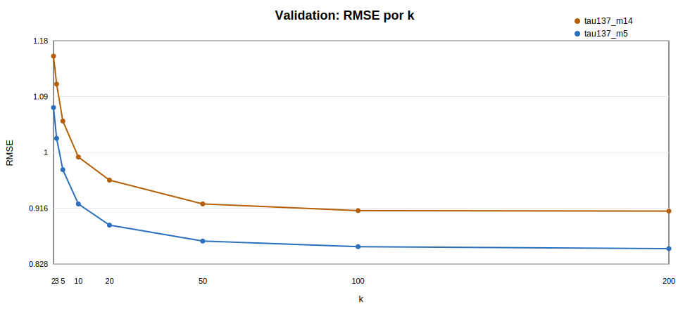
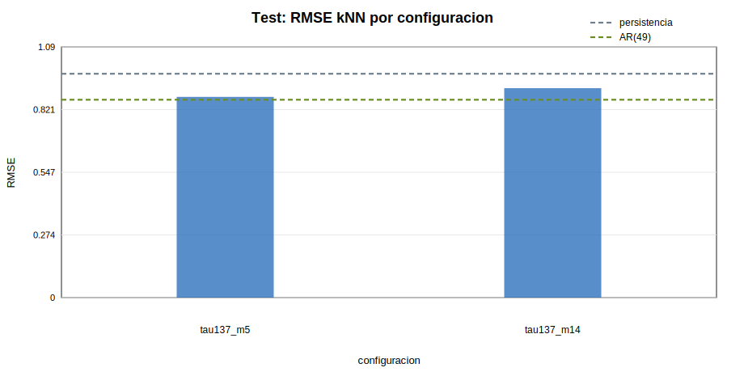
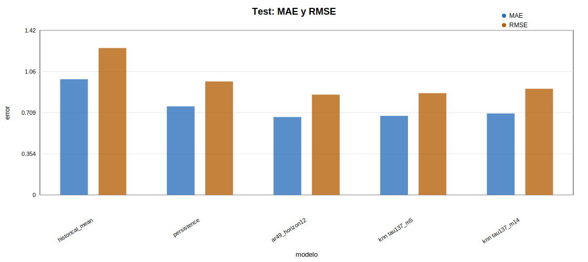

# Fase 12 - Sensibilidad de prediccion local

## Objetivo

Esta fase no introduce modelos nuevos. Extiende la validacion de la Fase 11 porque k=50 estaba en el borde superior de la rejilla y porque se quiso incorporar un contraste deliberado de alta dimension con m=14. Esta configuracion no corresponde a la seleccion corregida de Cao, situada en m=7. Se comprueba si ampliar k o aumentar de forma acusada la dimension cambia la conclusion predictiva.

## Configuraciones evaluadas

| config_name | tau | m | theiler_window | effective_history_bars | effective_history_hours | validation_eval_n | test_eval_n | eval_sample_note |
| --- | --- | --- | --- | --- | --- | --- | --- | --- |
| tau137_m5 | 137 | 5 | 685 | 548 | 45.6667 | 5000 | 5000 | 5000 puntos equiespaciados |
| tau137_m14 | 137 | 14 | 1918 | 1781 | 148.417 | 1000 | 1000 | reducido por coste computacional de embedding alto |

Para m=5 la memoria efectiva es 548 velas, unas 45.7 horas. Para m=14 sube a 1781 velas, unas 148.4 horas o 6.2 dias. Por tanto m=14 aumenta mucho la dimensionalidad y la memoria temporal, con posible coste por menor densidad local.

`tau137_m14` se evalua con 1000 puntos equiespaciados en validation y test porque la busqueda exacta con KD-tree en 14 dimensiones no fue viable en tiempo razonable con 5000 ni 3000 puntos en este entorno sin NumPy/SciPy/sklearn. `tau137_m5` mantiene 5000 puntos, como en la Fase 11.

## Reglas anti-leakage

Validation busca vecinos solo en train. Test busca vecinos solo en train+validation. Cada candidato debe cumplir `candidate_index + 12 <= query_index` y `abs(query_index - candidate_index) > theiler_window`. Test no se usa ni para seleccionar k ni como libreria de vecinos.

La comprobacion de alineacion mantiene `log_rv_future_12(t) == log_rv_past_12(t+12)` con max_abs_diff=0.

## Seleccion de k

| config_name | tau | m | theiler_window | k | n | mae | mse | rmse | r2_oos | bias_yhat_minus_y | error_std |
| --- | --- | --- | --- | --- | --- | --- | --- | --- | --- | --- | --- |
| tau137_m5 | 137 | 5 | 685 | 2 | 5000 | 0.834563114548 | 1.15326066381 | 1.0738997457 | 0.31335902464 | 0.119850988386 | 1.06729762918 |
| tau137_m5 | 137 | 5 | 685 | 3 | 5000 | 0.797181143754 | 1.05157070969 | 1.02546121803 | 0.373904304188 | 0.117118572317 | 1.01885306204 |
| tau137_m5 | 137 | 5 | 685 | 5 | 5000 | 0.7597698088 | 0.953030078779 | 0.97623259461 | 0.432574505164 | 0.112611783789 | 0.969812751146 |
| tau137_m5 | 137 | 5 | 685 | 10 | 5000 | 0.720698027602 | 0.851019964847 | 0.922507433491 | 0.493310404969 | 0.109739579471 | 0.916048589622 |
| tau137_m5 | 137 | 5 | 685 | 20 | 5000 | 0.693985657311 | 0.790878887908 | 0.889313717373 | 0.529117858587 | 0.107239923814 | 0.882912449526 |
| tau137_m5 | 137 | 5 | 685 | 50 | 5000 | 0.673657485496 | 0.747016478739 | 0.86430115049 | 0.555233140551 | 0.11410975917 | 0.856821025685 |
| tau137_m5 | 137 | 5 | 685 | 100 | 5000 | 0.666801036539 | 0.731836688172 | 0.855474539756 | 0.56427105065 | 0.118209342764 | 0.847352843167 |
| tau137_m5 | 137 | 5 | 685 | 200 | 5000 | 0.664480051246 | 0.726567698857 | 0.852389405646 | 0.567408159264 | 0.123832676939 | 0.843430757127 |
| tau137_m14 | 137 | 14 | 1918 | 2 | 1000 | 0.890247431846 | 1.33294752906 | 1.15453346814 | 0.242040877073 | 0.16711417847 | 1.1429465023 |
| tau137_m14 | 137 | 14 | 1918 | 3 | 1000 | 0.863797498711 | 1.23360719101 | 1.11067870737 | 0.298529158763 | 0.15615101308 | 1.10019747619 |
| tau137_m14 | 137 | 14 | 1918 | 5 | 1000 | 0.819953397183 | 1.10810218617 | 1.05266432739 | 0.369895556404 | 0.147274926471 | 1.0428325762 |
| tau137_m14 | 137 | 14 | 1918 | 10 | 1000 | 0.783938837416 | 0.99241519271 | 0.996200377791 | 0.435679100155 | 0.163086009215 | 0.983252221579 |
| tau137_m14 | 137 | 14 | 1918 | 20 | 1000 | 0.757964289772 | 0.921430944293 | 0.959911946114 | 0.476043148626 | 0.16721451887 | 0.945708524645 |
| tau137_m14 | 137 | 14 | 1918 | 50 | 1000 | 0.726694898403 | 0.851178009916 | 0.922593090108 | 0.515991347158 | 0.169112314957 | 0.907415250744 |
| tau137_m14 | 137 | 14 | 1918 | 100 | 1000 | 0.717804202236 | 0.831858412967 | 0.912062724251 | 0.526977124496 | 0.176398627917 | 0.895289607064 |
| tau137_m14 | 137 | 14 | 1918 | 200 | 1000 | 0.715295817218 | 0.830519208944 | 0.911328266292 | 0.527738641274 | 0.18224042834 | 0.893367640427 |

Aunque el mejor valor seleccionado vuelve a estar en el extremo superior de la rejilla ampliada, la reducción de RMSE entre k=100 y k=200 es ya pequeña. Esto sugiere que la mejora del predictor local empieza a estabilizarse y que el método funciona más como un promedio suavizado de estados similares que como una predicción basada en vecinos extremadamente próximos. Por tanto, el resultado no debe interpretarse como evidencia de una dinámica determinista fina, sino como indicio de que el espacio reconstruido agrupa estados con comportamiento futuro parcialmente parecido.

## Resultados en test

| config_name | model | split | tau | m | theiler_window | selected_k | n | mae | mse | rmse | r2_oos | bias_yhat_minus_y | error_std |
| --- | --- | --- | --- | --- | --- | --- | --- | --- | --- | --- | --- | --- | --- |
| tau137_m5 | historical_mean | test | 137 | 5 | 685 | 200 | 5000 | 0.996536415516 | 1.60136622883 | 1.26545099819 | 0 | 0.0658455397862 | 1.26386315072 |
| tau137_m5 | persistence | test | 137 | 5 | 685 | 200 | 5000 | 0.76286238025 | 0.955505422136 | 0.97749957654 | 0.403318613236 | -0.00431077663043 | 0.977587834896 |
| tau137_m5 | ar49_horizon12 | test | 137 | 5 | 685 | 200 | 5000 | 0.670989592158 | 0.746610956266 | 0.864066523056 | 0.533766266065 | 0.00876444999156 | 0.864108487042 |
| tau137_m5 | nearest_neighbor | test | 137 | 5 | 685 | 200 | 5000 | 0.932531725633 | 1.42463760651 | 1.19358183905 | 0.110361152335 | -0.0147277452501 | 1.19361033891 |
| tau137_m5 | knn_mean_k200 | test | 137 | 5 | 685 | 200 | 5000 | 0.681143476346 | 0.768309044749 | 0.876532398003 | 0.520216530787 | -0.0181533192938 | 0.876432044356 |
| tau137_m14 | historical_mean | test | 137 | 14 | 1918 | 200 | 1000 | 0.998605417299 | 1.59117933851 | 1.26141957275 | 0 | 0.0263571751552 | 1.26177522346 |
| tau137_m14 | persistence | test | 137 | 14 | 1918 | 200 | 1000 | 0.778243535871 | 0.994668366947 | 0.997330620681 | 0.374886071686 | -0.0484859009219 | 0.996649785609 |
| tau137_m14 | ar49_horizon12 | test | 137 | 14 | 1918 | 200 | 1000 | 0.674876770108 | 0.760887056504 | 0.872288402138 | 0.521809366117 | -0.0351458345296 | 0.87201619197 |
| tau137_m14 | nearest_neighbor | test | 137 | 14 | 1918 | 200 | 1000 | 0.977074309396 | 1.58224190528 | 1.25787197492 | 0.00561686103384 | -0.0443906740174 | 1.25771746691 |
| tau137_m14 | knn_mean_k200 | test | 137 | 14 | 1918 | 200 | 1000 | 0.701771179418 | 0.836335645759 | 0.914513884946 | 0.474392593268 | -0.0804970371687 | 0.911420078408 |

## Comparacion de configuraciones

| config_name | tau | m | theiler_window | selected_k | validation_rmse_selected_k | test_rmse_knn | test_rmse_persistence | test_rmse_ar49 | delta_rmse_knn_vs_persistence | delta_rmse_knn_vs_ar49 | relative_improvement_vs_persistence_percent | relative_difference_vs_ar49_percent |
| --- | --- | --- | --- | --- | --- | --- | --- | --- | --- | --- | --- | --- |
| tau137_m5 | 137 | 5 | 685 | 200 | 0.852389405646 | 0.876532398003 | 0.97749957654 | 0.864066523056 | -0.100967178537 | 0.0124658749469 | 10.3291275986 | 1.44269852081 |
| tau137_m14 | 137 | 14 | 1918 | 200 | 0.911328266292 | 0.914513884946 | 0.997330620681 | 0.872288402138 | -0.0828167357348 | 0.0422254828083 | 8.30383967137 | 4.84077086258 |

## Interpretacion

`tau137_m5` selecciona k=200; mejora a persistencia y no supera a AR(49). `tau137_m14` selecciona k=200; mejora a persistencia y no supera a AR(49). m=14 no mejora el RMSE del kNN frente a m=5. Esto refuerza la eleccion practica de m=5 para prediccion local simple. La comparacion directa entre m=5 y m=14 debe considerarse indicativa, no definitiva, porque m=14 tuvo que evaluarse sobre 1000 puntos por coste computacional, mientras que m=5 conserva 5000. Ninguna configuracion kNN supera al AR(49), de modo que la conclusion de Fase 11 se mantiene prudente: hay mejora frente a persistencia, pero no frente a la referencia lineal principal.

La comparación con m=14 debe interpretarse con cautela porque esta configuración se ha evaluado sobre 1000 puntos equiespaciados, frente a los 5000 usados para m=5. Aun así, el resultado no apunta a una mejora clara al aumentar la dimensión. Dado que m=14 incrementa la ventana efectiva hasta unos 6.2 días y reduce la densidad local de vecinos, su peor comportamiento es compatible con el problema de dimensionalidad en métodos locales.

## Limitaciones

- La evaluacion usa submuestras equiespaciadas por coste computacional: 5000 puntos para m=5 y 1000 para m=14.
- k se selecciona solo en validation y la prueba test se evalua una vez por configuracion.
- m=14 aumenta la dimensionalidad y puede sufrir curse of dimensionality.
- La conclusion depende del split temporal y del regimen de mercado observado.
- La mejora predictiva no implica caos ni rendimiento operativo de trading.

## Conclusion

En resumen, ampliar la rejilla de k confirma que k=50 no cerraba completamente la selección del predictor local. El mejor resultado aparece con k=200, aunque la mejora adicional respecto a k=100 es reducida, lo que sugiere una estabilización del rendimiento. La configuración m=14, utilizada como prueba de sensibilidad de alta dimensión, no mejora a la configuración principal m=5 y además implica mayor dimensionalidad, mayor memoria efectiva y menor densidad local. En test, el kNN local con m=5 mejora claramente a persistencia, pero sigue quedando ligeramente por detrás del AR(49). Por tanto, la conclusión de la Fase 11 se mantiene: la reconstrucción del espacio de estados aporta información predictiva frente a referencias simples, pero no demuestra superioridad no lineal frente al modelo autorregresivo lineal ni constituye evidencia de caos determinista.
