# Fase 13 - Validacion metodologica con mapa logistico

## Objetivo

Esta fase valida el pipeline en un sistema sintetico donde se conoce que la dinamica es determinista, no lineal y caotica. No se mezcla con BTC y no busca mejorar el modelo financiero.

## Sistema sintetico

Se genera el mapa logistico `x[t+1] = r x[t] (1 - x[t])` con r=4.0, x0=0.123456789, n_total=12000, burn_in=1000 y seed=20260603. Tras descartar el transitorio quedan 11000 observaciones.

| series_name | noise_level | noise_sigma | clipped_count |
| --- | --- | --- | --- |
| logistic_clean | none | 0 | 0 |
| logistic_noise_small | small | 0.00355378 | 371 |
| logistic_noise_moderate | moderate | 0.0177689 | 829 |

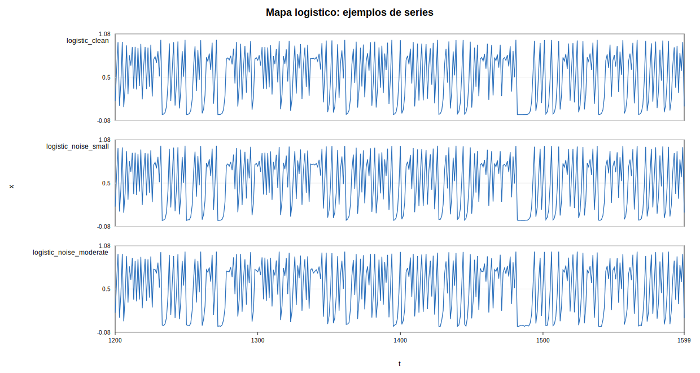

La figura muestra tres realizaciones observadas del mapa logistico: la serie limpia, la serie con ruido pequeno y la serie con ruido moderado. En los tres casos se aprecia una dinamica irregular y acotada en el intervalo [0,1], caracteristica del mapa logistico en regimen caotico. Visualmente, el ruido no cambia la escala global de la serie, pero introduce perturbaciones locales sobre la trayectoria observada. Por tanto, esta figura sirve como punto de partida: las tres series proceden de la misma dinamica determinista subyacente, pero presentan distintos niveles de degradacion observacional.

Las series con ruido se generan anadiendo ruido observacional y recortando los valores al intervalo [0,1]. Ese recorte introduce una pequena alteracion adicional de la distribucion, especialmente cerca de los bordes. Por ello, los resultados con ruido deben entenderse como un experimento practico de degradacion de la observacion, no como una caracterizacion exhaustiva del mapa logistico con ruido.

## AMI y seleccion de tau

| series_name | tau_selected | m_fnn | m_cao | m_selected | tau_selection_note | selection_note |
| --- | --- | --- | --- | --- | --- | --- |
| logistic_clean | 9 | 5 | 10 | 5 | primer minimo local de AMI | FNN y Cao discrepan; se usa FNN=5 de forma operativa |
| logistic_noise_small | 9 | 6 | 10 | 6 | primer minimo local de AMI | FNN y Cao discrepan; se usa FNN=6 de forma operativa |
| logistic_noise_moderate | 5 | 5 | 10 | 5 | primer minimo local de AMI | FNN y Cao discrepan; se usa FNN=5 de forma operativa |

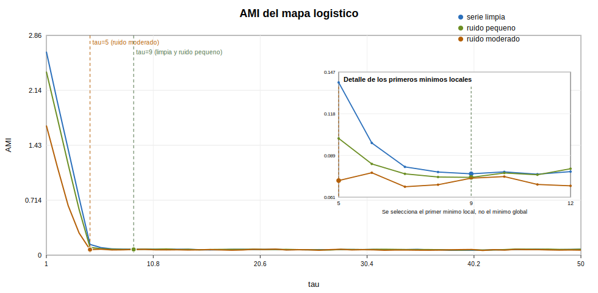

La informacion mutua media cae bruscamente en los primeros retardos, lo que indica que observaciones muy cercanas contienen informacion redundante. En la serie limpia y en la serie con ruido pequeno aparece un primer minimo local en tau=9, mientras que en la serie con ruido moderado el minimo se adelanta a tau=5. Esto sugiere que el ruido modifica la escala temporal a la que las coordenadas retardadas dejan de aportar informacion repetida. En consecuencia, el retardo se selecciona de forma operativa mediante el primer minimo local de AMI, no como un valor universal del sistema.

## FNN, Cao y seleccion de m

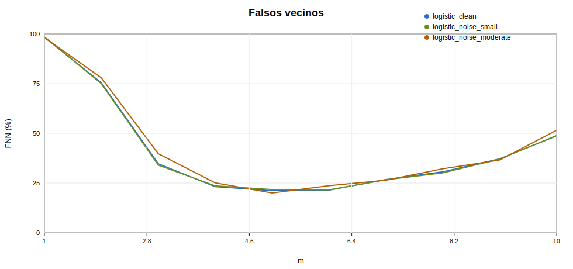

El porcentaje de falsos vecinos es muy alto en dimensiones bajas y desciende con claridad al aumentar m, especialmente hasta m=5 o m=6. Esto indica que una representacion unidimensional o bidimensional no despliega suficientemente la dinamica observada. Aun asi, el porcentaje de falsos vecinos no cae hasta cero, por lo que la dimension elegida debe interpretarse como una dimension practica para reconstruccion y prediccion, no como una estimacion exacta de la dimension real del sistema.

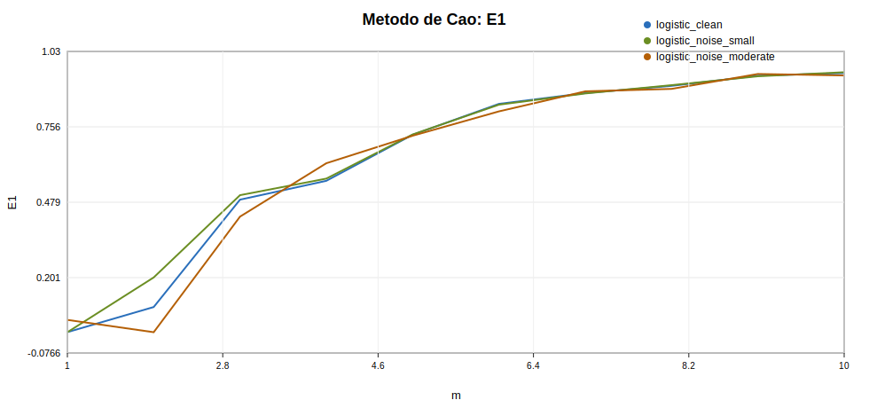

El metodo de Cao muestra un crecimiento progresivo de E1 sin una estabilizacion temprana completamente clara. En las tres series, el criterio tiende hacia dimensiones altas dentro del rango evaluado, lo que explica que m_Cao=10. Esta discrepancia con FNN no invalida la reconstruccion, pero obliga a una interpretacion prudente: Cao no proporciona aqui una dimension baja cerrada, sino una senal de que la reconstruccion es sensible al criterio usado.

En la serie limpia se espera una seleccion mas clara que en BTC. Con ruido, los falsos vecinos pueden estabilizarse peor y Cao puede discrepar; por eso la dimension seleccionada se interpreta de forma operativa.

Conviene matizar que el mapa logistico, aunque es un sistema determinista caotico clasico, es un mapa discreto unidimensional no invertible. Por tanto, los criterios de reconstruccion por retardos no deben interpretarse exactamente igual que en el caso ideal de un flujo suave invertible. La discrepancia entre FNN y Cao debe leerse como una senal metodologica, no como una contradiccion que invalide el experimento.

## Reconstruccion del espacio de estados

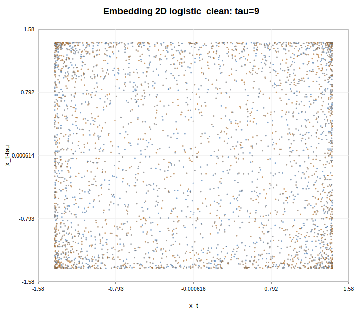

La reconstruccion bidimensional de la serie limpia muestra una nube acotada y no uniforme, con mayor concentracion de puntos cerca de determinadas zonas del soporte. No aparece una curva simple porque se usa un retardo tau=9, que separa bastante las coordenadas en una dinamica fuertemente mezclante. Aun asi, la nube no es arbitraria: conserva una estructura geometrica limitada por la dinamica del mapa logistico.

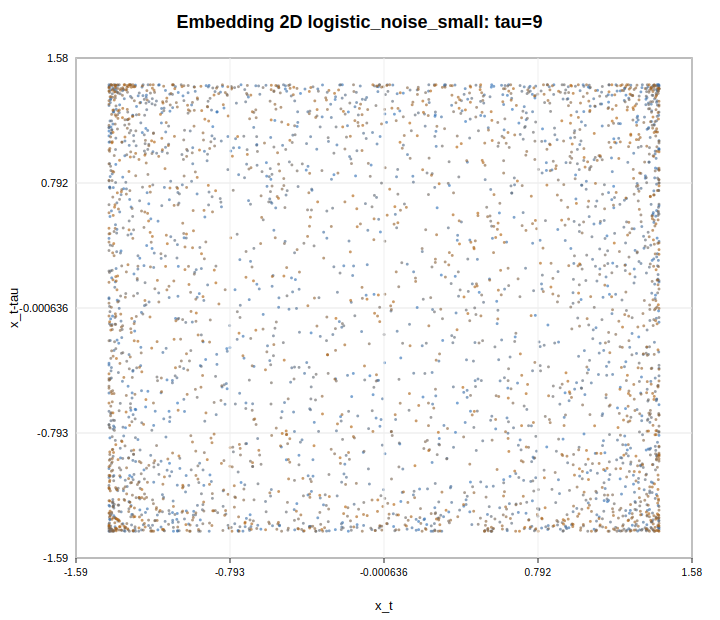

Con ruido pequeno, la reconstruccion 2D mantiene una forma global parecida a la de la serie limpia, pero los bordes y concentraciones aparecen algo mas difusos. Esto es coherente con un ruido observacional debil: la dinamica determinista subyacente sigue siendo visible, aunque las coordenadas retardadas quedan ligeramente perturbadas.

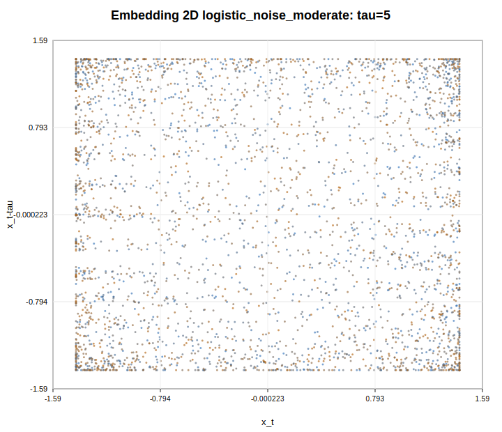

La reconstruccion 2D con ruido moderado conserva el caracter acotado de la nube, pero la estructura aparece mas dispersa y menos limpia que en el caso sin ruido. Ademas, el retardo seleccionado cambia a tau=5, senal de que el ruido altera la escala temporal detectada por AMI.

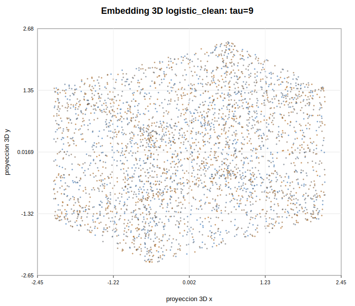

La proyeccion tridimensional de la serie limpia muestra una nube compacta, con forma global definida y densidad no uniforme. Aunque no debe interpretarse como un atractor perfectamente reconstruido, si evidencia que la serie del mapa logistico produce una geometria mas organizada que la obtenida habitualmente en series financieras reales.

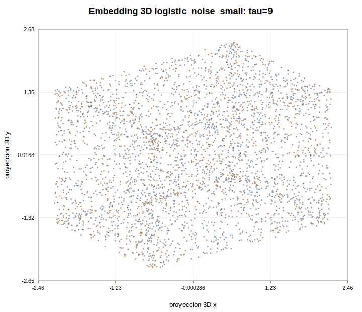

Al anadir ruido pequeno, la proyeccion 3D conserva una forma global similar a la de la serie limpia, pero la nube se vuelve ligeramente mas difusa. La estructura general sigue siendo reconocible, lo que sugiere que la reconstruccion mantiene informacion dinamica util a pesar de la perturbacion observacional.

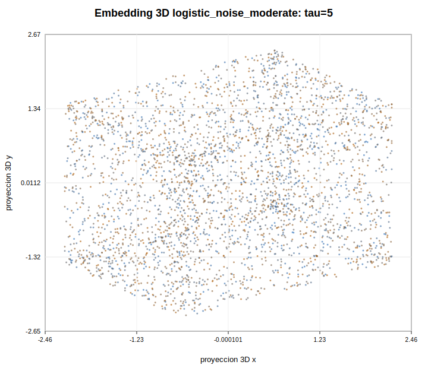

Con ruido moderado, la proyeccion 3D sigue mostrando una nube acotada, pero la geometria aparece mas dispersa y menos definida. La perdida de nitidez es coherente con la degradacion observada en los criterios de reconstruccion y en la estimacion de Lyapunov.

La serie limpia muestra una geometria visual mas definida que las series con ruido. Al aumentar el ruido, la estructura reconstruida se difumina. No se habla de atractor perfecto, sino de una reconstruccion visual de una dinamica sintetica conocida.

## Lyapunov aproximado

| series_name | tau | m | slope_per_step | fit_start | fit_end | r2_fit | theoretical_ln2 | n_fit_points |
| --- | --- | --- | --- | --- | --- | --- | --- | --- |
| logistic_clean | 9 | 5 | 0.185186 | 1 | 6 | 0.686203 | 0.693147 | 6 |
| logistic_noise_small | 9 | 6 | 0.131452 | 1 | 6 | 0.633133 | 0.693147 | 6 |
| logistic_noise_moderate | 5 | 5 | -0.00837915 | 1 | 6 | 0.00135571 | 0.693147 | 6 |

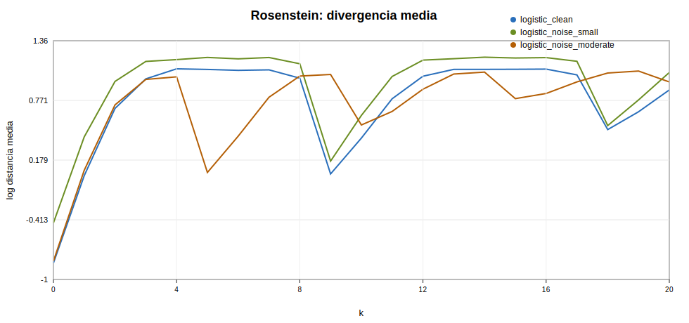

Para r=4 el exponente teorico es ln(2) ~= 0.693 por iteracion. Las estimaciones de Rosenstein son aproximadas y dependen del embedding, del bloque usado y del rango de ajuste; una pendiente positiva en la serie limpia es la senal cualitativa principal.

La curva de Rosenstein muestra una divergencia inicial positiva en la serie limpia y, en menor medida, en la serie con ruido pequeno. Esto es coherente con la sensibilidad a condiciones iniciales esperada en el mapa logistico caotico. Sin embargo, las curvas se saturan y oscilan rapidamente, y la pendiente estimada queda lejos del valor teorico. En la serie con ruido moderado no aparece una region lineal clara. Por tanto, esta figura debe interpretarse cualitativamente: el metodo detecta divergencia en el caso limpio, pero no proporciona una estimacion exacta del exponente de Lyapunov.

## Prediccion local

### Mapa de transicion de la serie limpia

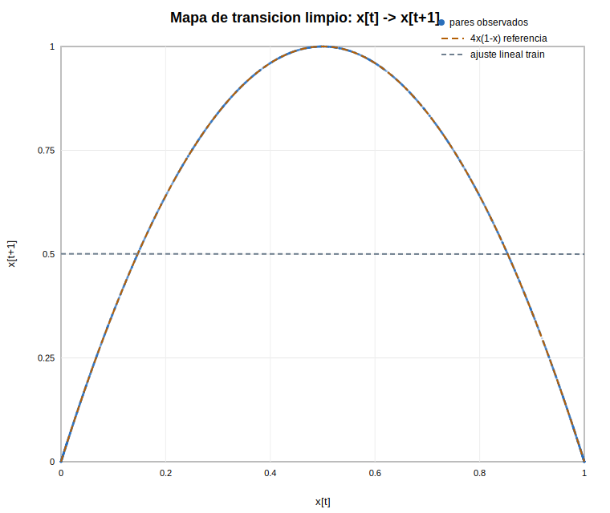

El mapa de transicion representa pares observados `(x[t], x[t+1])` de la serie limpia. La nube sigue la parabola teorica `4x(1-x)`, que se dibuja solo como referencia visual: no se usa para entrenar ni para predecir. Tambien se incluye una recta ajustada sobre train para mostrar la limitacion de una aproximacion lineal global. La diferencia entre la parabola y la recta explica por que un AR lineal puede ser una referencia util, pero no un modelo estructural adecuado para este sistema.

### Referencia lineal AR(p)

Como referencia lineal se ajustan modelos AR(p) sobre el tramo de entrenamiento, con p=0,...,100, seleccionando el orden mediante BIC. El caso p=0 corresponde a la prediccion constante mediante la media historica. Esta comparacion no pretende modelar correctamente el mapa logistico, cuya regla de transicion es cuadratica, sino comprobar si una referencia lineal puede competir con la prediccion local en un sistema no lineal controlado.

Si el criterio selecciona p=0 o p=1, esto indica que dentro de la familia AR no aparece una memoria lineal larga util. Este resultado es coherente con el mapa logistico: puede existir una relacion determinista fuerte entre x[t] y x[t+1], pero dicha relacion no es lineal. En esta fase el test no se usa para seleccionar AR; la seleccion por BIC usa exclusivamente train.

| series_name | referencia_lineal | p | innovation_variance | bic |
| --- | --- | --- | --- | --- |
| logistic_clean | AR(0) / media | 0 | 0.999848 | 7.79475 |
| logistic_noise_small | AR(0) / media | 0 | 0.999848 | 7.79475 |
| logistic_noise_moderate | AR(0) / media | 0 | 0.999848 | 7.79475 |

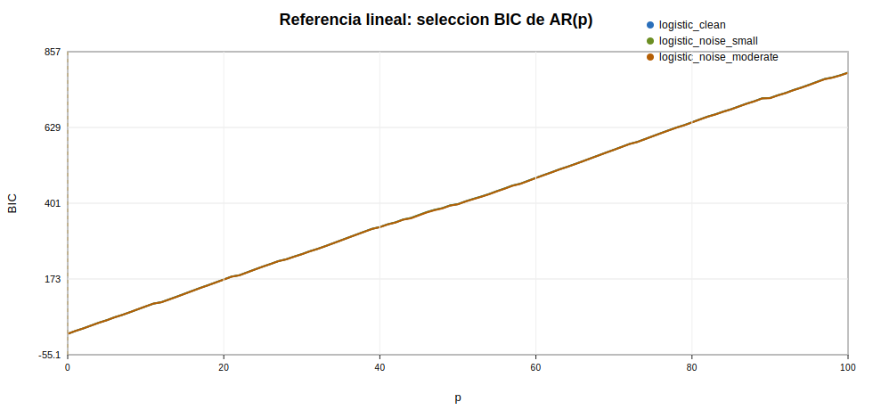

La referencia lineal seleccionada globalmente queda etiquetada como AR(0) / media. El grafico BIC frente a p muestra donde cae el minimo para cada serie. Si el minimo esta en p=0 o p=1, la lectura correcta no es que el mapa logistico sea lineal, sino que una familia AR no encuentra memoria lineal larga que compense la penalizacion por complejidad.

### Comparacion predictiva

| series_name | model | split | tau | m | theiler_window | selected_k | ar_order | n | mae | rmse | r2_oos |
| --- | --- | --- | --- | --- | --- | --- | --- | --- | --- | --- | --- |
| logistic_clean | historical_mean | test | 9 | 5 | 45 | 5 |  | 2199 | 0.320829 | 0.356523 | 0 |
| logistic_clean | persistence | test | 9 | 5 | 45 | 5 |  | 2199 | 0.410283 | 0.499399 | -0.962099 |
| logistic_clean | ar_bic | test | 9 | 5 | 45 | 5 | 0 | 2199 | 0.320829 | 0.356523 | 0 |
| logistic_clean | nearest_neighbor | test | 9 | 5 | 45 | 5 |  | 2199 | 0.0928535 | 0.127247 | 0.872614 |
| logistic_clean | knn_mean_k5 | test | 9 | 5 | 45 | 5 |  | 2199 | 0.0745183 | 0.0981669 | 0.924185 |
| logistic_noise_small | historical_mean | test | 9 | 6 | 54 | 5 |  | 2199 | 0.320744 | 0.356395 | 0 |
| logistic_noise_small | persistence | test | 9 | 6 | 54 | 5 |  | 2199 | 0.410286 | 0.499336 | -0.963016 |
| logistic_noise_small | ar_bic | test | 9 | 6 | 54 | 5 | 0 | 2199 | 0.320744 | 0.356395 | 0 |
| logistic_noise_small | nearest_neighbor | test | 9 | 6 | 54 | 5 |  | 2199 | 0.131899 | 0.179361 | 0.746723 |
| logistic_noise_small | knn_mean_k5 | test | 9 | 6 | 54 | 5 |  | 2199 | 0.100647 | 0.130101 | 0.866741 |
| logistic_noise_moderate | historical_mean | test | 5 | 5 | 25 | 5 |  | 2199 | 0.320119 | 0.355751 | 0 |
| logistic_noise_moderate | persistence | test | 5 | 5 | 25 | 5 |  | 2199 | 0.409888 | 0.498455 | -0.963174 |
| logistic_noise_moderate | ar_bic | test | 5 | 5 | 25 | 5 | 0 | 2199 | 0.320119 | 0.355751 | 0 |
| logistic_noise_moderate | nearest_neighbor | test | 5 | 5 | 25 | 5 |  | 2199 | 0.101944 | 0.139849 | 0.845466 |
| logistic_noise_moderate | knn_mean_k5 | test | 5 | 5 | 25 | 5 |  | 2199 | 0.0822988 | 0.107455 | 0.908764 |

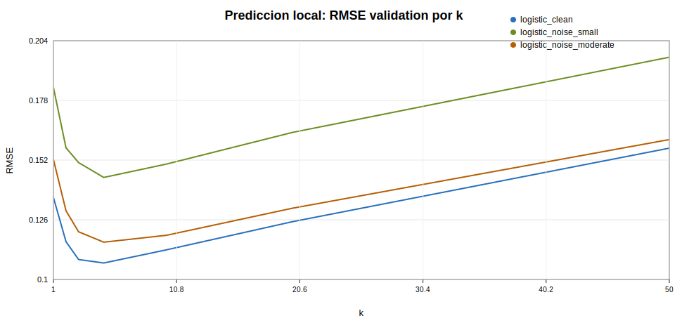

La validacion muestra que el error disminuye al pasar de un unico vecino a una media de varios vecinos, alcanzando el mejor resultado en torno a k=5 para las tres series. A partir de ahi, aumentar demasiado k empeora el rendimiento, porque se promedian estados menos parecidos y la prediccion pierde caracter local. Este comportamiento es distinto del observado en BTC, donde valores grandes de k actuaban mas como suavizado.

Para la memoria se incluyen primero versiones compactas de las predicciones: usan una ventana continua mas corta del test y muestran valor real, persistencia, AR lineal y kNN. No se incluyen AR adicionales ni la curva del vecino mas proximo para mantener la comparacion principal legible.

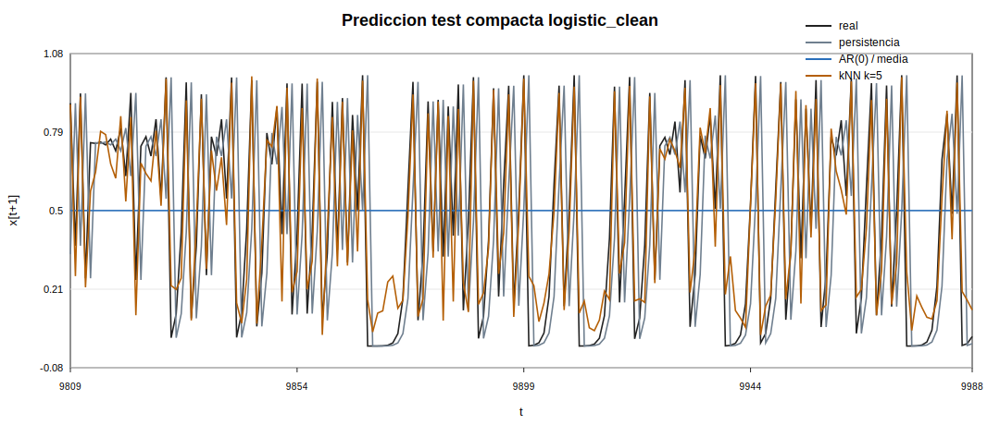

En la serie limpia, el predictor local kNN sigue muy de cerca la trayectoria real a corto plazo y mejora claramente tanto a persistencia como al AR lineal. La persistencia falla porque en el mapa logistico el valor siguiente puede cambiar de forma brusca respecto al valor actual; el AR lineal queda cerca de la media historica porque no puede representar bien la regla cuadratica global. El metodo local, en cambio, usa estados reconstruidos similares para aproximar la regla dinamica.

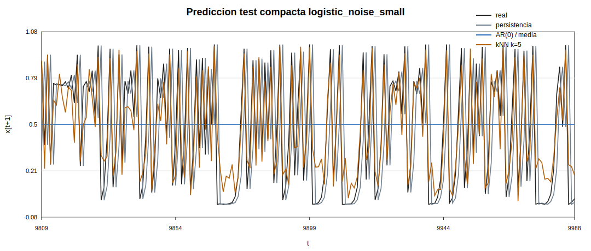

Con ruido pequeno, el kNN sigue capturando buena parte de la evolucion real, aunque aparecen desviaciones mayores que en la serie limpia. La curva kNN conserva la forma general de la trayectoria, pero suaviza algunos cambios bruscos y pierde precision en transiciones rapidas. Esto refleja el efecto esperado del ruido observacional: la estructura dinamica sigue siendo aprovechable, pero la prediccion local se vuelve menos precisa.

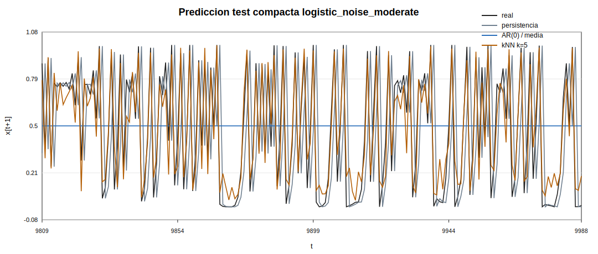

En la serie con ruido moderado, el kNN continua superando visualmente a las referencias lineales y reproduce parte importante del patron temporal. Sin embargo, las diferencias frente al valor real son mas visibles en algunos saltos y cambios abruptos. El resultado muestra que el ruido no elimina por completo la capacidad predictiva del espacio reconstruido, pero si introduce errores locales y reduce la interpretacion determinista limpia del sistema.

Versiones diagnosticas completas:

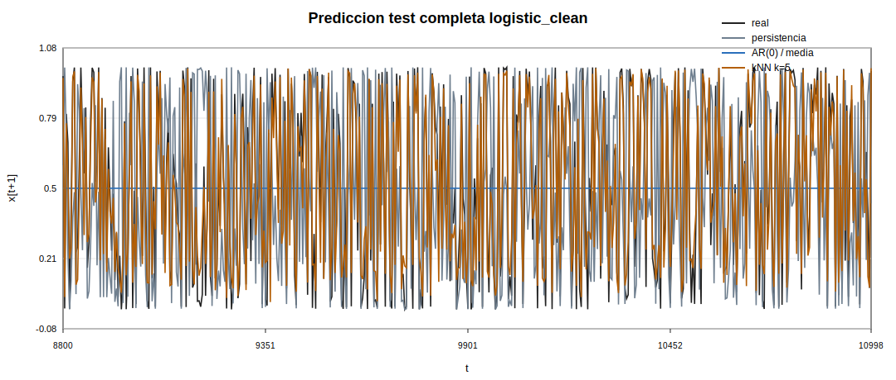

La version completa del test confirma que la mejora del predictor local en la serie limpia no depende de una ventana concreta. A lo largo del tramo evaluado, kNN mantiene una trayectoria mucho mas cercana al valor real que persistencia, AR(0) / media y la media historica. La media de vecinos resulta mas estable que una prediccion puramente local de un unico vecino y reduce el error global.

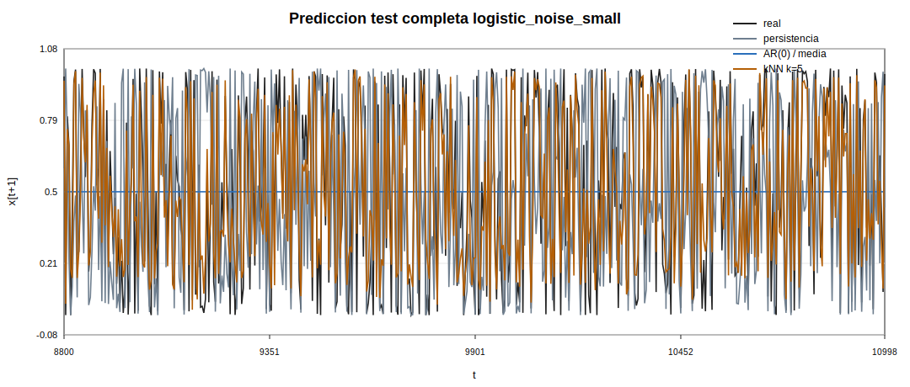

En la serie con ruido pequeno, la figura completa muestra que el predictor local conserva capacidad predictiva durante todo el tramo de test, aunque con mayor dispersion que en la serie limpia. El vecino mas proximo se vuelve mas irregular, mientras que la media de vecinos ofrece una prediccion mas estable.

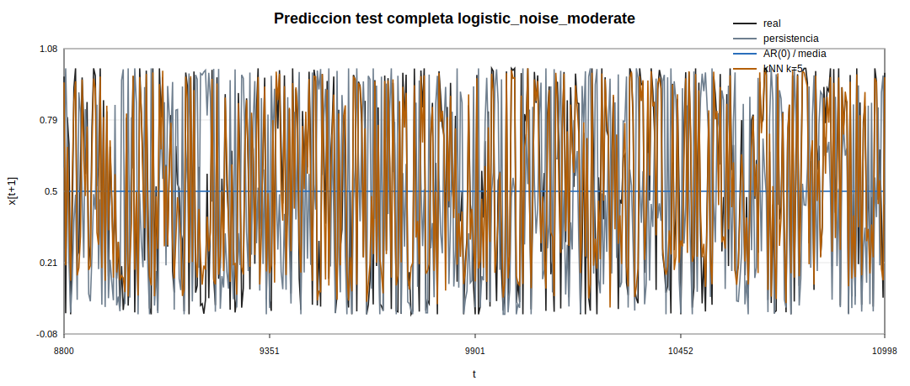

En la serie con ruido moderado, el grafico completo muestra una prediccion local todavia util, pero menos limpia desde el punto de vista dinamico. kNN sigue estando mas cerca de la trayectoria real que las referencias lineales en muchos tramos, aunque no reproduce perfectamente todos los saltos.

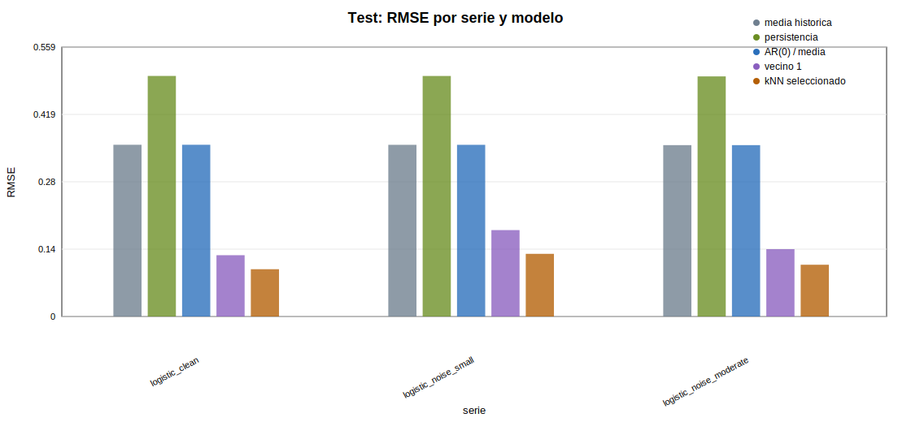

La comparacion de metricas resume el resultado principal de la fase: el predictor local por media de vecinos obtiene el menor RMSE en las tres series. La media historica, AR(0) / media y la persistencia quedan claramente por detras; el vecino mas cercano mejora esas referencias, pero queda por detras del kNN medio. En conjunto, la figura valida que el pipeline predice bien en un sistema caotico sintetico y que el ruido degrada, aunque no siempre de forma lineal, la calidad predictiva.

En la serie limpia, el AR(0) / media seleccionado por BIC queda en RMSE=0.356523, mientras que el mejor kNN obtiene RMSE=0.0981669. Con ruido pequeno, AR=0.356395 y kNN=0.130101; con ruido moderado, AR=0.355751 y kNN=0.107455.

En la serie limpia, el AR seleccionado por BIC queda muy cerca de la media historica y claramente por detras del kNN local. Esto no es un fallo del AR, sino una consecuencia de la especificacion lineal: la transicion real del mapa logistico es cuadratica. La ventaja del kNN en este sistema controlado muestra que el predictor local en espacio reconstruido puede explotar estructura no lineal cuando esta existe de forma explicita.

## Efecto del ruido

El ruido difumina la reconstruccion, puede aumentar la dimension operativa sugerida por FNN/Cao y degrada la interpretabilidad de Rosenstein. En prediccion, las dos series con ruido quedan peor que la limpia, aunque la degradacion no es monotona entre ruido pequeno y moderado. Esto reproduce la idea principal sin forzar una lectura mas fuerte que los resultados.

## Comparacion conceptual con BTC

Este resultado contrasta con BTC, donde AR(49) fue el modelo mas competitivo. La diferencia es informativa: en el mapa logistico la dinamica no lineal es limpia y dominante; en BTC la senal predictiva aparece mezclada con persistencia lineal, ruido, heterocedasticidad y cambios de regimen. El experimento sintetico valida la herramienta; los resultados en BTC deben interpretarse con mucha mas cautela.

## Conclusion

El pipeline detecta estructura en el mapa logistico limpio, produce una reconstruccion visual mas clara que en BTC, estima divergencia positiva de trayectorias y permite prediccion local a corto plazo. Al anadir ruido, la reconstruccion se difumina, Rosenstein se vuelve menos interpretable y la prediccion local empeora frente a la serie limpia, aunque no de forma monotona entre los dos niveles de ruido. En el mapa logistico, la comparacion con AR confirma que la ventaja del kNN no se debe simplemente a usar mas retardos, sino a capturar una relacion local no lineal. En cambio, en BTC el AR(49) sigue siendo muy competitivo, por lo que no se puede afirmar superioridad general del enfoque no lineal en datos financieros reales.
