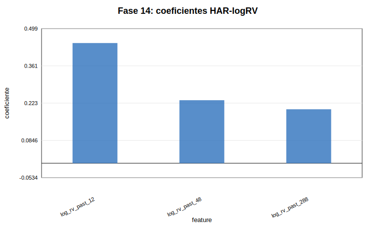
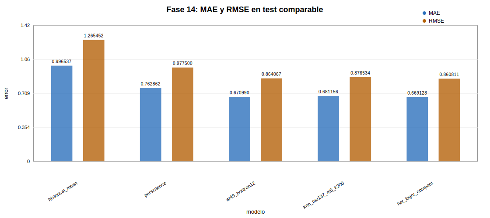
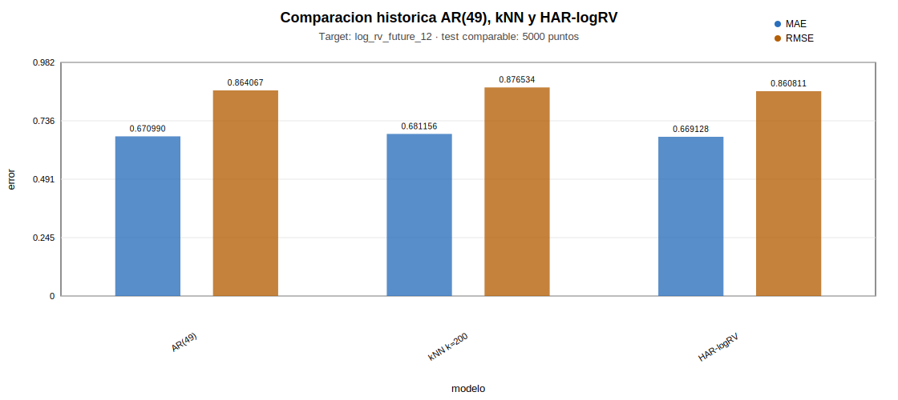
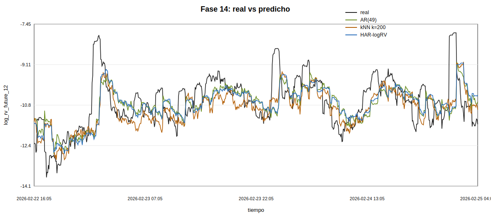
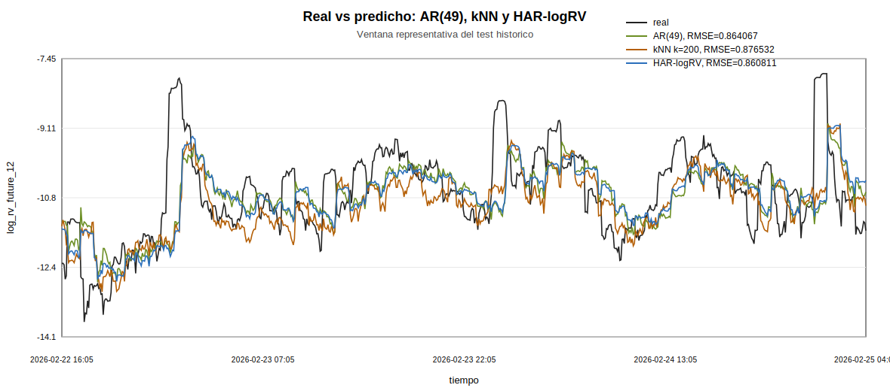
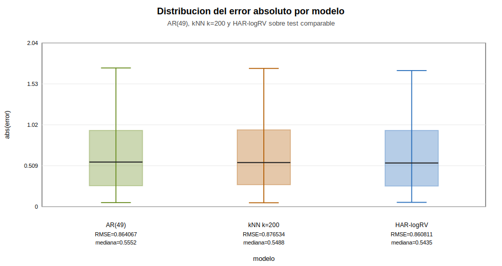
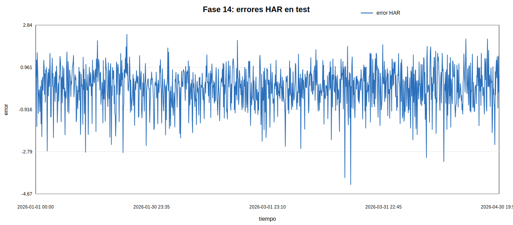
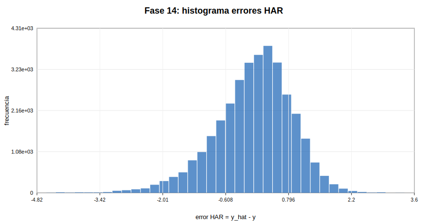
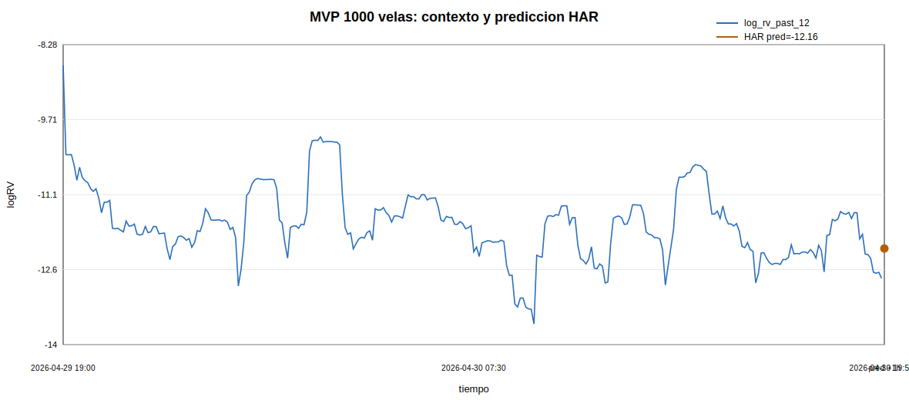

# Fase 14 - HAR-logRV compacto y exportacion para MVP

## Objetivo

Esta fase introduce un unico benchmark especifico de volatilidad realizada: HAR-logRV compacto. No se abre una familia grande de modelos, no se usan GARCH, LightGBM, XGBoost ni redes neuronales. El objetivo es tener un modelo simple, interpretable, rapido y exportable al MVP.

## Motivacion

En BTC, la prediccion local kNN mejora a persistencia, pero no supera a AR(49). Ademas, BTC no se comporta como el mapa logistico limpio de la Fase 13: la volatilidad financiera mezcla persistencia, ruido, heterocedasticidad y cambios de regimen. HAR-logRV introduce memoria multiescala con horizontes de 1 hora, 4 horas y 1 dia.

## Definicion del modelo

```text
log_rv_future_12 = beta_0
    + beta_1 log_rv_past_12
    + beta_2 log_rv_past_48
    + beta_3 log_rv_past_288
    + epsilon
```

`log_rv_past_12` resume la ultima hora, `log_rv_past_48` las ultimas 4 horas y `log_rv_past_288` el ultimo dia. No se usa ventana semanal porque el MVP parte de unas 1000 velas recientes.

## Datos y split

| split | start | end | n |
| --- | --- | --- | --- |
| train | 2024-01-02 00:00:00 | 2025-06-30 23:55:00 | 157248 |
| validation | 2025-07-01 00:00:00 | 2025-12-31 23:55:00 | 52992 |
| test | 2026-01-01 00:00:00 | 2026-04-30 19:55:00 | 34512 |

El modelo HAR se ajusta solo con train. Validation no selecciona variables, porque las features estan fijadas antes de esta fase. Test no se usa para entrenar ni seleccionar. La comprobacion anti-leakage mantiene `log_rv_future_12(t) == log_rv_past_12(t+12)` con max_abs_diff=0.

## Coeficientes

| term | feature | coefficient |
| --- | --- | --- |
| intercept | intercept | -2.43865 |
| beta_1 | log_rv_past_12 | 0.445207 |
| beta_2 | log_rv_past_48 | 0.23344 |
| beta_3 | log_rv_past_288 | 0.199924 |



El mayor peso absoluto corresponde a `log_rv_past_12`. Los signos son log_rv_past_12=+, log_rv_past_48=+, log_rv_past_288=+. La lectura es de persistencia suavizada: el modelo combina memoria corta, intradia y diaria en lugar de depender solo de la ultima hora.

## Comparacion con modelos anteriores

| model | split | n | mae | mse | rmse | r2_oos | bias_yhat_minus_y | error_std |
| --- | --- | --- | --- | --- | --- | --- | --- | --- |
| historical_mean | test_knn_comparable_sample | 5000 | 0.996536 | 1.60137 | 1.26545 | 0 | 0.0658455 | 1.26386 |
| persistence | test_knn_comparable_sample | 5000 | 0.762862 | 0.955505 | 0.9775 | 0.403319 | -0.00431078 | 0.977588 |
| ar49_horizon12 | test_knn_comparable_sample | 5000 | 0.67099 | 0.746611 | 0.864067 | 0.533766 | 0.00876445 | 0.864108 |
| knn_tau137_m5_k200 | test_knn_comparable_sample | 5000 | 0.681143 | 0.768309 | 0.876532 | 0.520217 | -0.0181533 | 0.876432 |
| har_logrv_compact | test_knn_comparable_sample | 5000 | 0.669129 | 0.740995 | 0.860811 | 0.537273 | 0.0200016 | 0.860664 |
| historical_mean | test_full | 34512 | 0.998867 | 1.60622 | 1.26737 | 0 | 0.0663369 | 1.26565 |
| persistence | test_full | 34512 | 0.760279 | 0.952477 | 0.975949 | 0.407008 | -0.000111271 | 0.975963 |
| ar49_horizon12 | test_full | 34512 | 0.67278 | 0.748074 | 0.864913 | 0.534265 | 0.0115395 | 0.864848 |
| har_logrv_compact | test_full | 34512 | 0.668908 | 0.74117 | 0.860912 | 0.538563 | 0.022382 | 0.860634 |



## Figuras comparativas para MVP

Estas figuras se usan en la pagina de comparacion del MVP. A diferencia de `phase14_test_metrics_comparison.svg`, que incluye tambien media historica y persistencia, estas figuras aislan los tres modelos principales de la aplicacion: AR(49), kNN local y HAR-logRV global. La comparacion se realiza sobre la misma muestra test comparable de 5000 puntos, por lo que los RMSE son directamente comparables.













La tabla `phase14_test_metrics.csv` distingue `test_knn_comparable_sample`, donde todos los modelos se comparan sobre los mismos 5000 puntos usados para kNN, y `test_full`, donde HAR, AR(49), persistencia y media se evaluan sobre todo el test disponible.

## Modo MVP con 1000 observaciones

| n_input_rows | n_effective_rows | train_n | test_n | rmse_test_mvp | mae_test_mvp | r2_oos_test_mvp | last_timestamp | predicted_log_rv_future_12 |
| --- | --- | --- | --- | --- | --- | --- | --- | --- |
| 1000 | 1000 | 700 | 300 | 0.728971 | 0.576381 | -0.180447 | 2026-04-30 19:55:00 | -12.1488 |



La simulacion usa solo las ultimas 1000 velas, separa 70%/30% temporalmente y ajusta HAR con las filas efectivas. Esto comprueba que el modelo es viable en modo MVP porque necesita como maximo 288 velas de memoria.

## Limitaciones

- HAR-logRV es OLS lineal y no modela no linealidad explicita.
- No estima incertidumbre predictiva.
- No es una estrategia de trading ni asesoria financiera.
- Es sensible a cambios de regimen.
- La validacion con 1000 observaciones es pequena y no sustituye el historico completo.
- La comparacion kNN usa muestra de 5000 puntos por coste computacional.

## Conclusion

HAR-logRV mejora a persistencia. Supera a AR(49). Supera al kNN local tau137_m5_k200. Por simplicidad, velocidad e interpretabilidad, es razonable usar HAR-logRV como modelo practico principal del MVP. La lectura global del TFG queda separada: la reconstruccion no lineal y kNN pertenecen al analisis dinamico, mientras HAR-logRV es el cierre predictivo practico basado en memoria multiescala.

