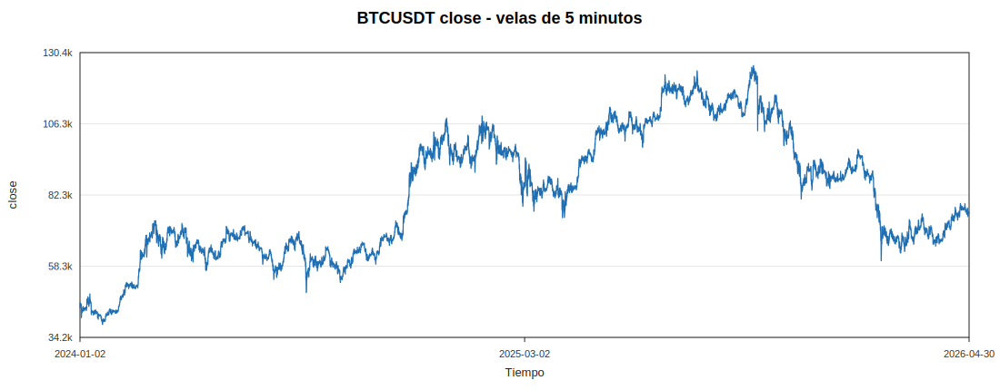
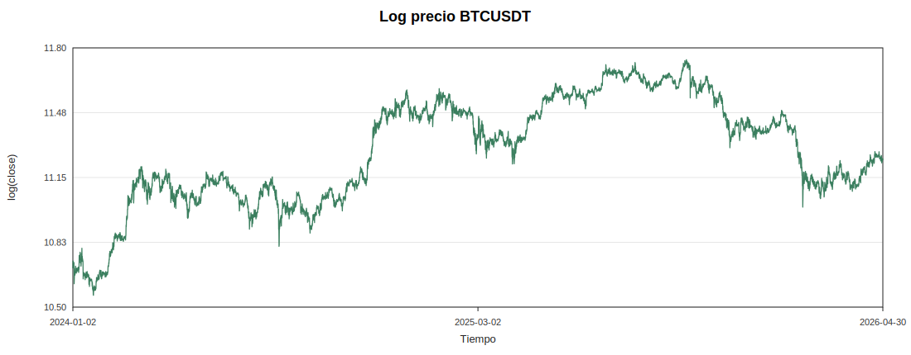
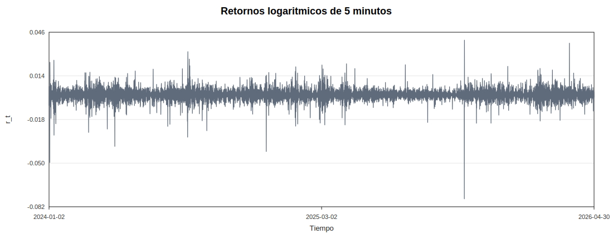
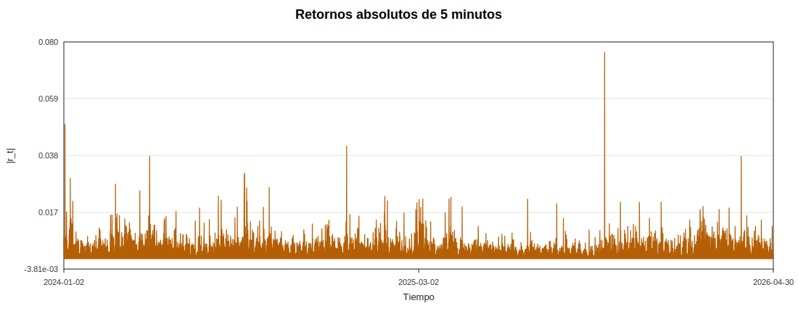
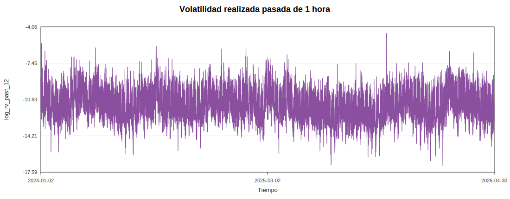
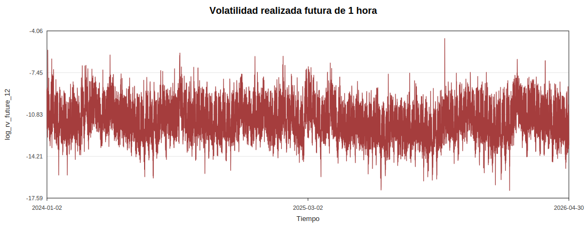
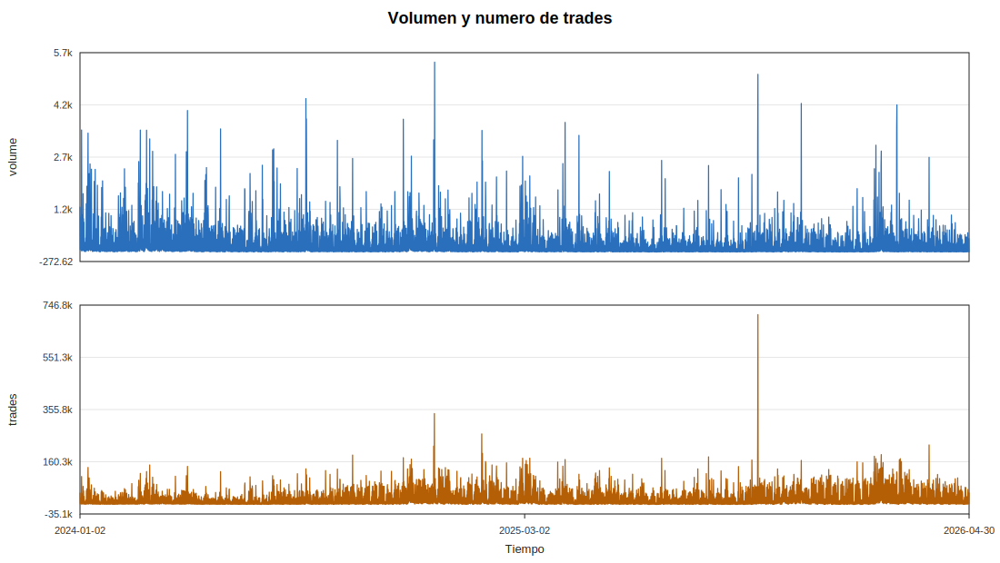

# Fase 2 - Aplicacion de herramientas generales

Dataset usado: `data/processed/btc_5m_features.csv`

Esta fase es exploratoria. No se interpreta todavia estacionariedad formal, caos ni predictibilidad; solo se describe la estructura visible y los estadisticos basicos de las variables construidas en Fase 1.

## Graficos e interpretacion

### Evolucion del precio BTC

Comentario: El precio muestra cambios de nivel amplios a lo largo de la muestra. El cierre minimo es 38584.33 y el maximo 126011.18.

Conclusion breve: El precio bruto sirve como contexto economico, pero no es la variable principal para reconstruccion por su fuerte componente de nivel.

### Evolucion del log precio

Comentario: El logaritmo comprime la escala del precio y facilita interpretar cambios relativos. Aun asi, conserva tendencias y cambios persistentes de nivel.

Conclusion breve: La transformacion logaritmica ayuda en escala, pero no convierte por si sola al precio en una serie adecuada como objeto principal.

### Retornos logaritmicos

Comentario: Los retornos estan centrados cerca de cero (media 2.24e-06), con minimo -0.0762 y maximo 0.04. La asimetria entre extremos sugiere episodios bruscos, especialmente en la cola negativa.

Conclusion breve: Los retornos son mas apropiados que el precio para estudiar variacion de corto plazo, aunque su distribucion no parece gaussiana simple.

### Retornos absolutos

Comentario: La mediana de |r_t| es 0.000645, mientras que el p99 alcanza 0.00545. Los picos no aparecen aislados de forma uniforme, sino agrupados temporalmente.

Conclusion breve: El grafico es compatible con clustering de volatilidad: periodos tranquilos alternan con racimos de movimientos grandes.

### Volatilidad realizada pasada

Comentario: `log_rv_past_12` oscila entre -17 y -4.68. La escala logaritmica revela persistencia en periodos de volatilidad elevada y baja.

Conclusion breve: Esta serie resume la intensidad reciente de variacion y queda como variable principal para la caracterizacion no lineal.

### Volatilidad realizada futura

Comentario: `log_rv_future_12` tiene rango similar al pasado: minimo -17 y maximo -4.68. Visualmente comparte episodios de alta volatilidad porque mide ventanas futuras proximas, no porque se haya usado en los predictores.

Conclusion breve: Es un target razonable para estudiar predictibilidad local de la volatilidad a una hora.

### Volumen y numero de trades

Comentario: Volumen y trades presentan colas derechas: el p99 de volumen es 635 y el p99 de trades 6.47e+04. Los aumentos de actividad suelen coincidir con episodios de mayor volatilidad.

Conclusion breve: La actividad de mercado puede ser informacion contextual util, aunque la serie principal del TFG sigue siendo la volatilidad realizada.

## Estadisticos descriptivos

| variable | mean | std | min | p01 | p05 | p25 | p50 | p75 | p95 | p99 | max | skewness | kurtosis_excess |
| --- | --- | --- | --- | --- | --- | --- | --- | --- | --- | --- | --- | --- | --- |
| r | 2.23854e-06 | 0.00154604 | -0.0762134 | -0.00432949 | -0.0021983 | -0.000640905 | 8.49375e-08 | 0.00064975 | 0.00218448 | 0.00433196 | 0.0400047 | -0.654918 | 53.6015 |
| abs_r | 0.000984775 | 0.00119182 | 0 | 5.20405e-06 | 5.16477e-05 | 0.000281924 | 0.000645215 | 0.00126897 | 0.00302694 | 0.00545134 | 0.0762134 | 5.94974 | 133.034 |
| r2 | 2.39022e-06 | 1.78224e-05 | 0 | 2.70821e-11 | 2.66748e-09 | 7.94812e-08 | 4.16303e-07 | 1.61028e-06 | 9.16239e-06 | 2.97171e-05 | 0.00580849 | 169.88 | 48685 |
| log_rv_past_12 | -11.2757 | 1.21736 | -16.9779 | -14.0813 | -13.2359 | -12.0777 | -11.3078 | -10.495 | -9.23703 | -8.28376 | -4.6791 | 0.123635 | 0.319237 |
| log_rv_future_12 | -11.2758 | 1.21736 | -16.9779 | -14.0813 | -13.236 | -12.0778 | -11.3079 | -10.4952 | -9.23719 | -8.28376 | -4.6791 | 0.123744 | 0.319292 |
| volume | 94.4719 | 138.521 | 0.90958 | 6.43012 | 11.9818 | 28.9331 | 54.615 | 107.314 | 298.976 | 634.685 | 5471.44 | 7.48112 | 114.884 |
| trades | 11924.8 | 13172.1 | 408 | 1288 | 1983 | 4219.75 | 7652 | 14468 | 36750 | 64722.5 | 711259 | 4.45409 | 72.7655 |

## Eventos extremos relevantes

| event | variable | time | value | close | log_rv_past_12 | log_rv_future_12 |
| --- | --- | --- | --- | --- | --- | --- |
| retorno mas negativo | r | 2025-10-10 21:15:00 | -0.0762134 | 103975 | -5.02924 | -5.86325 |
| retorno mas positivo | r | 2025-10-10 21:20:00 | 0.0400047 | 108219 | -4.81092 | -6.67324 |
| mayor retorno absoluto | abs_r | 2025-10-10 21:15:00 | 0.0762134 | 103975 | -5.02924 | -5.86325 |
| mayor log volatilidad pasada 1h | log_rv_past_12 | 2025-10-10 21:45:00 | -4.6791 | 113104 | -4.6791 | -8.51003 |
| mayor log volatilidad futura 1h | log_rv_future_12 | 2025-10-10 20:45:00 | -4.6791 | 116891 | -10.4914 | -4.6791 |
| mayor volumen | volume | 2024-12-05 22:25:00 | 5471.44 | 94115.9 | -6.33954 | -7.69867 |
| mayor numero de trades | trades | 2025-10-10 21:20:00 | 711259 | 108219 | -4.81092 | -6.67324 |

## Comentario estadistico

Los retornos tienen media muy cercana a cero (2.24e-06), pero muestran colas pesadas: su exceso de curtosis es 53.6. El minimo (-0.0762) es mas extremo en valor absoluto que el maximo (0.04), lo que apunta a asimetria episodica en shocks negativos.

`abs_r` tiene mediana 0.000645 y p99 0.00545; esta separacion entre el centro y la cola superior es consistente con episodios extremos y heterocedasticidad.

`log_rv_past_12` tiene desviacion tipica 1.22 y exceso de curtosis 0.319. La transformacion logaritmica reduce la dominancia de los valores extremos, pero no elimina la persistencia visual de la volatilidad.

El volumen tambien presenta cola derecha pronunciada: p99 635 frente a mediana 54.6. Esto sugiere que los episodios de estres de mercado combinan movimientos de precio y actividad anormal.

## Conclusion parcial

La exploracion general confirma que el precio debe tratarse solo como contexto, mientras que retornos, retornos absolutos y volatilidad realizada capturan mejor la dinamica intradia. La serie `log_rv_past_12` presenta persistencia visual, episodios extremos y clustering de volatilidad, por lo que sigue siendo la candidata natural para las fases de estacionariedad, correlograma, recurrencia y reconstruccion del espacio de estados. No hay todavia base para afirmar caos; esta fase solo documenta estructura temporal y colas pesadas.

En esta iteración se ha completado la Fase 2 del proyecto, centrada en la aplicación de herramientas generales de exploración sobre el dataset procesado en Fase 1. A diferencia de la fase anterior, aquí no se construyen nuevas variables predictivas, sino que se generan gráficos, estadísticos descriptivos, eventos extremos e interpretaciones iniciales para comprender mejor la estructura temporal de las series.

La fase parte del archivo data/processed/btc_5m_features.csv y analiza las variables principales construidas previamente: precio de cierre, log-precio, retornos logarítmicos, retornos absolutos, volatilidad realizada pasada, volatilidad realizada futura, volumen y número de trades. Para ello se han creado gráficos SVG y tablas resumen que permiten inspeccionar visualmente la evolución temporal, la presencia de extremos, la dispersión y la forma de las distribuciones.

Los resultados confirman que el precio bruto y el log-precio son útiles como contexto económico, pero no son las mejores series para el análisis dinámico principal debido a su componente de nivel y tendencia. En cambio, los retornos, retornos absolutos y volatilidad realizada capturan mejor la dinámica intradía de BTC.

Los retornos logarítmicos aparecen centrados cerca de cero, pero presentan colas pesadas y episodios extremos. El mínimo observado es más extremo en valor absoluto que el máximo, lo que sugiere la presencia de shocks negativos bruscos. Los retornos absolutos muestran una diferencia clara entre la mediana y el percentil 99, lo que es compatible con heterocedasticidad y clustering de volatilidad.

La variable más importante de esta fase es log_rv_past_12, que representa la volatilidad realizada pasada de una hora en escala logarítmica. Esta serie muestra persistencia visual, alternancia entre periodos tranquilos y periodos de alta volatilidad, y episodios extremos. Por ello se mantiene como la candidata principal para las siguientes fases del proyecto, especialmente estacionariedad, correlograma, recurrencia y reconstrucción del espacio de estados.

También se analiza log_rv_future_12 como target principal para predicción de volatilidad a una hora. Su comportamiento es visualmente similar al de log_rv_past_12 porque ambas series miden ventanas próximas en el tiempo, pero la construcción realizada en Fase 1 evita leakage, ya que la volatilidad futura se calcula estrictamente desde t+1.

Además, se estudian volumen y número de trades como variables de actividad de mercado. Ambas presentan colas derechas pronunciadas, lo que indica que los episodios de estrés no solo se reflejan en movimientos de precio, sino también en incrementos anormales de actividad.

La Fase 2 permite concluir que la serie log_rv_past_12 es la opción más adecuada para continuar el análisis no lineal del TFG. No obstante, todavía no hay base para afirmar caos, estacionariedad ni predictibilidad: esta fase solo documenta estructura temporal, colas pesadas, eventos extremos y clustering de volatilidad.