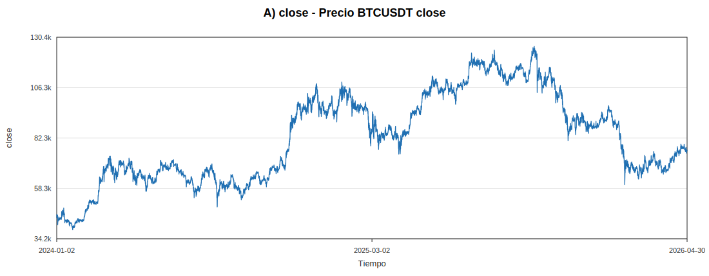
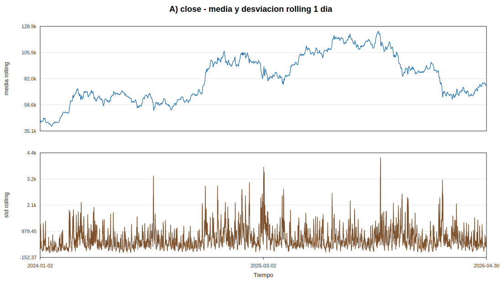
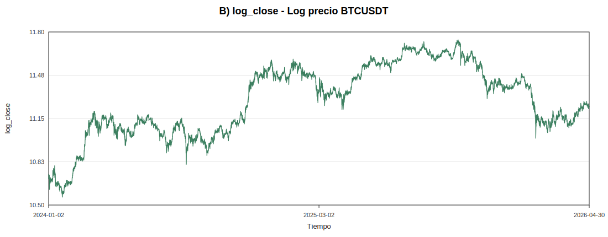
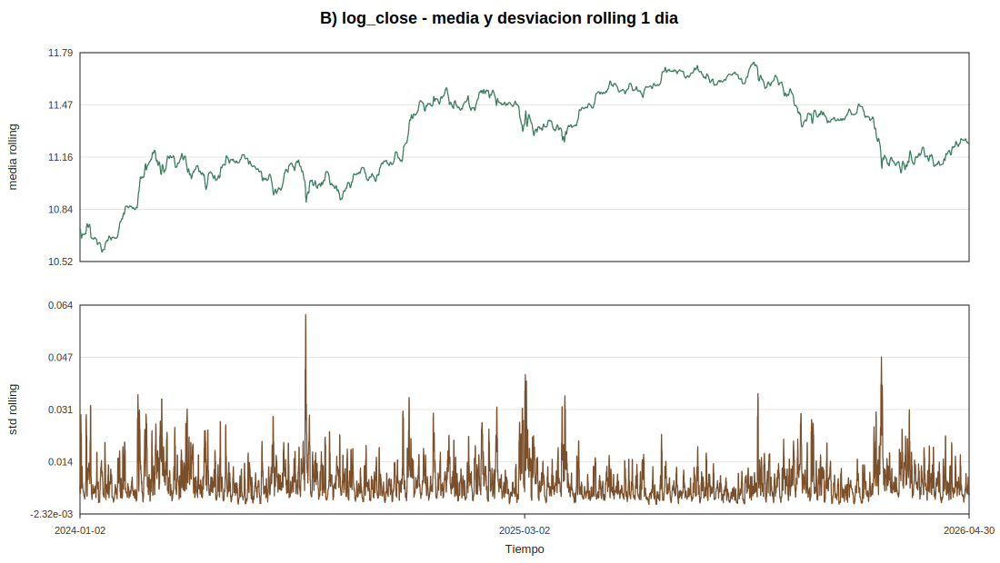
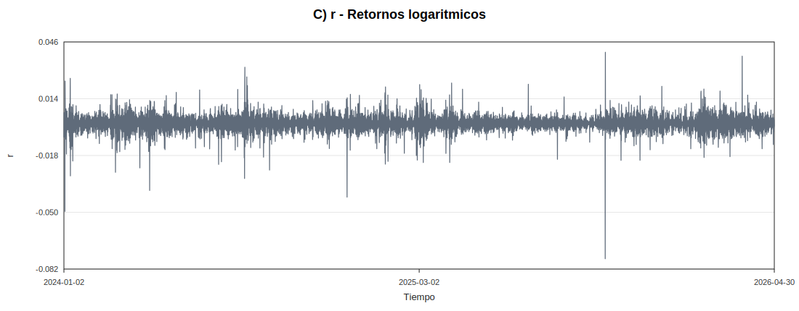
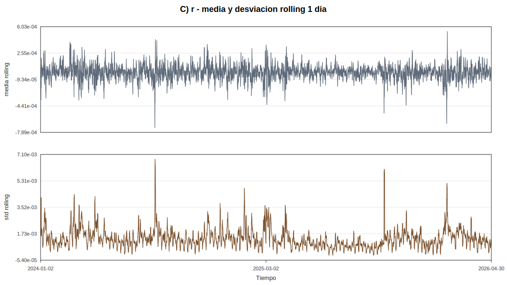
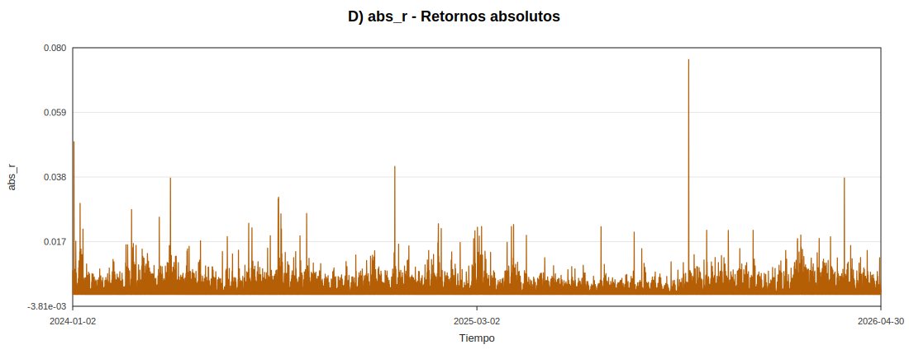
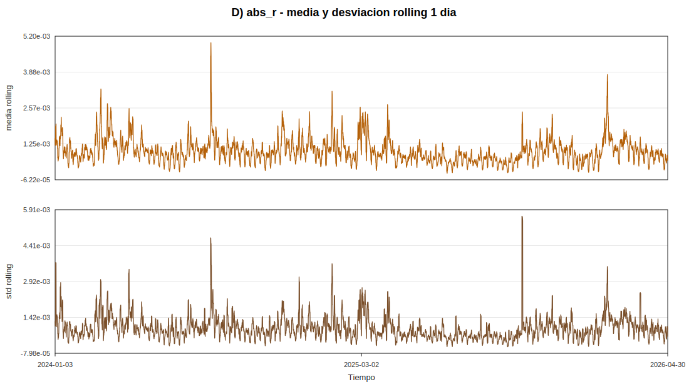
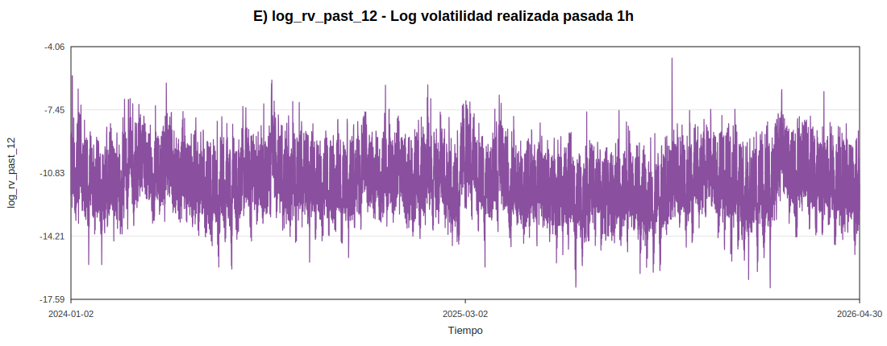
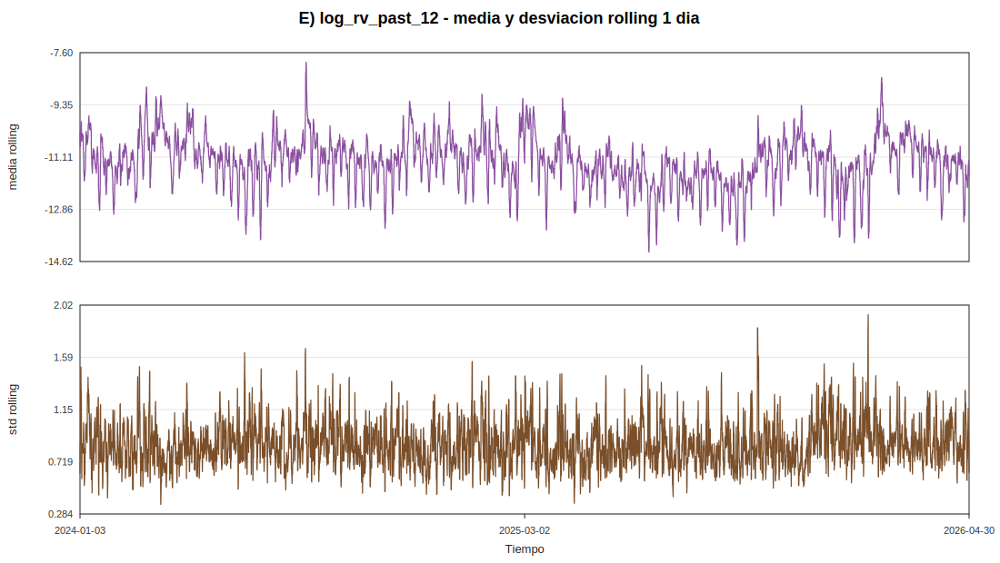

# Fase 3 - Estacionariedad y transformaciones

Dataset usado: `data/processed/btc_5m_features.csv`

Se analizan `close`, `log_close`, `r`, `abs_r` y `log_rv_past_12`. Los tests se ejecutan sin `statsmodels`; por ello se reportan estadisticos y rangos aproximados de p-value usando valores criticos asintoticos habituales. La interpretacion se basa en la combinacion de graficos, rolling moments, ADF y KPSS.

La ventana rolling usada para media y desviacion tipica es de 288 velas, equivalente a 1 dia de datos de 5 minutos.

## Nota sobre el filtro Hodrick-Prescott

No se aplica el filtro HP en esta fase. En la tesis de referencia tiene sentido como herramienta exploratoria sobre una serie macro mensual; en BTC intradia puede introducir artefactos de borde y una separacion ciclo-tendencia muy dependiente del parametro de suavizado. Para este TFG es mas defendible empezar con logaritmos, retornos, volatilidad realizada y tests de estacionariedad antes de cualquier filtrado.

## Resultados por serie

### A) close

**ADF**

| series | selected_lag | adf_statistic | critical_5pct | p_value_range | reject_unit_root_5pct |
| --- | --- | --- | --- | --- | --- |
| close | 2 | -1.97887 | -2.86 | > 0.10 | False |

**KPSS**

| series | nlags | kpss_statistic | critical_5pct | p_value_range | reject_stationarity_5pct |
| --- | --- | --- | --- | --- | --- |
| close | 84 | 137.359 | 0.463 | < 0.01 | True |

**Momentos rolling**

| series | raw_mean_first_half | raw_mean_second_half | raw_std_first_half | raw_std_second_half | rolling_mean_min | rolling_mean_max | rolling_std_min | rolling_std_max |
| --- | --- | --- | --- | --- | --- | --- | --- | --- |
| close | 70434.4 | 94929.9 | 17605.8 | 16707.7 | 39386.3 | 124674 | 53.4144 | 4169.11 |

Interpretacion media: No. La media rolling cambia con el nivel del mercado.

Interpretacion varianza: No clara. La desviacion rolling cambia por regimenes de precio y actividad.

Lectura conjunta de tests: ADF no rechaza raiz unitaria y KPSS rechaza estacionariedad en nivel.

Conclusion: El precio bruto no es una buena variable principal para reconstruccion: mezcla nivel, tendencia y cambios de escala.

### B) log_close

**ADF**

| series | selected_lag | adf_statistic | critical_5pct | p_value_range | reject_unit_root_5pct |
| --- | --- | --- | --- | --- | --- |
| log_close | 2 | -2.23414 | -2.86 | > 0.10 | False |

**KPSS**

| series | nlags | kpss_statistic | critical_5pct | p_value_range | reject_stationarity_5pct |
| --- | --- | --- | --- | --- | --- |
| log_close | 84 | 143.541 | 0.463 | < 0.01 | True |

**Momentos rolling**

| series | raw_mean_first_half | raw_mean_second_half | raw_std_first_half | raw_std_second_half | rolling_mean_min | rolling_mean_max | rolling_std_min | rolling_std_max |
| --- | --- | --- | --- | --- | --- | --- | --- | --- |
| log_close | 11.1318 | 11.4446 | 0.24742 | 0.18275 | 10.5811 | 11.7335 | 0.000700212 | 0.0610115 |

Interpretacion media: No. El logaritmo reduce escala, pero conserva cambios persistentes de nivel.

Interpretacion varianza: Algo mas estable que close, pero todavia con regimenes visibles.

Lectura conjunta de tests: ADF no rechaza raiz unitaria y KPSS rechaza estacionariedad en nivel.

Conclusion: El log precio es mejor para visualizar cambios relativos, pero no debe ser la serie principal del analisis no lineal.

### C) r

**ADF**

| series | selected_lag | adf_statistic | critical_5pct | p_value_range | reject_unit_root_5pct |
| --- | --- | --- | --- | --- | --- |
| r | 1 | -357.691 | -2.86 | < 0.01 | True |

**KPSS**

| series | nlags | kpss_statistic | critical_5pct | p_value_range | reject_stationarity_5pct |
| --- | --- | --- | --- | --- | --- |
| r | 84 | 0.272421 | 0.463 | > 0.10 | False |

**Momentos rolling**

| series | raw_mean_first_half | raw_mean_second_half | raw_std_first_half | raw_std_second_half | rolling_mean_min | rolling_mean_max | rolling_std_min | rolling_std_max |
| --- | --- | --- | --- | --- | --- | --- | --- | --- |
| r | 5.45024e-06 | -9.73152e-07 | 0.00166469 | 0.00141748 | -0.000726065 | 0.000539336 | 0.000271011 | 0.00677034 |

Interpretacion media: Aproximadamente si: la media rolling oscila alrededor de cero.

Interpretacion varianza: No estricta: la desviacion rolling cambia durante shocks y periodos tranquilos.

Lectura conjunta de tests: ADF rechaza raiz unitaria y KPSS no rechaza estacionariedad en nivel.

Conclusion: Los retornos son adecuados para estudiar variacion de corto plazo, pero la heterocedasticidad motiva trabajar tambien con volatilidad.

### D) abs_r

**ADF**

| series | selected_lag | adf_statistic | critical_5pct | p_value_range | reject_unit_root_5pct |
| --- | --- | --- | --- | --- | --- |
| abs_r | 12 | -71.1873 | -2.86 | < 0.01 | True |

**KPSS**

| series | nlags | kpss_statistic | critical_5pct | p_value_range | reject_stationarity_5pct |
| --- | --- | --- | --- | --- | --- |
| abs_r | 84 | 8.48005 | 0.463 | < 0.01 | True |

**Momentos rolling**

| series | raw_mean_first_half | raw_mean_second_half | raw_std_first_half | raw_std_second_half | rolling_mean_min | rolling_mean_max | rolling_std_min | rolling_std_max |
| --- | --- | --- | --- | --- | --- | --- | --- | --- |
| abs_r | 0.00107678 | 0.000892771 | 0.00126955 | 0.00110101 | 0.000176766 | 0.00495646 | 0.00019251 | 0.00563876 |

Interpretacion media: No estricta: el nivel medio de |r| sube y baja por clusters.

Interpretacion varianza: No estricta: hay colas y episodios extremos.

Lectura conjunta de tests: ADF rechaza raiz unitaria, pero KPSS rechaza estacionariedad en nivel. La lectura prudente es estacionariedad imperfecta o cambios de regimen.

Conclusion: `abs_r` es una proxy simple de volatilidad y muestra clustering, pero es mas ruidosa que una volatilidad realizada agregada.

### E) log_rv_past_12

**ADF**

| series | selected_lag | adf_statistic | critical_5pct | p_value_range | reject_unit_root_5pct |
| --- | --- | --- | --- | --- | --- |
| log_rv_past_12 | 12 | -40.334 | -2.86 | < 0.01 | True |

**KPSS**

| series | nlags | kpss_statistic | critical_5pct | p_value_range | reject_stationarity_5pct |
| --- | --- | --- | --- | --- | --- |
| log_rv_past_12 | 84 | 10.4994 | 0.463 | < 0.01 | True |

**Momentos rolling**

| series | raw_mean_first_half | raw_mean_second_half | raw_std_first_half | raw_std_second_half | rolling_mean_min | rolling_mean_max | rolling_std_min | rolling_std_max |
| --- | --- | --- | --- | --- | --- | --- | --- | --- |
| log_rv_past_12 | -11.0851 | -11.4662 | 1.17785 | 1.22638 | -14.298 | -7.91865 | 0.36268 | 1.94494 |

Interpretacion media: Mas plausible que en precios, aunque no perfectamente constante por cambios de regimen de volatilidad.

Interpretacion varianza: Mas estable tras logaritmo, pero todavia sensible a episodios extremos.

Lectura conjunta de tests: ADF rechaza raiz unitaria, pero KPSS rechaza estacionariedad en nivel. La lectura prudente es estacionariedad imperfecta o cambios de regimen.

Conclusion: `log_rv_past_12` equilibra interpretabilidad, menor ruido que |r| y ausencia de nivel de precio. Se mantiene como v_t para el resto del TFG.

## Comparacion global

### ADF

| series | selected_lag | nobs | adf_statistic | critical_1pct | critical_5pct | critical_10pct | p_value_range | reject_unit_root_5pct |
| --- | --- | --- | --- | --- | --- | --- | --- | --- |
| close | 2 | 244749 | -1.97887 | -3.43 | -2.86 | -2.57 | > 0.10 | False |
| log_close | 2 | 244749 | -2.23414 | -3.43 | -2.86 | -2.57 | > 0.10 | False |
| r | 1 | 244750 | -357.691 | -3.43 | -2.86 | -2.57 | < 0.01 | True |
| abs_r | 12 | 244739 | -71.1873 | -3.43 | -2.86 | -2.57 | < 0.01 | True |
| log_rv_past_12 | 12 | 244739 | -40.334 | -3.43 | -2.86 | -2.57 | < 0.01 | True |

### KPSS

| series | nlags | nobs | kpss_statistic | critical_1pct | critical_5pct | critical_10pct | p_value_range | reject_stationarity_5pct |
| --- | --- | --- | --- | --- | --- | --- | --- | --- |
| close | 84 | 244752 | 137.359 | 0.739 | 0.463 | 0.347 | < 0.01 | True |
| log_close | 84 | 244752 | 143.541 | 0.739 | 0.463 | 0.347 | < 0.01 | True |
| r | 84 | 244752 | 0.272421 | 0.739 | 0.463 | 0.347 | > 0.10 | False |
| abs_r | 84 | 244752 | 8.48005 | 0.739 | 0.463 | 0.347 | < 0.01 | True |
| log_rv_past_12 | 84 | 244752 | 10.4994 | 0.739 | 0.463 | 0.347 | < 0.01 | True |

## Conclusion parcial

El precio y el log precio no son adecuados como serie principal: sus graficos y momentos rolling muestran cambios de nivel persistentes, y los tests no ofrecen una imagen de estacionariedad limpia. Los retornos corrigen el problema de nivel y se centran alrededor de cero, pero mantienen varianza variable. `abs_r` y `log_rv_past_12` capturan la dinamica de volatilidad; entre ellas, `log_rv_past_12` es menos ruidosa y conserva estructura temporal relevante. Por tanto, se mantiene `v_t = log_rv_past_12` como serie principal para las fases siguientes. log_rv_past_12 es más adecuada que el precio y el log-precio, no parece tener raíz unitaria, pero conserva cambios de régimen y estacionariedad imperfecta.

En esta iteración se ha completado la Fase 3 del proyecto, dedicada al análisis de estacionariedad y transformaciones de las principales series construidas en fases anteriores. El objetivo de esta fase es determinar qué variable resulta más adecuada como objeto principal del análisis dinámico posterior.

Se parte del dataset data/processed/btc_5m_features.csv y se analizan cinco series: close, log_close, r, abs_r y log_rv_past_12. Para cada una de ellas se generan gráficos temporales, gráficos de media y desviación típica rolling, y se aplican contrastes ADF y KPSS. La ventana rolling utilizada es de 288 observaciones, equivalente a un día de datos de 5 minutos.

Los resultados muestran que el precio bruto close no es adecuado como serie principal, ya que presenta cambios persistentes de nivel. El test ADF no rechaza la presencia de raíz unitaria y el test KPSS rechaza la estacionariedad en nivel. El logaritmo del precio, log_close, reduce los problemas de escala y facilita la interpretación de cambios relativos, pero sigue conservando una estructura de nivel persistente, por lo que tampoco se considera una serie adecuada para el análisis dinámico principal.

Los retornos logarítmicos r corrigen el problema de nivel del precio. Su media rolling oscila alrededor de cero y los contrastes ADF y KPSS ofrecen una imagen más compatible con estacionariedad en media. Sin embargo, la desviación típica rolling muestra variaciones importantes durante periodos de estrés y tranquilidad, lo que apunta a heterocedasticidad y motiva el estudio explícito de la volatilidad.

La serie abs_r funciona como una proxy simple de volatilidad, pero presenta mucho ruido y cambios de régimen. Por ello, aunque resulta útil para observar clustering de volatilidad, no se toma como serie principal. En cambio, log_rv_past_12 resume la volatilidad realizada de la última hora en escala logarítmica, reduciendo parte del ruido de los retornos absolutos y eliminando el problema de nivel del precio.

La lectura conjunta de los resultados indica que log_rv_past_12 no presenta una raíz unitaria clara, aunque sí muestra estacionariedad imperfecta y posibles cambios de régimen, algo esperable en series de volatilidad financiera. Por tanto, se mantiene v_t = log_rv_past_12 como serie principal para las siguientes fases del TFG, especialmente el análisis de autocorrelación, recurrencia y reconstrucción del espacio de estados.