# Fase 4 - Correlograma y espectro

Dataset usado: `data/processed/btc_5m_features.csv`

Se analizan `r`, `abs_r` y `log_rv_past_12`. La serie principal del TFG sigue siendo `v_t = log_rv_past_12`.

Las bandas de ACF/PACF son ±1.96/sqrt(n). Son orientativas: en series financieras con colas pesadas, heterocedasticidad y dependencia temporal, no deben interpretarse como contrastes exactos de ruido blanco.

El periodograma se calcula tras restar la media y se representa frente al periodo equivalente en retardos de 5 minutos, usando escala log para mostrar conjuntamente 1 hora, 1 dia y 1 semana.

## Resultados por serie

### Retornos logaritmicos r

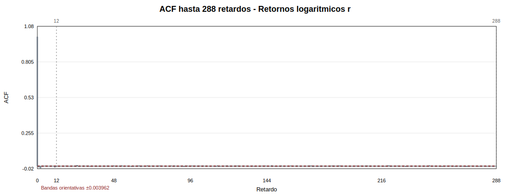

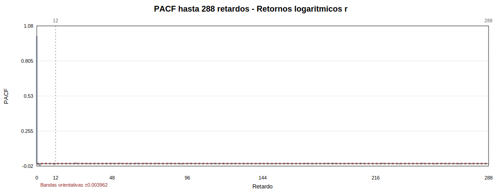

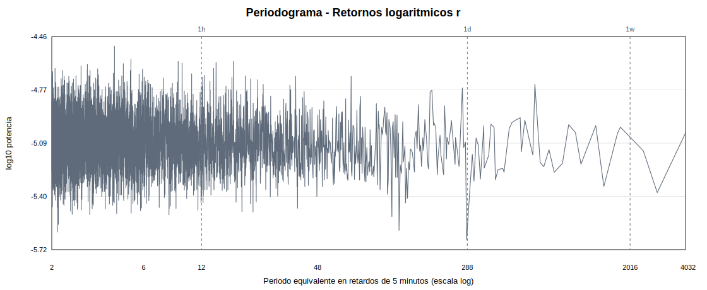

**Resumen de correlograma**

| series | acf_lag_1 | acf_lag_12 | acf_lag_288 | acf_lag_2016 | acf_significant_lags_1_288 | pacf_lag_1 | pacf_lag_12 | pacf_significant_lags_1_288 |
| --- | --- | --- | --- | --- | --- | --- | --- | --- |
| r | -0.0102611 | 0.00327008 | 0.000870851 | -0.00130255 | 55 | -0.0102611 | 0.00298275 | 54 |

**Principales picos espectrales**

| rank | period_lags | period_hours | period_days | power | nearest_reference |
| --- | --- | --- | --- | --- | --- |
| 1 | 4.23414 | 0.352845 | 0.0147019 | 3.06035e-05 |  |
| 2 | 5.15555 | 0.429629 | 0.0179012 | 2.56324e-05 |  |
| 3 | 17.557 | 1.46309 | 0.0609619 | 2.49341e-05 |  |
| 4 | 9.06853 | 0.755711 | 0.031488 | 2.48405e-05 |  |
| 5 | 14.2687 | 1.18906 | 0.049544 | 2.45464e-05 |  |
| 6 | 9.5021 | 0.791842 | 0.0329934 | 2.43533e-05 |  |

**Potencia en referencias temporales**

| reference_label | reference_period_lags | nearest_period_lags | power |
| --- | --- | --- | --- |
| 1 hora | 12 | 12.0002 | 2.71164e-07 |
| 1 dia | 288 | 288.07 | 3.05883e-08 |
| 1 semana | 2016 | 2016.49 | 1.57028e-06 |

Interpretacion ACF/PACF: La ACF de `r` es muy pequena en retardos relevantes: lag 1 = -0.01026, lag 12 = 0.00327, lag 288 = 0.0008709. Aunque una muestra tan grande hace que algunos spikes superen bandas orientativas, la magnitud economica de la dependencia lineal directa es reducida.

Interpretacion espectral: El periodograma de `r` no debe leerse como una prueba de ciclos deterministas. Los picos principales en el rango inspeccionado son: 4.2 retardos (0.35 h); 5.2 retardos (0.43 h); 17.6 retardos (1.46 h). En retornos, estos picos pueden reflejar microestructura, actividad horaria o eventos extremos.

Conclusion: Los retornos parecen dificiles de predecir linealmente a partir de sus propios retardos. Esto justifica no usar el precio ni el retorno bruto como serie central para reconstruccion.

### Retornos absolutos |r|

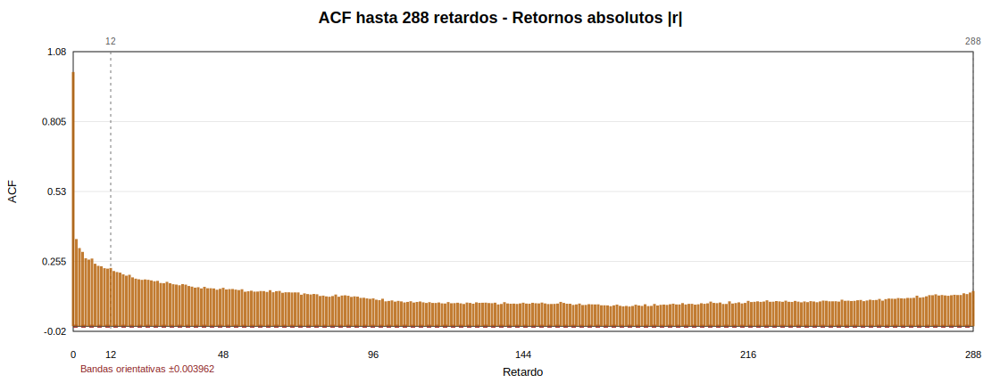

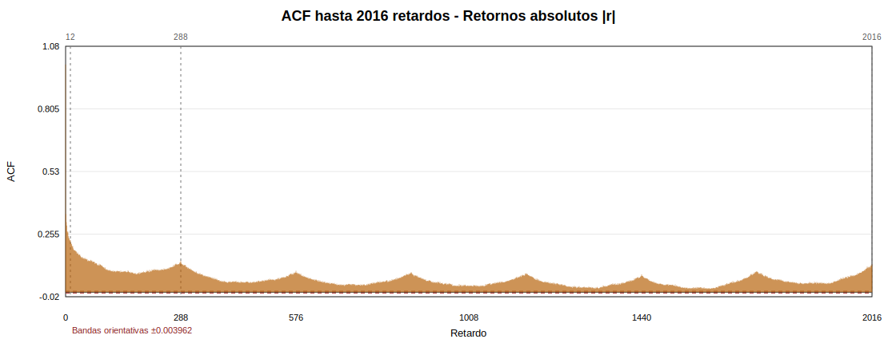

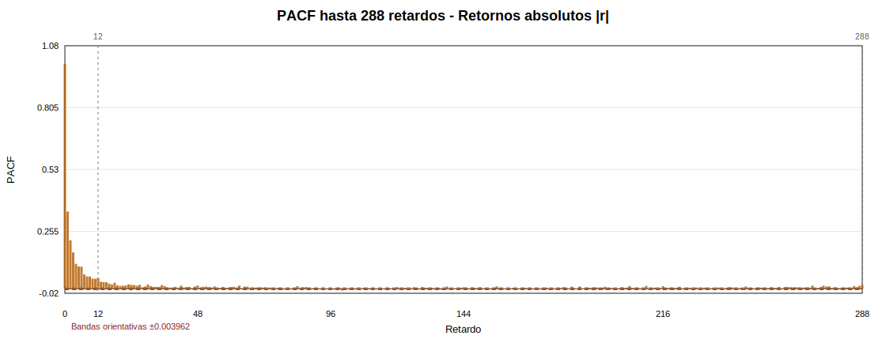

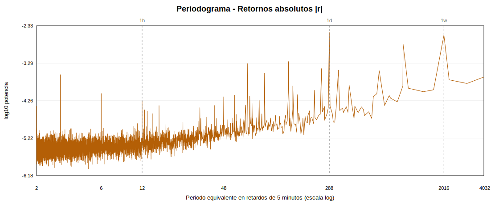

**Resumen de correlograma**

| series | acf_lag_1 | acf_lag_12 | acf_lag_288 | acf_lag_2016 | acf_significant_lags_1_288 | pacf_lag_1 | pacf_lag_12 | pacf_significant_lags_1_288 |
| --- | --- | --- | --- | --- | --- | --- | --- | --- |
| abs_r | 0.34292 | 0.229202 | 0.138541 | 0.122675 | 288 | 0.34292 | 0.0479334 | 157 |

**Principales picos espectrales**

| rank | period_lags | period_hours | period_days | power | nearest_reference |
| --- | --- | --- | --- | --- | --- |
| 1 | 288.07 | 24.0059 | 1.00024 | 0.00313072 | 1 dia |
| 2 | 2016.49 | 168.041 | 7.00171 | 0.00268486 | 1 semana |
| 3 | 1008.25 | 84.0205 | 3.50085 | 0.00157776 |  |
| 4 | 144.035 | 12.0029 | 0.500122 | 0.000560338 |  |
| 5 | 71.9978 | 5.99982 | 0.249992 | 0.000495145 |  |
| 6 | 252.062 | 21.0051 | 0.875214 | 0.000368619 |  |

**Potencia en referencias temporales**

| reference_label | reference_period_lags | nearest_period_lags | power |
| --- | --- | --- | --- |
| 1 hora | 12 | 12.0002 | 5.30454e-05 |
| 1 dia | 288 | 288.07 | 0.00313072 |
| 1 semana | 2016 | 2016.49 | 0.00268486 |

Interpretacion ACF/PACF: `abs_r` presenta autocorrelacion positiva mucho mas clara: lag 1 = 0.3429, lag 12 = 0.2292, lag 288 = 0.1385. Esto es compatible con clustering de volatilidad.

Interpretacion espectral: El espectro de `abs_r` concentra potencia en periodos recurrentes. Picos destacados: 288.1 retardos (24.01 h, cerca de 1 dia); 2016.5 retardos (168.04 h, cerca de 1 semana); 1008.2 retardos (84.02 h). La lectura es prudente: periodicidad operativa o de actividad no implica dinamica caotica.

Conclusion: `abs_r` muestra dependencia en intensidad de movimientos, pero es una medida mas ruidosa que la volatilidad realizada agregada.

### v_t = log_rv_past_12

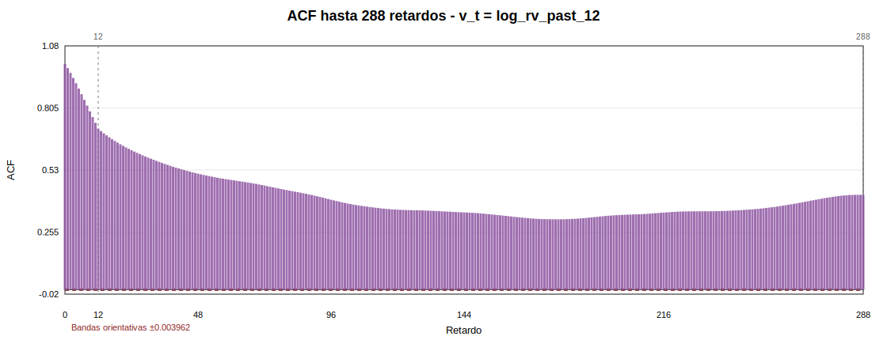

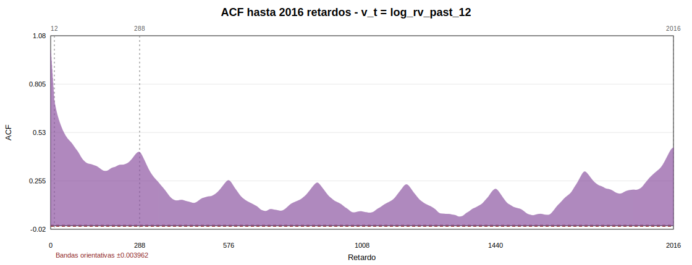

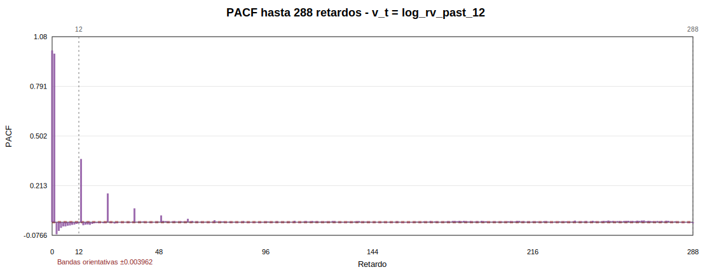

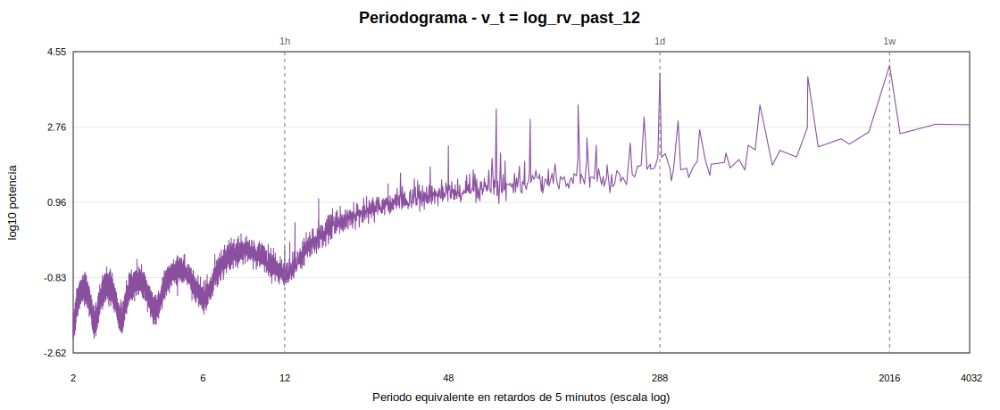

**Resumen de correlograma**

| series | acf_lag_1 | acf_lag_12 | acf_lag_288 | acf_lag_2016 | acf_significant_lags_1_288 | pacf_lag_1 | pacf_lag_12 | pacf_significant_lags_1_288 |
| --- | --- | --- | --- | --- | --- | --- | --- | --- |
| log_rv_past_12 | 0.981392 | 0.713859 | 0.419326 | 0.444135 | 288 | 0.981392 | -0.00594039 | 123 |

**Principales picos espectrales**

| rank | period_lags | period_hours | period_days | power | nearest_reference |
| --- | --- | --- | --- | --- | --- |
| 1 | 2016.49 | 168.041 | 7.00171 | 16850.4 | 1 semana |
| 2 | 288.07 | 24.0059 | 1.00024 | 10919.7 | 1 dia |
| 3 | 1008.25 | 84.0205 | 3.50085 | 9036.96 |  |
| 4 | 672.164 | 56.0137 | 2.3339 | 1929.43 |  |
| 5 | 144.035 | 12.0029 | 0.500122 | 1926.22 |  |
| 6 | 71.9978 | 5.99982 | 0.249992 | 1543.62 |  |

**Potencia en referencias temporales**

| reference_label | reference_period_lags | nearest_period_lags | power |
| --- | --- | --- | --- |
| 1 hora | 12 | 12.0002 | 0.797781 |
| 1 dia | 288 | 288.07 | 10919.7 |
| 1 semana | 2016 | 2016.49 | 16850.4 |

Interpretacion ACF/PACF: `log_rv_past_12` muestra persistencia marcada: lag 1 = 0.9814, lag 12 = 0.7139, lag 288 = 0.4193. Parte de la autocorrelacion de corto plazo procede mecanicamente del solapamiento de la ventana de 12 velas, pero la persistencia se extiende mas alla de ese horizonte.

Interpretacion espectral: El periodograma de la serie principal muestra picos en el rango de periodos intradia/semanales: 2016.5 retardos (168.04 h, cerca de 1 semana); 288.1 retardos (24.01 h, cerca de 1 dia); 1008.2 retardos (84.02 h). Estos picos sugieren estructura temporal o actividad recurrente, no una prueba de caos.

Conclusion: La serie `v_t = log_rv_past_12` contiene estructura temporal suficiente para justificar las fases posteriores de recurrencia y reconstruccion del espacio de estados.

## Conclusion global

La informacion lineal y espectral confirma una separacion clara entre retornos y medidas de volatilidad. `r` presenta autocorrelaciones de magnitud pequena, por lo que su predictibilidad lineal directa parece limitada. `abs_r` y, de forma mas clara, `log_rv_past_12`, muestran persistencia positiva compatible con clustering de volatilidad. En `log_rv_past_12` debe recordarse que el solapamiento de la ventana de 12 velas aumenta la autocorrelacion de corto plazo, pero la estructura se extiende a retardos superiores. Esta fase no aporta evidencia de caos; solo documenta dependencia temporal, persistencia, posibles periodicidades operativas y clustering de volatilidad. Con ello queda justificado continuar hacia recurrencia y reconstruccion del espacio de estados usando `v_t = log_rv_past_12`.

Resultados importante:

r

ACF lag 1    = -0.0102611
ACF lag 12   = 0.00327008
ACF lag 288  = 0.000870851
ACF lag 2016 = -0.00130255

PACF lag 1   = -0.0102611
PACF lag 12  = 0.00298275

picos periodograma

4.23 retardos  ≈ 0.35 horas
5.16 retardos  ≈ 0.43 horas
17.56 retardos ≈ 1.46 horas

r sirve como comparación, pero no como serie principal para reconstrucción dinámica.

abs_r

ACF lag 1    = 0.34292
ACF lag 12   = 0.229202
ACF lag 288  = 0.138541
ACF lag 2016 = 0.122675

PACF lag 1   = 0.34292
PACF lag 12  = 0.0479334

picos periodograma

288.07 retardos   ≈ 24.01 horas  ≈ 1 día
2016.49 retardos  ≈ 168.04 horas ≈ 1 semana
1008.25 retardos  ≈ 84.02 horas  ≈ 3.5 días

abs_r confirma que la estructura interesante no está en el signo del retorno, sino en la intensidad del movimiento.

log_rv_past_12

ACF lag 1    = 0.981392
ACF lag 12   = 0.713859
ACF lag 288  = 0.419326
ACF lag 2016 = 0.444135

PACF lag 1   = 0.981392
PACF lag 12  = -0.00594039

picos periodograma

2016.49 retardos  ≈ 168.04 horas ≈ 1 semana
288.07 retardos   ≈ 24.01 horas  ≈ 1 día
1008.25 retardos  ≈ 84.02 horas  ≈ 3.5 días
672.16 retardos   ≈ 56.01 horas
144.04 retardos   ≈ 12.00 horas
71.99 retardos    ≈ 6.00 horas

log_rv_past_12 queda confirmada como la serie principal v_t para las siguientes fases.

En esta iteración se ha completado la Fase 4 del proyecto, dedicada al análisis de correlogramas y espectro de potencia. El objetivo de esta fase es estudiar la dependencia lineal, la persistencia temporal y las posibles periodicidades de las principales series transformadas.

Se parte del dataset data/processed/btc_5m_features.csv y se analizan tres series: r, abs_r y log_rv_past_12. La serie principal del TFG sigue siendo v_t = log_rv_past_12, mientras que r y abs_r se utilizan como series de comparación para justificar la elección de una medida de volatilidad como objeto principal del análisis dinámico.

Para cada serie se calcula la ACF hasta 288 retardos, equivalente a un día de datos de 5 minutos, y hasta 2016 retardos, equivalente a una semana. También se calcula la PACF hasta 288 retardos y el periodograma, representado frente al periodo equivalente en retardos de 5 minutos. Además, se registran los principales picos espectrales y la potencia asociada a referencias temporales de 1 hora, 1 día y 1 semana.

Los resultados muestran que los retornos logarítmicos r presentan autocorrelaciones de magnitud muy reducida. Aunque algunos retardos superan las bandas orientativas de significación debido al gran tamaño muestral, la dependencia lineal directa es económicamente pequeña. Esto sugiere que los retornos son difíciles de predecir linealmente a partir de sus propios retardos.

En cambio, abs_r presenta autocorrelación positiva clara, con valores relevantes incluso a retardos diarios y semanales. Este resultado es compatible con clustering de volatilidad: los episodios de movimientos intensos tienden a agruparse temporalmente. El periodograma de abs_r muestra picos próximos a 1 día y 1 semana, lo que sugiere periodicidades operativas o patrones recurrentes de actividad del mercado.

La serie log_rv_past_12 muestra la estructura temporal más clara. Su ACF es muy elevada en retardos cortos y permanece positiva incluso a horizontes diarios y semanales. Parte de esta autocorrelación inicial se debe mecánicamente al solapamiento de la ventana móvil de 12 velas usada para construir la volatilidad realizada. Sin embargo, la persistencia se extiende más allá de ese horizonte, lo que indica que la serie contiene estructura temporal relevante. Su periodograma presenta picos destacados alrededor de 1 semana, 1 día y otros periodos subdiarios.

La Fase 4 no permite afirmar la existencia de caos ni de dinámica determinista no lineal. Su aportación es más limitada y más precisa: documenta que los retornos tienen poca dependencia lineal directa, mientras que las medidas de volatilidad, especialmente log_rv_past_12, presentan persistencia, clustering y posibles periodicidades operativas. Estos resultados justifican continuar las siguientes fases del TFG usando v_t = log_rv_past_12 como serie principal para recurrencia y reconstrucción del espacio de estados.