# Fase 5 - Graficos de recurrencia iniciales

Dataset usado: `data/processed/btc_5m_features.csv`

Esta fase es exploratoria. Los recurrence plots se construyen sobre la serie escalar normalizada de cada ventana, antes de reconstruir el espacio de estados. Por tanto, no se interpretan como prueba de caos.

## Por que no se usa la matriz completa

Una matriz completa con las 245,088 observaciones originales tendria 245,088 x 245,088 = 60,068,127,744 celdas. Incluso tras el procesado, con 244,752 observaciones, serian 59,903,541,504 celdas. Esto es inviable en memoria para un analisis interactivo y, ademas, seria poco interpretable visualmente.

## Parametros comunes

- Tamano de ventana principal: 2,000 observaciones.
- Normalizacion: z-score calculado dentro de cada ventana y serie.
- Metrica: distancia absoluta en 1D, equivalente a euclidea escalar.
- Tasa de recurrencia objetivo: 5.0%.
- Pixel negro: par recurrente. Pixel blanco: par no recurrente.

## Ventanas seleccionadas

| window | description | start_index | end_index_exclusive | start_time | end_time | mean_log_rv_past_12 | min_log_rv_past_12 | max_log_rv_past_12 | selection_method |
| --- | --- | --- | --- | --- | --- | --- | --- | --- | --- |
| quiet | Ventana tranquila | 165846 | 167846 | 2025-07-30 20:30:00 | 2025-08-06 19:05:00 | -11.9688 | -14.4352 | -9.47072 | rolling mean de log_rv_past_12 mas cercano al percentil 10 de medias rolling de 2000 observaciones |
| high_volatility | Ventana de alta volatilidad | 185597 | 187597 | 2025-10-07 10:25:00 | 2025-10-14 09:00:00 | -11.0327 | -13.3049 | -4.6791 | ventana centrada en el maximo de log_rv_past_12 dentro del dataset procesado |
| recent | Ventana reciente | 242752 | 244752 | 2026-04-23 21:20:00 | 2026-04-30 19:55:00 | -12.0331 | -15.1949 | -8.57561 | ultimas observaciones disponibles del dataset procesado |
| middle | Ventana continua representativa | 121376 | 123376 | 2025-02-26 10:40:00 | 2025-03-05 09:15:00 | -9.98353 | -12.727 | -6.95604 | bloque continuo centrado en la mitad del dataset procesado |

## Graficos por ventana

### Ventana tranquila (quiet)

#### Retornos logaritmicos r

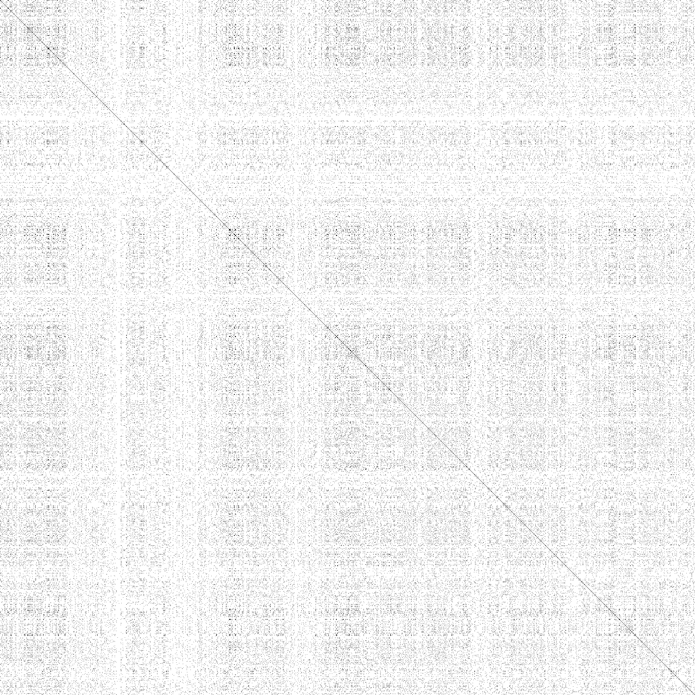

| series | window | start_time | end_time | n | normalization | metric | epsilon | target_rr | achieved_rr |
| --- | --- | --- | --- | --- | --- | --- | --- | --- | --- |
| r | quiet | 2025-07-30 20:30:00 | 2025-08-06 19:05:00 | 2000 | z-score por ventana | absolute_distance_1d | 0.0722084 | 0.05 | 0.05 |

Lectura visual: Predomina una textura fina y dispersa, cercana a ruido, con la diagonal principal esperada por identidad temporal. Las lineas diagonales fuera de la principal son cortas o poco persistentes; los cambios de textura aparecen mas como bandas puntuales que como bloques estables. En la ventana tranquila los patrones son menos abruptos, aunque siguen apareciendo pequenas zonas densas asociadas a niveles bajos de volatilidad.

#### Retornos absolutos |r|

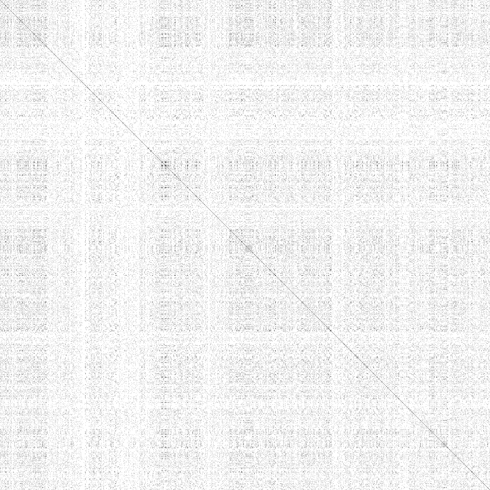

| series | window | start_time | end_time | n | normalization | metric | epsilon | target_rr | achieved_rr |
| --- | --- | --- | --- | --- | --- | --- | --- | --- | --- |
| abs_r | quiet | 2025-07-30 20:30:00 | 2025-08-06 19:05:00 | 2000 | z-score por ventana | absolute_distance_1d | 0.0522476 | 0.05 | 0.05 |

Lectura visual: Aparecen mas agrupaciones y pequenos bloques que en `r`, porque la serie recoge intensidad y no signo. Las bandas verticales/horizontales senalan intervalos con niveles de movimiento parecidos a muchos otros momentos; esto es compatible con clustering de volatilidad. En la ventana tranquila los patrones son menos abruptos, aunque siguen apareciendo pequenas zonas densas asociadas a niveles bajos de volatilidad.

#### v_t = log_rv_past_12

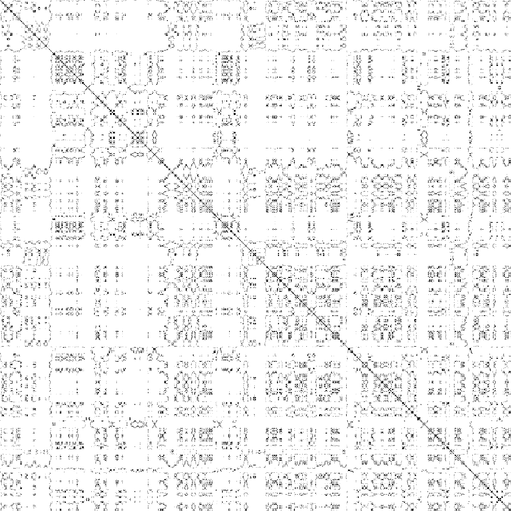

| series | window | start_time | end_time | n | normalization | metric | epsilon | target_rr | achieved_rr |
| --- | --- | --- | --- | --- | --- | --- | --- | --- | --- |
| log_rv_past_12 | quiet | 2025-07-30 20:30:00 | 2025-08-06 19:05:00 | 2000 | z-score por ventana | absolute_distance_1d | 0.0851032 | 0.05 | 0.05 |

Lectura visual: Se observan bloques y motivos rectangulares mas claros, junto con tramos diagonales secundarios mas visibles que en `r`. La textura sugiere regimenes de volatilidad y recurrencia de estados de intensidad similar. En la ventana tranquila los patrones son menos abruptos, aunque siguen apareciendo pequenas zonas densas asociadas a niveles bajos de volatilidad.

### Ventana de alta volatilidad (high_volatility)

#### Retornos logaritmicos r

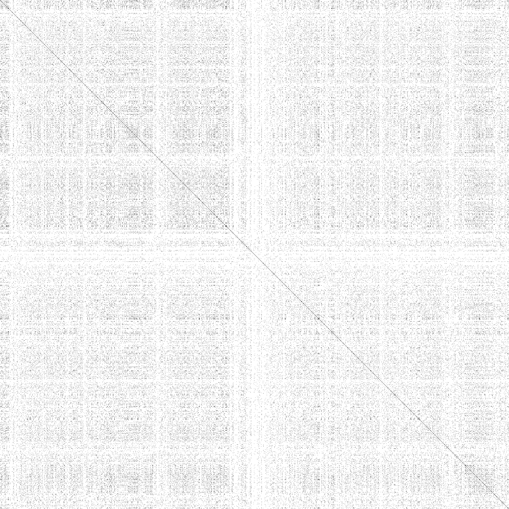

| series | window | start_time | end_time | n | normalization | metric | epsilon | target_rr | achieved_rr |
| --- | --- | --- | --- | --- | --- | --- | --- | --- | --- |
| r | high_volatility | 2025-10-07 10:25:00 | 2025-10-14 09:00:00 | 2000 | z-score por ventana | absolute_distance_1d | 0.0396758 | 0.05 | 0.05 |

Lectura visual: Predomina una textura fina y dispersa, cercana a ruido, con la diagonal principal esperada por identidad temporal. Las lineas diagonales fuera de la principal son cortas o poco persistentes; los cambios de textura aparecen mas como bandas puntuales que como bloques estables. En alta volatilidad destacan rupturas de textura y zonas densas alrededor del episodio extremo; esto apunta a cambio de regimen, no a una prueba de caos.

#### Retornos absolutos |r|

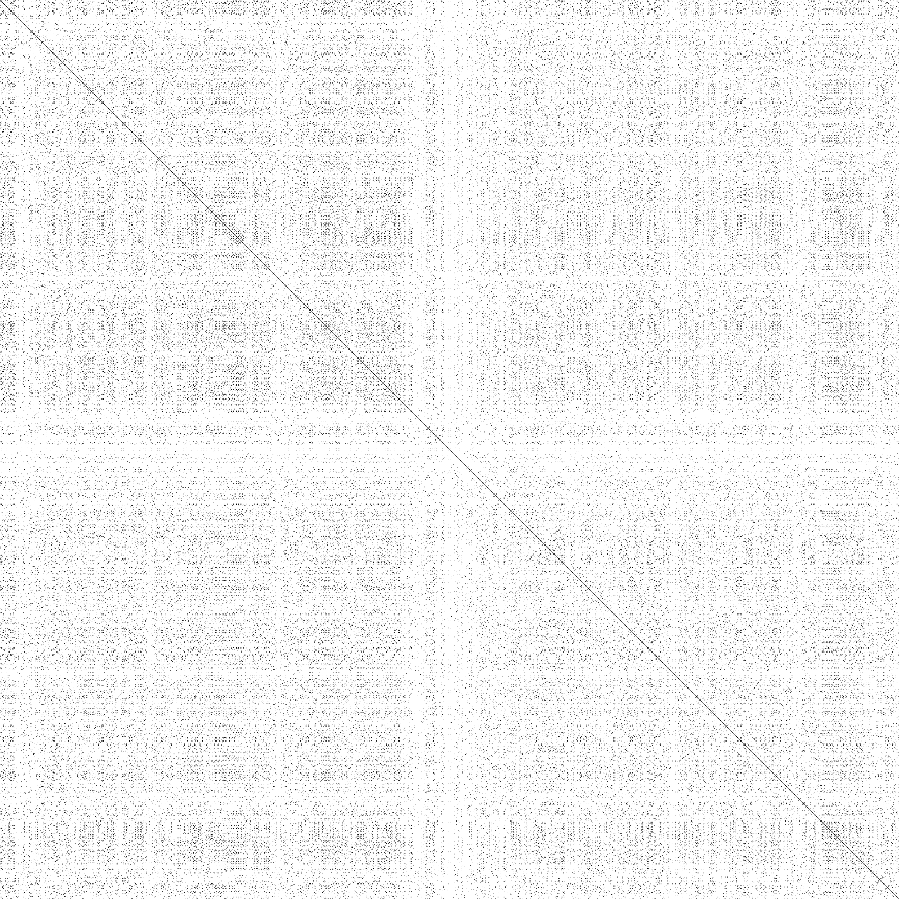

| series | window | start_time | end_time | n | normalization | metric | epsilon | target_rr | achieved_rr |
| --- | --- | --- | --- | --- | --- | --- | --- | --- | --- |
| abs_r | high_volatility | 2025-10-07 10:25:00 | 2025-10-14 09:00:00 | 2000 | z-score por ventana | absolute_distance_1d | 0.0224419 | 0.05 | 0.05 |

Lectura visual: Aparecen mas agrupaciones y pequenos bloques que en `r`, porque la serie recoge intensidad y no signo. Las bandas verticales/horizontales senalan intervalos con niveles de movimiento parecidos a muchos otros momentos; esto es compatible con clustering de volatilidad. En alta volatilidad destacan rupturas de textura y zonas densas alrededor del episodio extremo; esto apunta a cambio de regimen, no a una prueba de caos.

#### v_t = log_rv_past_12

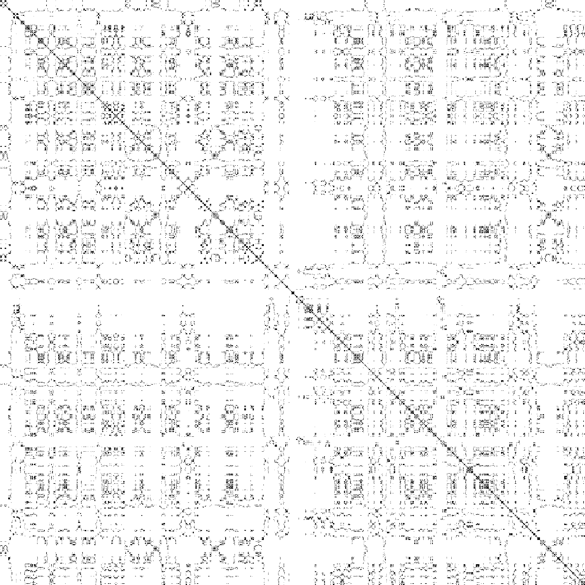

| series | window | start_time | end_time | n | normalization | metric | epsilon | target_rr | achieved_rr |
| --- | --- | --- | --- | --- | --- | --- | --- | --- | --- |
| log_rv_past_12 | high_volatility | 2025-10-07 10:25:00 | 2025-10-14 09:00:00 | 2000 | z-score por ventana | absolute_distance_1d | 0.0751379 | 0.05 | 0.05 |

Lectura visual: Se observan bloques y motivos rectangulares mas claros, junto con tramos diagonales secundarios mas visibles que en `r`. La textura sugiere regimenes de volatilidad y recurrencia de estados de intensidad similar. En alta volatilidad destacan rupturas de textura y zonas densas alrededor del episodio extremo; esto apunta a cambio de regimen, no a una prueba de caos.

### Ventana reciente (recent)

#### Retornos logaritmicos r

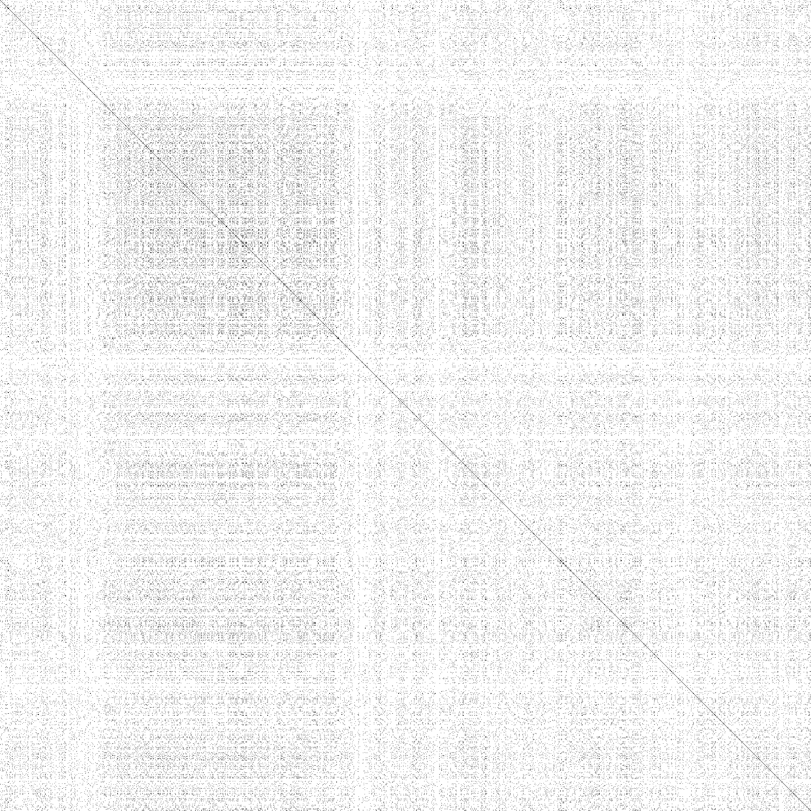

| series | window | start_time | end_time | n | normalization | metric | epsilon | target_rr | achieved_rr |
| --- | --- | --- | --- | --- | --- | --- | --- | --- | --- |
| r | recent | 2026-04-23 21:20:00 | 2026-04-30 19:55:00 | 2000 | z-score por ventana | absolute_distance_1d | 0.0607894 | 0.05 | 0.05 |

Lectura visual: Predomina una textura fina y dispersa, cercana a ruido, con la diagonal principal esperada por identidad temporal. Las lineas diagonales fuera de la principal son cortas o poco persistentes; los cambios de textura aparecen mas como bandas puntuales que como bloques estables. La ventana reciente funciona como contraste: permite comprobar si la estructura aparece tambien fuera del shock principal.

#### Retornos absolutos |r|

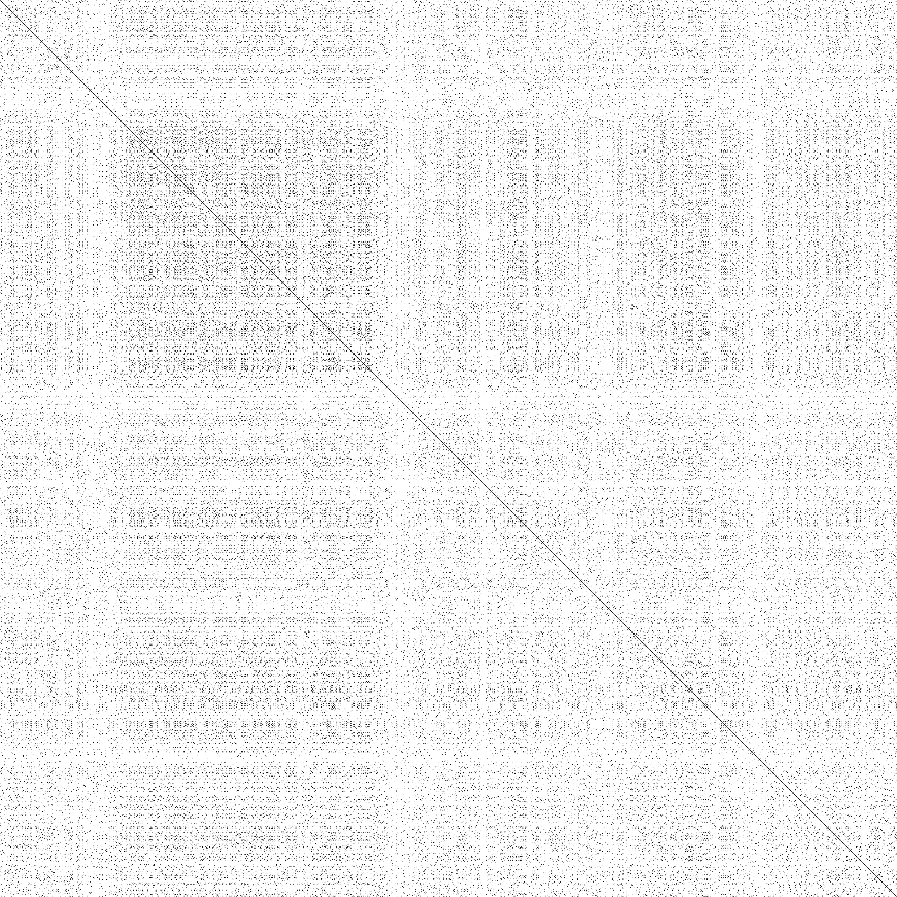

| series | window | start_time | end_time | n | normalization | metric | epsilon | target_rr | achieved_rr |
| --- | --- | --- | --- | --- | --- | --- | --- | --- | --- |
| abs_r | recent | 2026-04-23 21:20:00 | 2026-04-30 19:55:00 | 2000 | z-score por ventana | absolute_distance_1d | 0.0408924 | 0.05 | 0.05 |

Lectura visual: Aparecen mas agrupaciones y pequenos bloques que en `r`, porque la serie recoge intensidad y no signo. Las bandas verticales/horizontales senalan intervalos con niveles de movimiento parecidos a muchos otros momentos; esto es compatible con clustering de volatilidad. La ventana reciente funciona como contraste: permite comprobar si la estructura aparece tambien fuera del shock principal.

#### v_t = log_rv_past_12

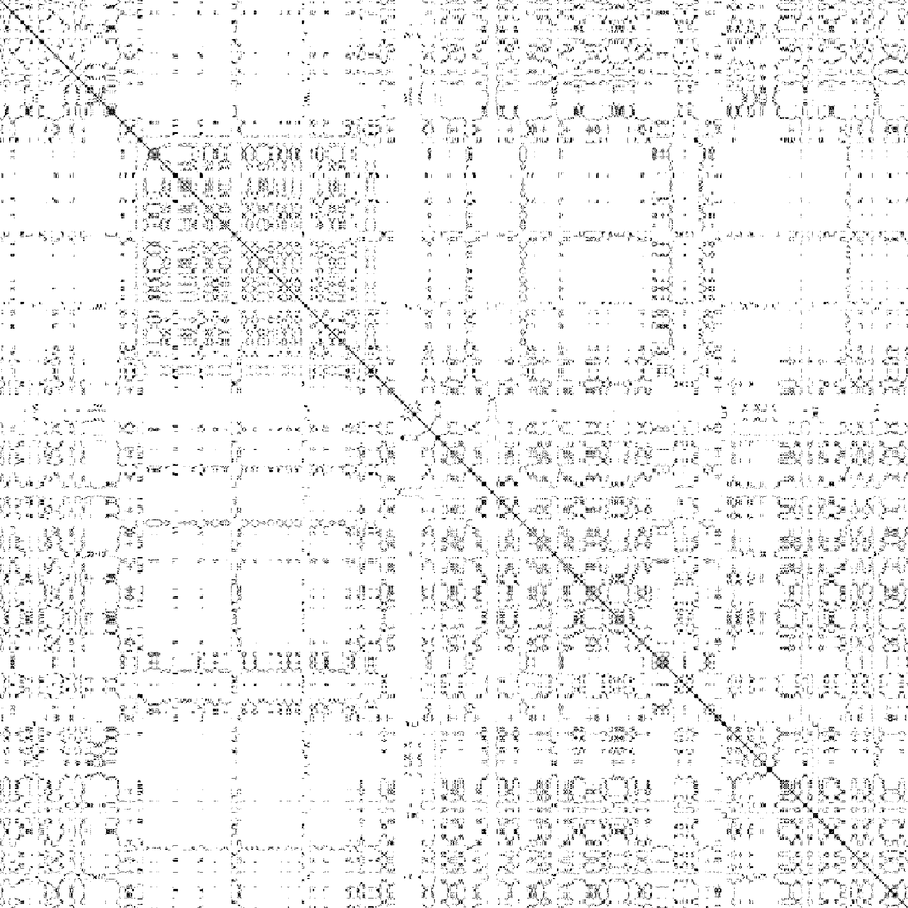

| series | window | start_time | end_time | n | normalization | metric | epsilon | target_rr | achieved_rr |
| --- | --- | --- | --- | --- | --- | --- | --- | --- | --- |
| log_rv_past_12 | recent | 2026-04-23 21:20:00 | 2026-04-30 19:55:00 | 2000 | z-score por ventana | absolute_distance_1d | 0.0875331 | 0.05 | 0.05 |

Lectura visual: Se observan bloques y motivos rectangulares mas claros, junto con tramos diagonales secundarios mas visibles que en `r`. La textura sugiere regimenes de volatilidad y recurrencia de estados de intensidad similar. La ventana reciente funciona como contraste: permite comprobar si la estructura aparece tambien fuera del shock principal.

### Ventana continua representativa (middle)

#### Retornos logaritmicos r

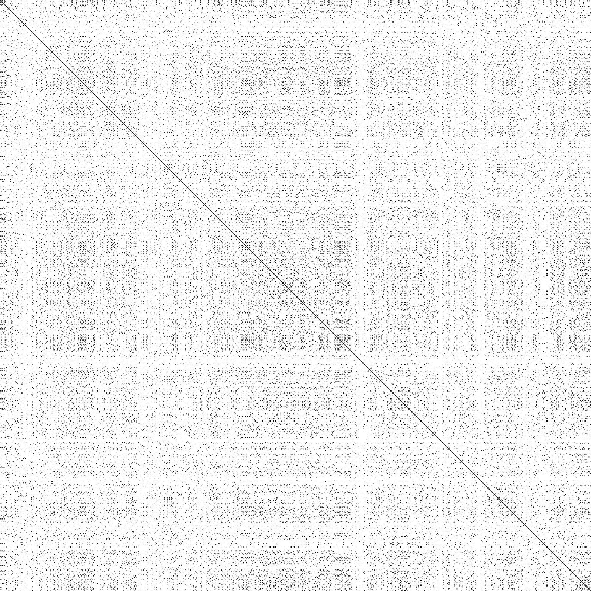

| series | window | start_time | end_time | n | normalization | metric | epsilon | target_rr | achieved_rr |
| --- | --- | --- | --- | --- | --- | --- | --- | --- | --- |
| r | middle | 2025-02-26 10:40:00 | 2025-03-05 09:15:00 | 2000 | z-score por ventana | absolute_distance_1d | 0.0652727 | 0.05 | 0.05 |

Lectura visual: Predomina una textura fina y dispersa, cercana a ruido, con la diagonal principal esperada por identidad temporal. Las lineas diagonales fuera de la principal son cortas o poco persistentes; los cambios de textura aparecen mas como bandas puntuales que como bloques estables. La ventana media proporciona una referencia continua no elegida por extremos, util para comparar textura ordinaria frente a ventanas tranquila y extrema.

#### Retornos absolutos |r|

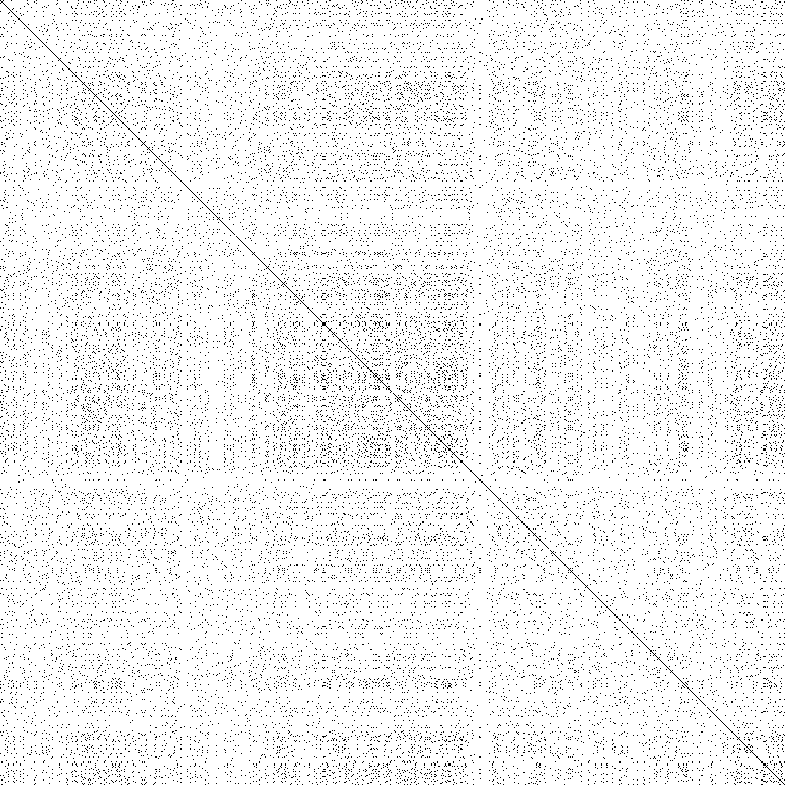

| series | window | start_time | end_time | n | normalization | metric | epsilon | target_rr | achieved_rr |
| --- | --- | --- | --- | --- | --- | --- | --- | --- | --- |
| abs_r | middle | 2025-02-26 10:40:00 | 2025-03-05 09:15:00 | 2000 | z-score por ventana | absolute_distance_1d | 0.044898 | 0.05 | 0.05 |

Lectura visual: Aparecen mas agrupaciones y pequenos bloques que en `r`, porque la serie recoge intensidad y no signo. Las bandas verticales/horizontales senalan intervalos con niveles de movimiento parecidos a muchos otros momentos; esto es compatible con clustering de volatilidad. La ventana media proporciona una referencia continua no elegida por extremos, util para comparar textura ordinaria frente a ventanas tranquila y extrema.

#### v_t = log_rv_past_12

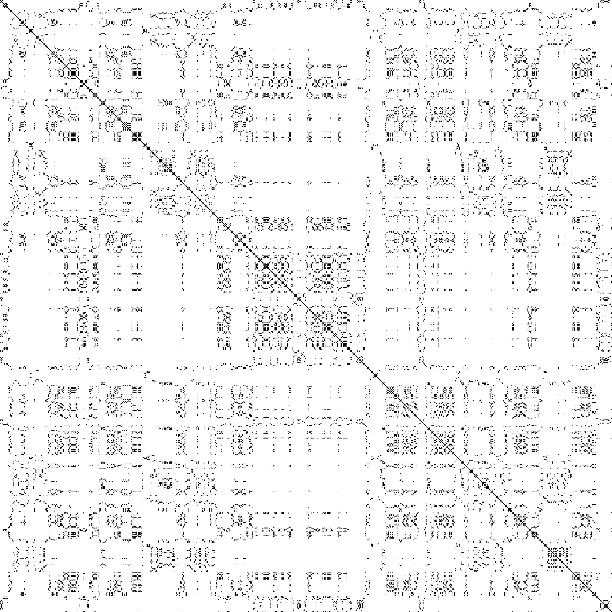

| series | window | start_time | end_time | n | normalization | metric | epsilon | target_rr | achieved_rr |
| --- | --- | --- | --- | --- | --- | --- | --- | --- | --- |
| log_rv_past_12 | middle | 2025-02-26 10:40:00 | 2025-03-05 09:15:00 | 2000 | z-score por ventana | absolute_distance_1d | 0.0861855 | 0.05 | 0.05 |

Lectura visual: Se observan bloques y motivos rectangulares mas claros, junto con tramos diagonales secundarios mas visibles que en `r`. La textura sugiere regimenes de volatilidad y recurrencia de estados de intensidad similar. La ventana media proporciona una referencia continua no elegida por extremos, util para comparar textura ordinaria frente a ventanas tranquila y extrema.

## Comparacion entre series

`r` se usa como contraste de retornos firmados. Al fijar RR al 5%, la densidad global de puntos negros es comparable con las otras series; por tanto, lo relevante no es que haya mas o menos puntos, sino su organizacion visual. En `r` la textura debe leerse como mas cercana a ruido, salvo episodios concretos.

`abs_r` elimina el signo y retiene intensidad. Por eso es esperable observar mas agrupacion en bloques, asociada a clusters de volatilidad. Aun asi, sigue siendo una medida puntual y ruidosa.

`log_rv_past_12` agrega una hora de retornos cuadrados y aplica logaritmo. Visualmente deberia mostrar bloques y texturas mas persistentes, coherentes con la eleccion de `v_t` para las fases posteriores.

## Conclusion parcial

Los graficos de recurrencia iniciales documentan que la estructura relevante aparece con mas claridad en medidas de volatilidad que en retornos firmados. Esta evidencia es visual y exploratoria: sugiere recurrencia, persistencia, clustering y posibles cambios de regimen, pero no permite afirmar caos. La fase justifica continuar con reconstruccion del espacio de estados y analisis de recurrencia mas formal usando `v_t = log_rv_past_12`.
