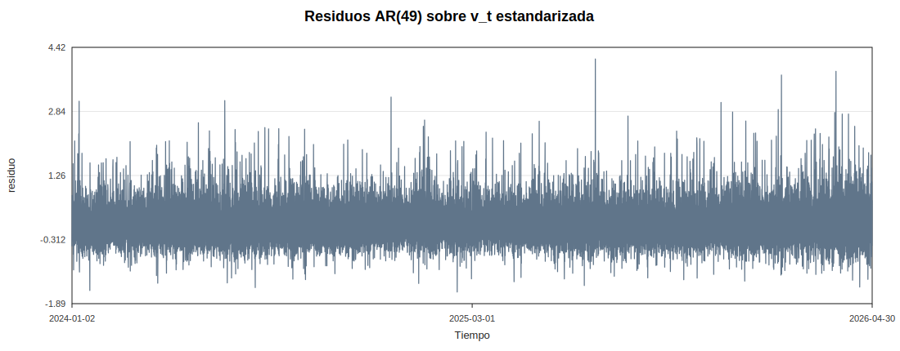
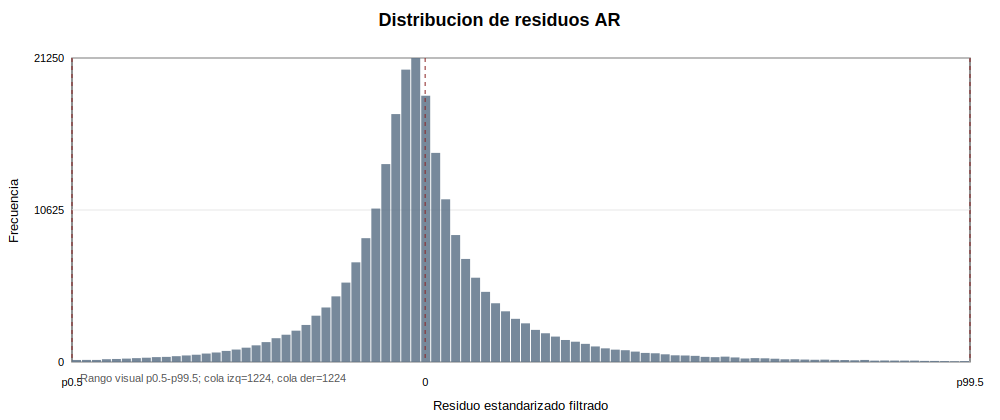
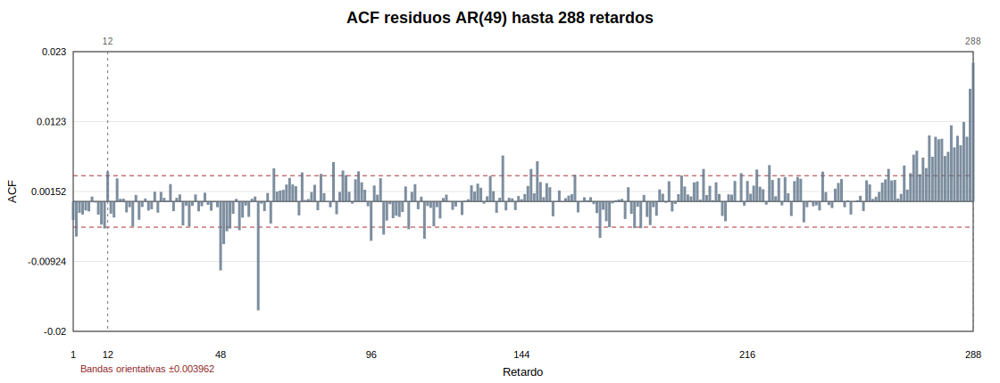
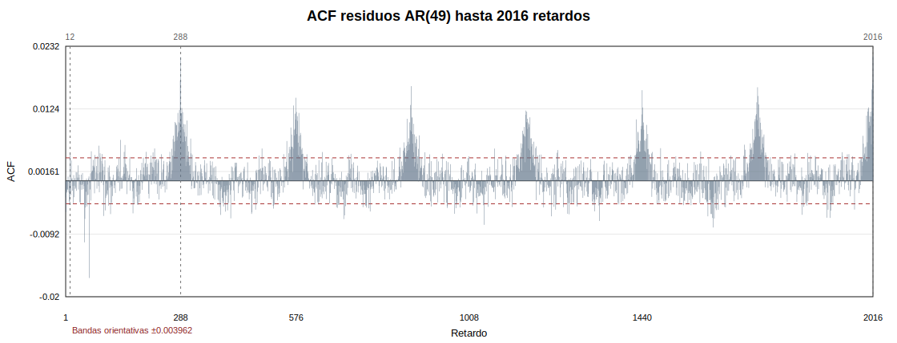
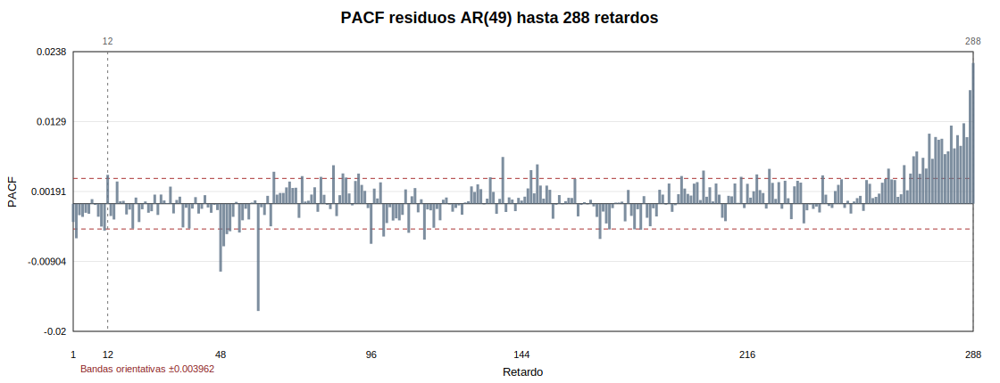
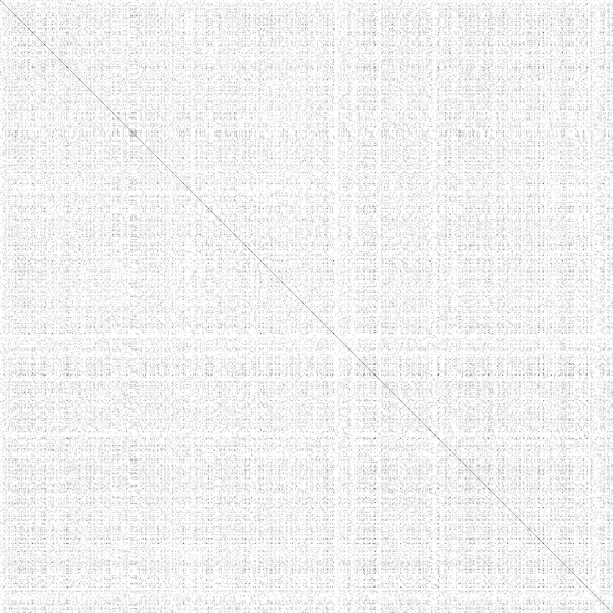
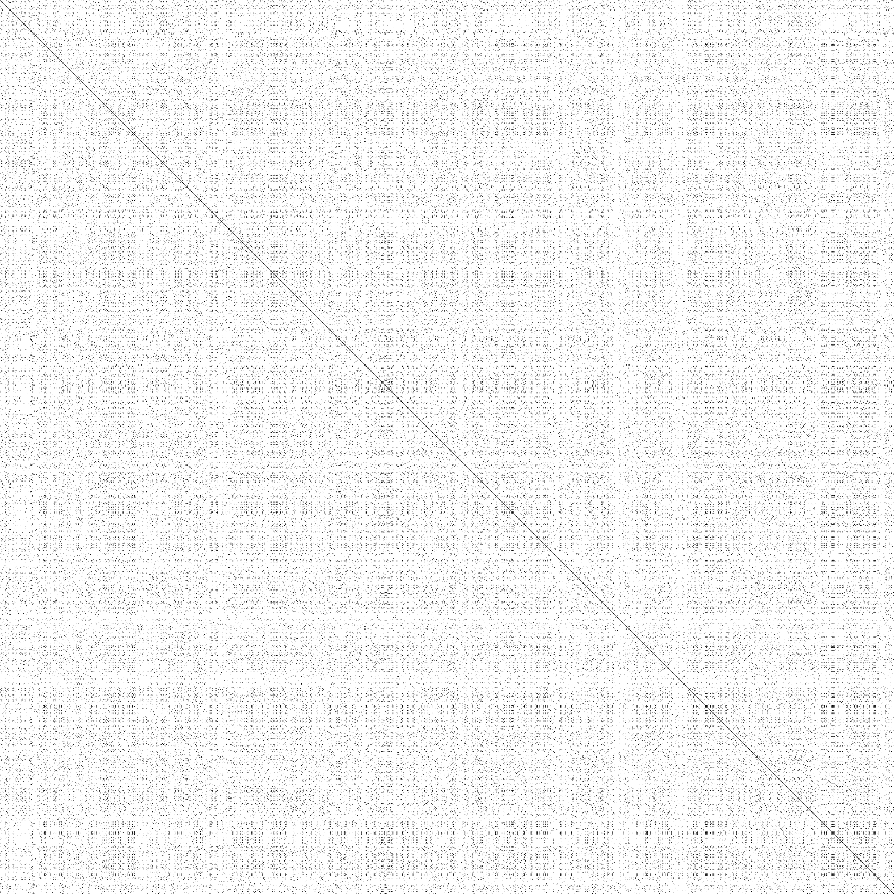

# Fase 6 - Filtrado lineal de la serie principal

Dataset usado: `data/processed/btc_5m_features.csv`

Serie principal: `v_t = log_rv_past_12`.

## Protocolo

Los modelos AR(p), p=1,...,100, se ajustan solo con datos de entrenamiento hasta `2025-06-30 23:55:00`. La serie se estandariza usando exclusivamente media y desviacion tipica del entrenamiento; despues se aplica el filtro al resto de la muestra sin recalibrar.

La estimacion AR se realiza por ecuaciones de Yule-Walker sobre la serie estandarizada. Es una referencia lineal adecuada para eliminar dependencia autorregresiva basica antes de los contrastes de no linealidad.

## Tramo de entrenamiento

| train_start | train_end | train_n | full_n | train_mean_log_rv_past_12 | train_std_log_rv_past_12 | max_ar_order_tested | selected_ar_order_bic | selected_innovation_variance |
| --- | --- | --- | --- | --- | --- | --- | --- | --- |
| 2024-01-02 00:00:00 | 2025-06-30 23:55:00 | 157248 | 244752 | -11.1573 | 1.18777 | 100 | 49 | 0.0301907 |

## Seleccion AR por BIC

| p | nobs_train | innovation_variance | aic | bic |
| --- | --- | --- | --- | --- |
| 49 | 157248 | 0.0301907 | -550303 | -549804 |
| 50 | 157248 | 0.0301895 | -550307 | -549799 |
| 51 | 157248 | 0.0301887 | -550309 | -549791 |
| 52 | 157248 | 0.0301884 | -550309 | -549781 |
| 53 | 157248 | 0.0301883 | -550307 | -549769 |
| 54 | 157248 | 0.0301872 | -550311 | -549763 |
| 61 | 157248 | 0.0301723 | -550375 | -549757 |
| 55 | 157248 | 0.0301861 | -550315 | -549757 |
| 56 | 157248 | 0.0301855 | -550316 | -549748 |
| 62 | 157248 | 0.030172 | -550374 | -549747 |

Orden seleccionado por BIC: `AR(49)`.

## Modelo ajustado

Ecuacion estimada sobre la serie estandarizada `z_t`: `z_t = 0 + 1.05378 z_(t-1) - 0.0161259 z_(t-2) - 0.0192856 z_(t-3) - 0.00736539 z_(t-4) - 0.00126326 z_(t-5) - 0.00532112 z_(t-6) - 0.00131484 z_(t-7) - 0.00167421 z_(t-8) + 0.0020688 z_(t-9) + 0.00521276 z_(t-10) + 0.00201499 z_(t-11) - 0.481862 z_(t-12) + ... + phi_49 z_(t-49) + e_t`

Coeficientes principales por valor absoluto:

| lag | coefficient | abs_coefficient | rank_abs |
| --- | --- | --- | --- |
| 1 | 1.05378 | 1.05378 | 1 |
| 12 | -0.481862 | 0.481862 | 2 |
| 13 | 0.478367 | 0.478367 | 3 |
| 24 | -0.229992 | 0.229992 | 4 |
| 25 | 0.22161 | 0.22161 | 5 |
| 36 | -0.105306 | 0.105306 | 6 |
| 37 | 0.0977494 | 0.0977494 | 7 |
| 48 | -0.0378087 | 0.0378087 | 8 |
| 49 | 0.0364125 | 0.0364125 | 9 |
| 3 | -0.0192856 | 0.0192856 | 10 |
| 2 | -0.0161259 | 0.0161259 | 11 |
| 22 | 0.0136134 | 0.0136134 | 12 |
| 4 | -0.00736539 | 0.00736539 | 13 |
| 21 | -0.00735124 | 0.00735124 | 14 |
| 34 | 0.00710398 | 0.00710398 | 15 |
| 15 | -0.00607787 | 0.00607787 | 16 |
| 41 | 0.00592439 | 0.00592439 | 17 |
| 6 | -0.00532112 | 0.00532112 | 18 |
| 10 | 0.00521276 | 0.00521276 | 19 |
| 44 | 0.00490534 | 0.00490534 | 20 |

## Residuos

| n | mean | std | min | p01 | p05 | p50 | p95 | p99 | max | skewness | kurtosis_excess | histogram_lower | histogram_upper | tail_below | tail_above |
| --- | --- | --- | --- | --- | --- | --- | --- | --- | --- | --- | --- | --- | --- | --- | --- |
| 244703 | -0.00131605 | 0.178535 | -1.60194 | -0.438613 | -0.226229 | -0.0159118 | 0.269361 | 0.63266 | 4.13057 | 2.33088 | 23.9502 | -0.537499 | 0.829305 | 1224 | 1224 |

## Dependencia temporal residual

Comparacion de correlograma entre `v_t` estandarizada y residuos:

| series | acf_lag_1 | acf_lag_12 | acf_lag_288 | acf_lag_2016 | acf_significant_lags_1_288 | acf_significant_lags_1_2016 | pacf_lag_1 | pacf_lag_12 | pacf_significant_lags_1_288 |
| --- | --- | --- | --- | --- | --- | --- | --- | --- | --- |
| z_log_rv_past_12 | 0.981392 | 0.713859 | 0.419326 | 0.444135 | 288 | 2016 | 0.981392 | -0.00594039 | 123 |
| ar_residual | -0.00286071 | 0.00459934 | 0.0213408 | 0.021495 | 57 | 403 | -0.00286071 | 0.00452807 | 57 |

Ljung-Box sobre residuos:

Para retardos menores o iguales que el orden ajustado AR(49), los grados de libertad corregidos `lag - p` no son positivos; en esos casos se deja el p-value sin calcular.

| lag | q_stat | df_adjusted | p_value | reject_5pct |
| --- | --- | --- | --- | --- |
| 12 | 25.6833 |  |  |  |
| 48 | 80.5059 |  |  |  |
| 288 | 1032.61 | 239 | 4.52626e-99 | True |
| 2016 | 6872.54 | 1967 | 0 | True |

## Recurrencia de residuos y comparacion con v_t

Los recurrence plots de residuos se construyen con las mismas ventanas de Fase 5, z-score por ventana, distancia absoluta 1D y RR objetivo del 5%. La comparacion visual se hace contra el recurrence plot de `v_t` de Fase 5.

### Ventana quiet

| v_t original | residuos AR |
| --- | --- |
|  |  |

| window | start_time | end_time | n | epsilon | target_rr | achieved_rr |
| --- | --- | --- | --- | --- | --- | --- |
| quiet | 2025-07-30 20:30:00 | 2025-08-06 19:05:00 | 2000 | 0.0494838 | 0.05 | 0.05 |

Lectura: si los residuos muestran una textura mas dispersa que `v_t`, el filtro AR ha eliminado parte de la dependencia lineal. Si persisten bloques, bandas o diagonales secundarias, queda estructura que no se explica solo por el AR lineal.

### Ventana high_volatility

| v_t original | residuos AR |
| --- | --- |
|  |  |

| window | start_time | end_time | n | epsilon | target_rr | achieved_rr |
| --- | --- | --- | --- | --- | --- | --- |
| high_volatility | 2025-10-07 10:25:00 | 2025-10-14 09:00:00 | 2000 | 0.047485 | 0.05 | 0.05 |

Lectura: si los residuos muestran una textura mas dispersa que `v_t`, el filtro AR ha eliminado parte de la dependencia lineal. Si persisten bloques, bandas o diagonales secundarias, queda estructura que no se explica solo por el AR lineal.

### Ventana recent

| v_t original | residuos AR |
| --- | --- |
|  |  |

| window | start_time | end_time | n | epsilon | target_rr | achieved_rr |
| --- | --- | --- | --- | --- | --- | --- |
| recent | 2026-04-23 21:20:00 | 2026-04-30 19:55:00 | 2000 | 0.0406614 | 0.05 | 0.05 |

Lectura: si los residuos muestran una textura mas dispersa que `v_t`, el filtro AR ha eliminado parte de la dependencia lineal. Si persisten bloques, bandas o diagonales secundarias, queda estructura que no se explica solo por el AR lineal.

### Ventana middle

| v_t original | residuos AR |
| --- | --- |
|  |  |

| window | start_time | end_time | n | epsilon | target_rr | achieved_rr |
| --- | --- | --- | --- | --- | --- | --- |
| middle | 2025-02-26 10:40:00 | 2025-03-05 09:15:00 | 2000 | 0.0501695 | 0.05 | 0.05 |

Lectura: si los residuos muestran una textura mas dispersa que `v_t`, el filtro AR ha eliminado parte de la dependencia lineal. Si persisten bloques, bandas o diagonales secundarias, queda estructura que no se explica solo por el AR lineal.

## Interpretacion

El filtrado reduce de forma clara la autocorrelacion de corto plazo: |ACF_residuo(1)| / |ACF_v(1)| = 0.002915. Esto indica que el AR seleccionado captura una parte importante de la dependencia lineal basica de `v_t`.

La lectura de Ljung-Box debe hacerse con cautela: con cientos de miles de observaciones, pequenas autocorrelaciones residuales pueden resultar estadisticamente significativas. Por tanto, importa tanto la magnitud de la ACF como el rechazo formal.

Si los recurrence plots de residuos conservan bloques o cambios de textura, esa estructura motiva la Fase 7: contrastes de no linealidad sobre `v_t` y sobre los residuos filtrados linealmente.

## Conclusion parcial

El AR seleccionado por BIC proporciona un filtro lineal de referencia para `log_rv_past_12`. La comparacion ACF/PACF y los recurrence plots permiten separar dependencia lineal basica de estructura residual. Esta fase no prueba no linealidad ni caos; solo prepara una serie de residuos para analizar si queda dependencia no explicada por un filtro autorregresivo lineal.

Aunque los contrastes Ljung-Box rechazan la hipótesis de ausencia de autocorrelación a retardos altos, las autocorrelaciones residuales tienen magnitud muy reducida. Por tanto, el rechazo debe interpretarse con cautela debido al gran tamaño muestral.

Tras el filtrado AR, la textura de los recurrence plots pierde parte de la estructura regular observada en la serie original, aunque siguen apreciándose heterogeneidades locales. Esto justifica aplicar contrastes formales de no linealidad y dependencia en varianza sobre los residuos.