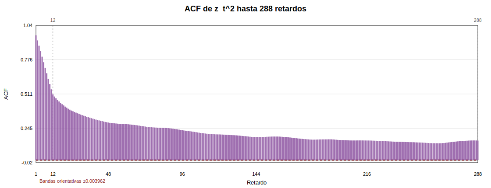
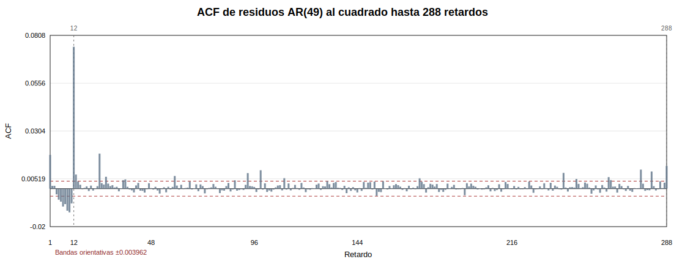
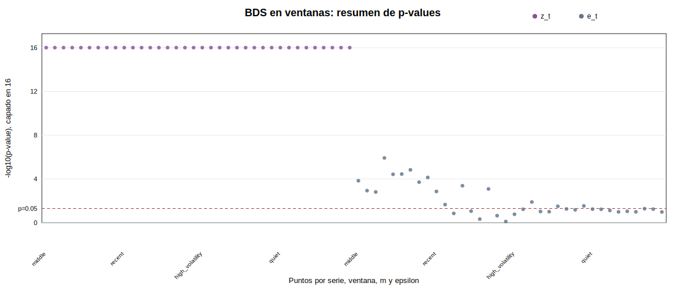
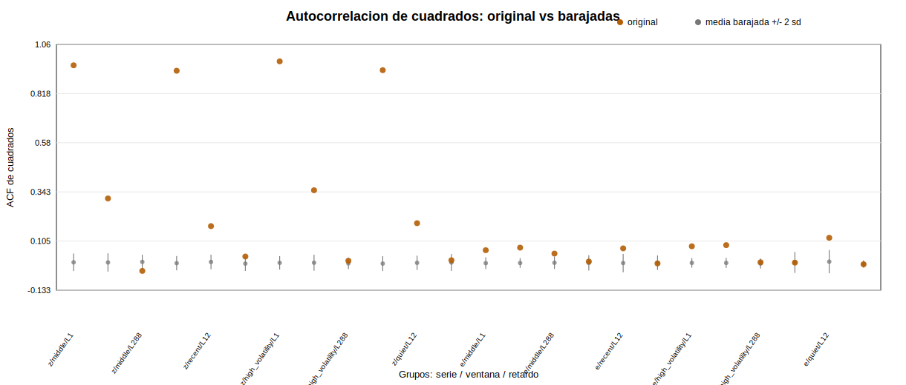

# Fase 7 - Contrastes de dependencia no lineal residual

Entrada principal: `reports/tables/phase6_residual_series.csv`

Se comparan exclusivamente `z_t = z_log_rv_past_12` y `e_t`, los residuos del AR(49) seleccionado en Fase 6. El objetivo no es demostrar caos, sino comprobar si queda dependencia en varianza o dependencia no i.i.d. tras el filtrado lineal.

## Ventanas usadas para BDS y barajado

El BDS no se aplica a toda la muestra, porque la serie tiene mas de 244000 observaciones. Se usan ventanas de 3,000 observaciones, reutilizando los centros de Fase 5 cuando estan disponibles.

Parametros: BDS con `m = [2, 3, 4]` y `epsilon = [0.5, 1.0, 1.5]` veces la desviacion tipica de cada ventana tras z-score. Para las permutaciones se usa semilla fija `20260601` y `n_shuffles = 50`.

| window | description | start_time | end_time | n | mean_z_log_rv_past_12 | min_z_log_rv_past_12 | max_z_log_rv_past_12 | selection_method |
| --- | --- | --- | --- | --- | --- | --- | --- | --- |
| middle | Ventana continua representativa | 2025-02-24 16:55:00 | 2025-03-07 02:50:00 | 3000 | 1.00293 | -1.32157 | 3.5371 | centro reutilizado de la ventana seleccionada en Fase 5 |
| recent | Ventana reciente | 2026-04-20 10:00:00 | 2026-04-30 19:55:00 | 3000 | -0.498834 | -3.39927 | 2.17356 | ultimas observaciones disponibles, ampliando la ventana reciente de Fase 5 |
| high_volatility | Ventana de alta volatilidad | 2025-10-05 16:45:00 | 2025-10-16 02:40:00 | 3000 | 0.0355591 | -2.02311 | 5.45408 | centrada en el episodio de alta volatilidad identificado en Fase 5 |
| quiet | Ventana tranquila | 2025-07-29 02:45:00 | 2025-08-08 12:40:00 | 3000 | -0.694014 | -2.76496 | 1.41997 | centro reutilizado de la ventana seleccionada en Fase 5 |

## Ljung-Box sobre cuadrados

### z_log_rv_past_12

| series | lag | q_stat | p_value | decision_5pct |
| --- | --- | --- | --- | --- |
| z_log_rv_past_12 | 12 | 1.65016e+06 | 0 | rechaza H0 |
| z_log_rv_past_12 | 24 | 2.19826e+06 | 0 | rechaza H0 |
| z_log_rv_past_12 | 48 | 2.83503e+06 | 0 | rechaza H0 |
| z_log_rv_past_12 | 96 | 3.63667e+06 | 0 | rechaza H0 |
| z_log_rv_past_12 | 288 | 4.93974e+06 | 0 | rechaza H0 |
| z_log_rv_past_12 | 2016 | 5.87046e+06 | 0 | rechaza H0 |

### ar_residual

| series | lag | q_stat | p_value | decision_5pct |
| --- | --- | --- | --- | --- |
| ar_residual | 12 | 1592.27 | 0 | rechaza H0 |
| ar_residual | 24 | 1696.02 | 0 | rechaza H0 |
| ar_residual | 48 | 1731.53 | 0 | rechaza H0 |
| ar_residual | 96 | 1787.03 | 1.8351e-309 | rechaza H0 |
| ar_residual | 288 | 2070.87 | 9.08407e-267 | rechaza H0 |
| ar_residual | 2016 | 4396.66 | 2.59351e-178 | rechaza H0 |

Interpretacion: Ljung-Box aplicado a cuadrados contrasta dependencia en la intensidad/varianza, no dependencia lineal en media. Si `e_t^2` rechaza, el AR(49) ha reducido la autocorrelacion de `z_t`, pero no ha agotado la estructura de volatilidad.

## ARCH LM sobre residuos AR

El contraste ARCH LM se aplica solo a `e_t`. La implementacion usa una aproximacion Yule-Walker sobre los cuadrados centrados para mantener el calculo reproducible sin matrices OLS masivas. La lectura es la misma: rechazar la nula sugiere heterocedasticidad condicional, no caos.

| lag | lm_stat | r_squared_yw | p_value | decision_5pct |
| --- | --- | --- | --- | --- |
| 12 | 1589.07 | 0.0064942 | 0 | rechaza H0 |
| 24 | 1644.4 | 0.00672066 | 0 | rechaza H0 |
| 48 | 1672.63 | 0.00683668 | 4.05154e-319 | rechaza H0 |
| 96 | 1724.22 | 0.00704892 | 1.4936e-296 | rechaza H0 |
| 288 | 1987.11 | 0.00813008 | 3.83463e-251 | rechaza H0 |

Retardos ARCH con rechazo al 5%: 5 de 5.

## BDS en ventanas

La hipotesis nula del BDS es i.i.d. El rechazo indica dependencia no compatible con una secuencia independiente e identicamente distribuida. No es una prueba directa de dinamica caotica.

| series | window | tests | rejections_5pct | min_p_value | max_p_value |
| --- | --- | --- | --- | --- | --- |
| ar_residual | high_volatility | 9 | 6 | 0.00248121 | 0.114302 |
| ar_residual | middle | 9 | 9 | 7.00443e-07 | 0.00171734 |
| ar_residual | quiet | 9 | 1 | 0.0277662 | 0.112596 |
| ar_residual | recent | 9 | 4 | 0.000181081 | 0.717184 |
| z_log_rv_past_12 | high_volatility | 9 | 9 | 0 | 0 |
| z_log_rv_past_12 | middle | 9 | 9 | 0 | 0 |
| z_log_rv_past_12 | quiet | 9 | 9 | 0 | 0 |
| z_log_rv_past_12 | recent | 9 | 9 | 0 | 0 |

## Comparacion con datos barajados

Para cada ventana se generan 50 permutaciones. El barajado conserva la distribucion marginal, pero destruye el orden temporal. Se compara la autocorrelacion de cuadrados en retardos 1, 12 y 288.

| series | window | statistics | extreme_5pct_two_sided | mean_abs_original | mean_abs_shuffle_mean |
| --- | --- | --- | --- | --- | --- |
| ar_residual | high_volatility | 3 | 2 | 0.055665 | 0.00173953 |
| ar_residual | middle | 3 | 3 | 0.0593663 | 0.00106541 |
| ar_residual | quiet | 3 | 1 | 0.0429666 | 0.00437025 |
| ar_residual | recent | 3 | 1 | 0.0263115 | 0.000793494 |
| z_log_rv_past_12 | high_volatility | 3 | 2 | 0.444613 | 0.00114559 |
| z_log_rv_past_12 | middle | 3 | 3 | 0.435053 | 0.0026256 |
| z_log_rv_past_12 | quiet | 3 | 2 | 0.378207 | 0.00193722 |
| z_log_rv_past_12 | recent | 3 | 3 | 0.378552 | 0.00334248 |

## Interpretacion conjunta

En `z_t^2`, Ljung-Box rechaza en 6 de 6 retardos; en `e_t^2`, rechaza en 6 de 6. El ARCH LM rechaza en 5 de 5 retardos. En BDS, `z_t` rechaza en 36 de 36 combinaciones ventana-parametro y los residuos rechazan en 20 de 36. En la comparacion por barajado, 7 de 12 estadisticos de residuos quedan en colas empiricas del 5%. La lectura prudente es que el AR(49) elimina gran parte de la dependencia lineal en media, pero no toda la dependencia en la varianza ni toda la estructura asociada al orden temporal.

## Conclusion parcial

La fase 7 distingue tres niveles: dependencia lineal en media, que ya se trato con el AR(49); dependencia en varianza, evaluada con cuadrados y ARCH; y dependencia no i.i.d., evaluada con BDS en ventanas. Si los residuos rechazan en estos contrastes, el filtrado lineal no agota la estructura temporal de la volatilidad. Esta evidencia justifica pasar a la Fase 8, reconstruccion del espacio de estados, manteniendo una interpretacion prudente: estructura residual no equivale a prueba de caos.
