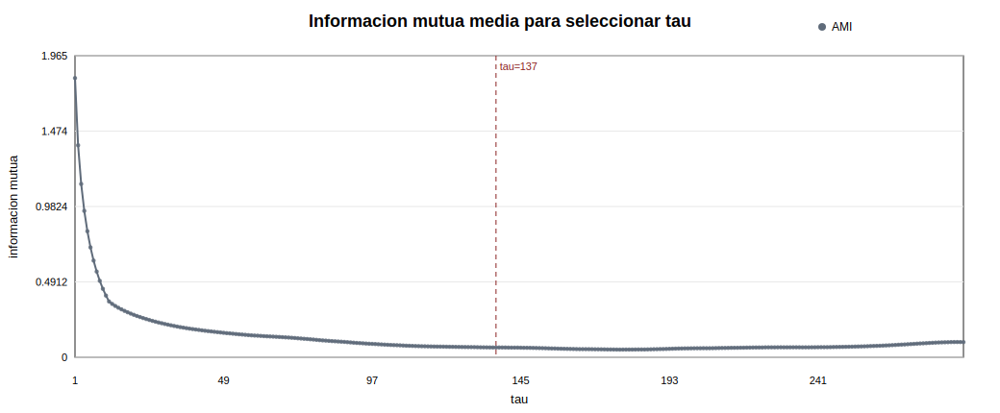
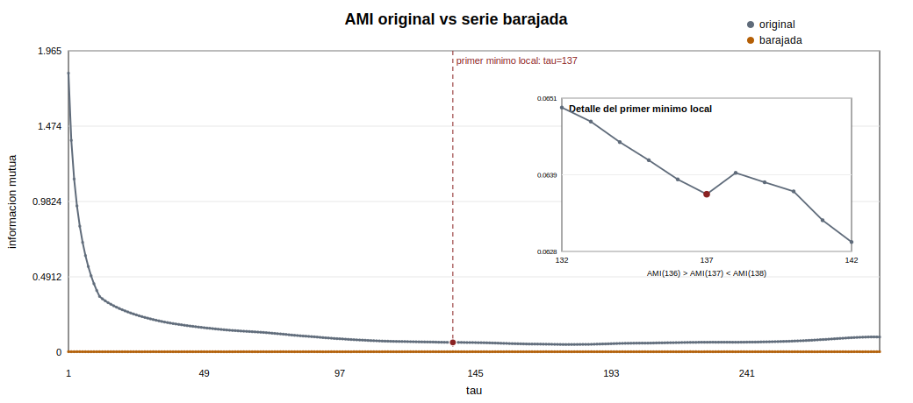
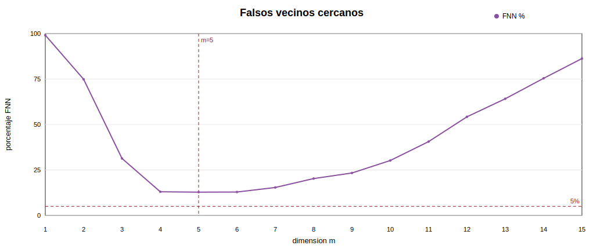
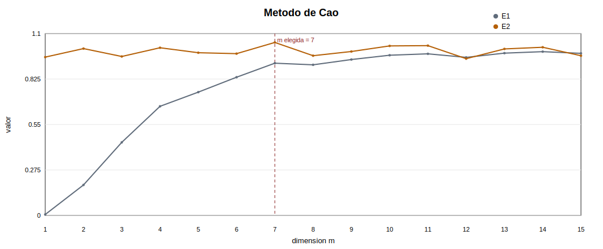
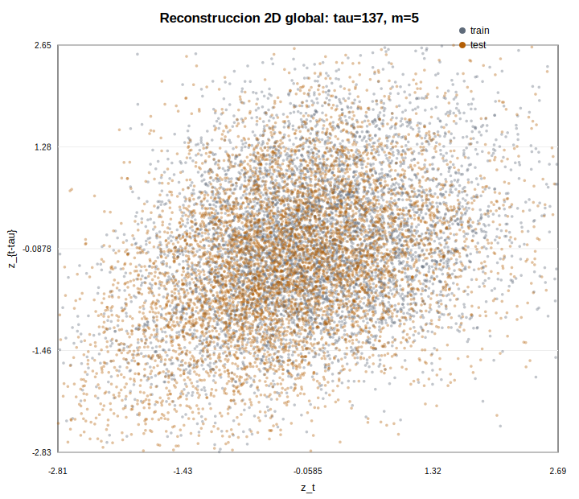
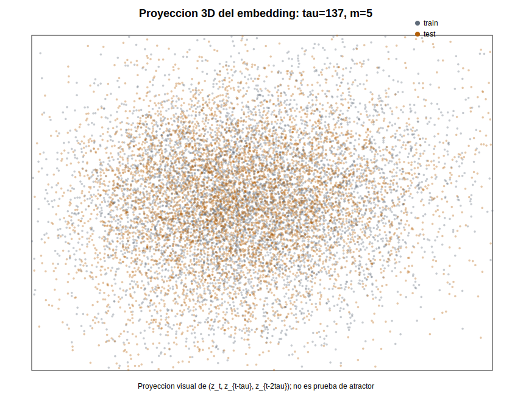
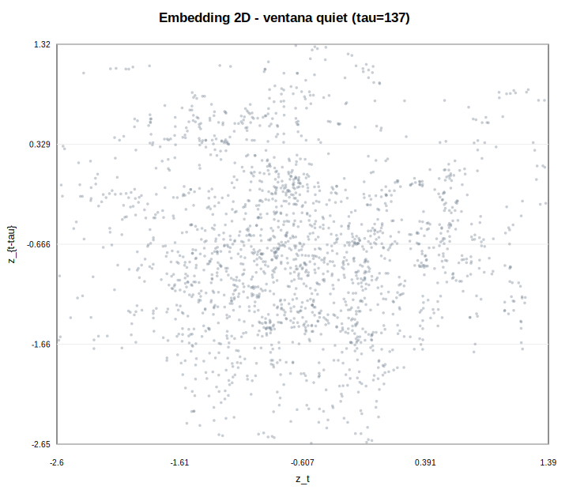
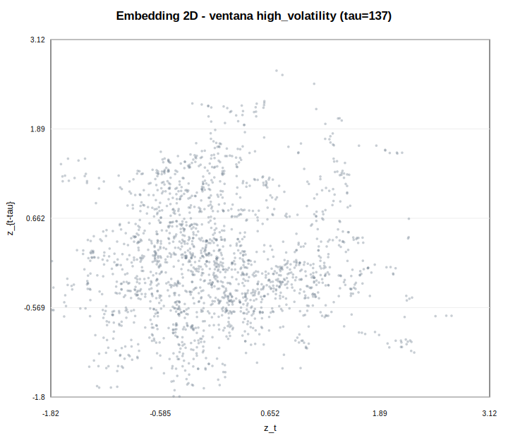
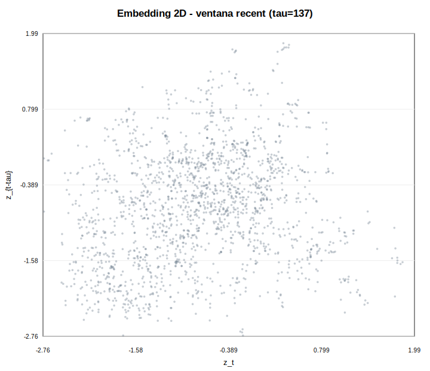
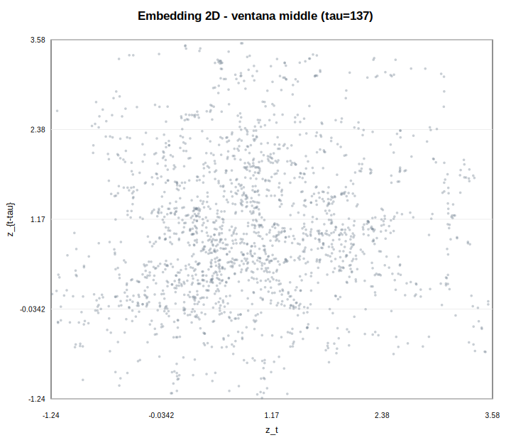

# Fase 8 - Reconstruccion del espacio de estados

Dataset usado: `data/processed/btc_5m_features.csv`

## Objetivo

Esta fase reconstruye el espacio de estados de la serie principal `v_t = log_rv_past_12`, estandarizada como `z_t` con parametros del tramo de entrenamiento. No se realiza prediccion en esta fase.

Las fases 6 y 7 mostraron que el filtrado AR reduce la dependencia lineal en media, pero no agota la dependencia en varianza ni la estructura no i.i.d. Por eso tiene sentido construir una representacion por retardos. Esto no implica que BTC sea caotico ni que exista un atractor extrano.

## Protocolo computacional

| series | train_start | train_end | test_start | test_end | train_size | test_size | sample_size_ami | sample_size_fnn | sample_size_cao | ami_bins | ami_max_lag | theiler_window | random_seed |
| --- | --- | --- | --- | --- | --- | --- | --- | --- | --- | --- | --- | --- | --- |
| z_log_rv_past_12 | 2024-01-02 00:00:00 | 2025-06-30 23:55:00 | 2025-07-01 00:00:00 | 2026-04-30 19:55:00 | 157248 | 87504 | 157248 | 3000 | 3000 | 32 | 288 | 137 | 20260602 |

La convencion usada es orientada a prediccion futura: `X_t = [z_t, z_{t-tau}, z_{t-2tau}, ..., z_{t-(m-1)tau}]`. Cada vector usa solo informacion presente y pasada.

## Informacion mutua media para tau

| tau | mutual_information | n_pairs |
| --- | --- | --- |
| 132 | 0.0649541 | 157116 |
| 133 | 0.0647441 | 157115 |
| 134 | 0.0644359 | 157114 |
| 135 | 0.064165 | 157113 |
| 136 | 0.0638775 | 157112 |
| 137 | 0.0636556 | 157111 |
| 138 | 0.0639757 | 157110 |
| 139 | 0.0638343 | 157109 |
| 140 | 0.0636981 | 157108 |
| 141 | 0.0632655 | 157107 |
| 142 | 0.0629391 | 157106 |

| tau_selected | ami_original | ami_shuffled | selection_rule |
| --- | --- | --- | --- |
| 137 | 0.0636556 | 0.0033312 | primer minimo local de AMI |

La serie barajada conserva la distribucion marginal, pero pierde el orden temporal. Si su AMI queda cerca de cero o claramente por debajo de la original, la eleccion de tau responde a dependencia temporal y no solo a la forma de la distribucion.

Lectura: la AMI cae con rapidez al principio y encuentra un minimo local en `tau = 137`. En ese mismo retardo, la AMI original queda claramente por encima de la AMI barajada, lo que apoya que la dependencia usada para seleccionar tau procede del orden temporal. Se selecciona `tau = 137` por ser el primer mínimo local de la información mutua, siguiendo el criterio habitual en reconstrucción por retardos. No obstante, la curva presenta una zona relativamente plana entre aproximadamente 130 y 180 retardos, por lo que la elección debe interpretarse como una selección operativa y no como un valor único e indiscutible.

## Falsos vecinos cercanos

| m | fnn_percent | n_used | false_neighbors | theiler_window | rtol | atol |
| --- | --- | --- | --- | --- | --- | --- |
| 1 | 99.1333 | 3000 | 2974 | 137 | 10 | 2 |
| 2 | 74.8667 | 3000 | 2246 | 137 | 10 | 2 |
| 3 | 31.3333 | 3000 | 940 | 137 | 10 | 2 |
| 4 | 13 | 3000 | 390 | 137 | 10 | 2 |
| 5 | 12.8 | 3000 | 384 | 137 | 10 | 2 |
| 6 | 12.8667 | 3000 | 386 | 137 | 10 | 2 |
| 7 | 15.3667 | 3000 | 461 | 137 | 10 | 2 |
| 8 | 20.2667 | 3000 | 608 | 137 | 10 | 2 |
| 9 | 23.3333 | 3000 | 700 | 137 | 10 | 2 |
| 10 | 30.2 | 3000 | 906 | 137 | 10 | 2 |
| 11 | 40.6 | 3000 | 1218 | 137 | 10 | 2 |
| 12 | 54.2333 | 3000 | 1627 | 137 | 10 | 2 |
| 13 | 64.1667 | 3000 | 1925 | 137 | 10 | 2 |
| 14 | 75.4 | 3000 | 2262 | 137 | 10 | 2 |
| 15 | 86.2667 | 3000 | 2588 | 137 | 10 | 2 |

Dimension sugerida por FNN: `m = 5` (minimo porcentaje FNN observado; no cae bajo el umbral).

Lectura: el porcentaje de falsos vecinos cae mucho entre m=1 y m=4/5, pero no baja del umbral operativo del 5%. Por tanto, `m_fnn` debe leerse como una dimension practica basada en el minimo de la curva, no como una anulacion clara de falsos vecinos.

m=5 es una dimensión práctica de compromiso, porque minimiza el porcentaje de falsos vecinos observado y evita embeddings demasiado grandes, pero la serie no muestra una estabilización clara hacia cero.

Esto cuadra bastante bien con una serie financiera de volatilidad: hay estructura, persistencia y dependencia temporal, pero no aparece un atractor limpio de baja dimensión.

Además, con tau = 137 y m = 5, cada vector reconstruido cubre:

(m - 1) * tau = 4 * 137 = 548 velas
548 * 5 min = 2740 min = 45 h 40 min

El estado reconstruido resume casi dos días naturales de historia efectiva. Esto es consistente con la idea de que la volatilidad tiene memoria de corto a mediano plazo, pero no una dependencia determinista de largo plazo.

## Metodo de Cao

| m | E1 | E2 | n_used |
| --- | --- | --- | --- |
| 1 | 0.00568134 | 0.957712 | 3000 |
| 2 | 0.184258 | 1.00926 | 3000 |
| 3 | 0.441987 | 0.9615 | 3000 |
| 4 | 0.660086 | 1.01429 | 3000 |
| 5 | 0.745851 | 0.984206 | 3000 |
| 6 | 0.836118 | 0.978619 | 3000 |
| 7 | 0.920896 | 1.0464 | 3000 |
| 8 | 0.911103 | 0.966233 | 3000 |
| 9 | 0.943036 | 0.991541 | 3000 |
| 10 | 0.969137 | 1.02545 | 3000 |
| 11 | 0.977578 | 1.02709 | 3000 |
| 12 | 0.956057 | 0.948262 | 3000 |
| 13 | 0.981681 | 1.00716 | 3000 |
| 14 | 0.990649 | 1.01729 | 3000 |
| 15 | 0.980544 | 0.966167 | 3000 |

Dimension sugerida por Cao: `m = 7`. A partir de esta dimension, `E1` entra en una meseta proxima a 1 y permanece dentro de una banda de +/-0.1 respecto a ese limite. `E2` se interpreta con cautela, porque en series financieras puede estar muy influido por ruido, no estacionariedad local y cambios de regimen.

Lectura: `E1` se aproxima gradualmente a valores cercanos a 1 en dimensiones altas, mientras que `E2` permanece alrededor de 1. Esta combinacion no ofrece una senal determinista fuerte; mas bien apunta a una mezcla de estructura temporal, ruido y posibles cambios de regimen.

## Parametros finales

Dado que FNN alcanza su mínimo en m=5 y Cao sitúa el inicio de la meseta en m=7, ambos criterios proporcionan resultados cercanos. Se adopta m=5 como dimensión práctica para la reconstrucción principal, priorizando una representación manejable para la predicción local. La proximidad entre ambos resultados refuerza la coherencia de la selección operativa, aunque no demuestra por sí sola la existencia de una dinámica determinista de baja dimensión.

| tau_selected | m_fnn | m_cao | m_selected | rule |
| --- | --- | --- | --- | --- |
| 137 | 5 | 7 | 5 | FNN y Cao son compatibles; se mantiene FNN como dimension operativa |

## Visualizacion del espacio reconstruido

Las nubes 2D/3D deben leerse como visualizaciones exploratorias. Una nube amorfa o con regiones densas no demuestra caos; como maximo sugiere que hay estados de volatilidad recurrentes y posibles regimenes.

Lectura: La reconstrucción no revela un atractor simple ni una geometría determinista evidente, pero sí conserva diferencias entre regímenes de mercado. Las ventanas de alta volatilidad y baja volatilidad ocupan regiones y formas distintas del espacio reconstruido, lo que justifica usar esta representación como base para predicción local y comparación con modelos de referencia.

### Ventanas representativas

#### quiet

| window | start_time | end_time | n_vectors |
| --- | --- | --- | --- |
| quiet | 2025-07-30 20:30:00 | 2025-08-06 19:05:00 | 1863 |

#### high_volatility

| window | start_time | end_time | n_vectors |
| --- | --- | --- | --- |
| high_volatility | 2025-10-07 10:25:00 | 2025-10-14 09:00:00 | 1863 |

#### recent

| window | start_time | end_time | n_vectors |
| --- | --- | --- | --- |
| recent | 2026-04-23 21:20:00 | 2026-04-30 19:55:00 | 1863 |

#### middle

| window | start_time | end_time | n_vectors |
| --- | --- | --- | --- |
| middle | 2025-02-26 10:40:00 | 2025-03-05 09:15:00 | 1863 |

## Material de apoyo

| tipo | archivo |
| --- | --- |
| tabla | reports/tables/phase8_ami_tau.csv |
| tabla | reports/tables/phase8_fnn.csv |
| tabla | reports/tables/phase8_cao.csv |
| json | reports/tables/phase8_selected_embedding_params.json |
| npz | data/processed/phase8_embedding_train.npz |
| npz | data/processed/phase8_embedding_test.npz |
| figura | reports/figures/phase8_ami_tau.svg |
| figura | reports/figures/phase8_fnn.svg |
| figura | reports/figures/phase8_cao.svg |
| figura | reports/figures/phase8_embedding_2d.svg |
| figura | reports/figures/phase8_embedding_3d.svg |

## Tabla resumen

Parámetro | Método | Valor | Interpretación
tau | Primer mínimo local AMI | 137 | Separación temporal de 11h25min
m_FNN | Falsos vecinos | 5 | Mínimo práctico observado, aunque FNN no cae bajo 5%
m_Cao | Método de Cao | 7 | Inicio operativo de la meseta de E1
m_final | Decisión operativa | 5 | Compromiso para predicción local
Ventana efectiva | (m-1)tau | 548 velas | 45h40min de historia efectiva

## Conclusion parcial

La reconstruccion por retardos proporciona una base operativa para las fases posteriores de cuantificacion dinamica y prediccion local. La eleccion de tau y m se apoya en AMI, FNN y Cao, pero estas herramientas son sensibles al ruido, al tamano muestral y a los cambios de regimen. Por tanto, la fase permite continuar metodologicamente; no demuestra un atractor extraño, no prueba caos y no garantiza capacidad predictiva.

La información mutua de la serie barajada permanece cercana a cero para todos los retardos, mientras que la serie original mantiene valores claramente superiores. Esto indica que la dependencia detectada por AMI procede del orden temporal de la serie y no solo de su distribución marginal. La selección de tau recorre los retardos en orden ascendente y toma el primero que cumple `AMI(tau) < AMI(tau-1)` y `AMI(tau) <= AMI(tau+1)`. En este caso, AMI(136)=0.0638775, AMI(137)=0.0636556 y AMI(138)=0.0639757, de modo que tau=137 es el primer mínimo local, aunque no sea el mínimo global de toda la curva.

Por el tamaño de la muestra y por las restricciones del entorno de ejecución, FNN y Cao se han calculado sobre una submuestra equiespaciada de 3000 puntos del tramo de entrenamiento. Por tanto, los valores obtenidos deben interpretarse como criterios aproximados de selección y no como estimaciones exactas sobre la muestra completa.
