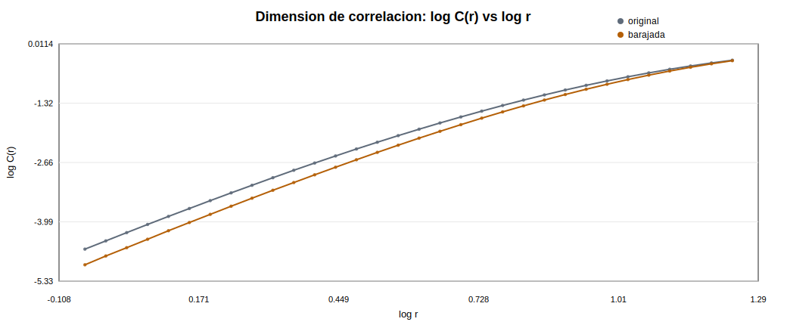
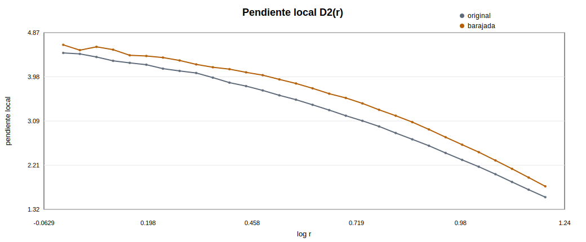
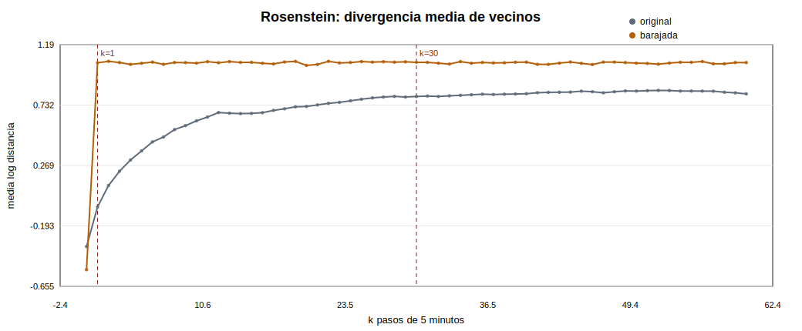
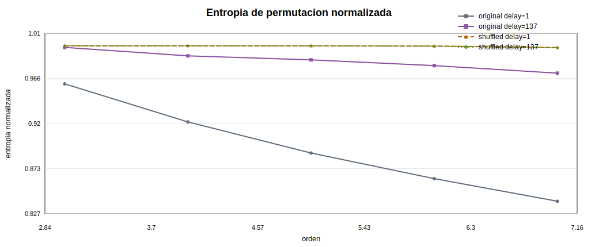
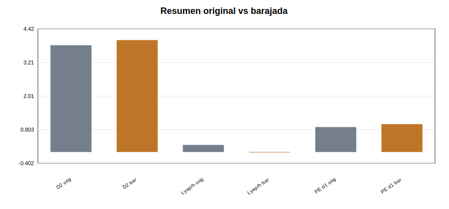

# Fase 9 - Cuantificacion de la dinamica reconstruida

Dataset usado: `data/processed/btc_5m_features.csv`

## Objetivo

Esta fase cuantifica de forma prudente la dinamica reconstruida de `z_log_rv_past_12`. No busca demostrar caos; busca indicios compatibles con estructura dinamica no trivial y compara los resultados con una serie barajada.

## Parametros heredados de Fase 8

| tau | m | train_size | train_vectors | theiler_window | selection_rule |
| --- | --- | --- | --- | --- | --- |
| 137 | 5 | 157248 | 156700 | 685 | FNN y Cao discrepan; se prioriza FNN y se deja Cao como cautela |

Se usa `theiler_window = m * tau` para excluir vecinos temporales muy cercanos y tambien estados que comparten gran parte de las coordenadas retardadas. Esto reduce vecinos triviales, aunque tambien hace los contrastes mas conservadores.

Detalles de calculo: dimension de correlacion con muestra equiespaciada de 2500 vectores y 32 radios; Rosenstein con bloque continuo de 3000 vectores, `k_max=60` y ajuste lineal `k=1..30`; entropia de permutacion con ordenes [3, 4, 5, 6, 7] y retardos `1` y `tau`.

## Dimension de correlacion

| series | d2_estimate | slope_std | n_scaling_points | plateau_clear | scaling_radius_min | scaling_radius_max |
| --- | --- | --- | --- | --- | --- | --- |
| original | 3.8301 | 0.392812 | 16 | True | 1.11646 | 2.08402 |
| shuffled | 4.01529 | 0.342752 | 15 | True | 1.21334 | 2.17256 |

Lectura: `D2` se reporta como estimacion aproximada si no hay meseta clara en la pendiente local. En datos financieros, una pendiente cambiante es esperable por ruido, colas, no estacionariedad y cambios de regimen.

En esta ejecucion aparece una meseta local relativamente estable, pero la estimacion de la serie barajada es muy cercana a la original. Por tanto, la dimension de correlacion no aporta por si sola evidencia fuerte de una estructura determinista de baja dimension.

Conviene interpretar esta meseta con cautela. El hecho de que la serie barajada produzca una estimacion de dimension de correlacion muy proxima a la original indica que parte del comportamiento observado puede deberse al tamaño finito de la muestra, a la dimension maxima del embedding utilizada o a propiedades marginales de la distribucion, y no necesariamente a la existencia de un atractor determinista de baja dimension. Por este motivo, en esta fase la dimension de correlacion se usa como indicador exploratorio y no como prueba concluyente.

## Lyapunov aproximado por Rosenstein

| series | slope_per_5min_step | slope_per_hour | fit_start_k | fit_end_k | r_squared | nearest_neighbor_pairs |
| --- | --- | --- | --- | --- | --- | --- |
| original | 0.0212562 | 0.255074 | 1 | 30 | 0.756004 | 2940 |
| shuffled | 0.000167745 | 0.00201294 | 1 | 30 | 0.0352889 | 2940 |

Lectura: una pendiente positiva no basta para afirmar caos. Puede reflejar ruido, volatilidad estocastica, microestructura o cambios de regimen. La comparacion con la serie barajada ayuda a calibrar si la curva depende del orden temporal.

En esta muestra, la pendiente de Rosenstein de la serie original es mucho mayor que la barajada y el ajuste lineal tiene R2 superior. Esto es compatible con sensibilidad local o divergencia de estados cercanos, pero sigue siendo una medida fragil en series financieras.

La diferencia frente al barajado sugiere que la divergencia observada depende del orden temporal de la serie. Sin embargo, en una serie financiera esta divergencia tambien puede aparecer por persistencia de la volatilidad, heterocedasticidad condicional o cambios de regimen. Por tanto, el resultado se interpreta como evidencia a favor de una estructura dinamica util para la prediccion local, no como demostracion de caos determinista.

## Entropia de permutacion

Nota visual: las dos curvas barajadas se representan con lineas distintas (discontinua para delay=1 y punteada para delay=tau) y marcadores diferentes porque sus valores son practicamente iguales y se superponen casi por completo.

| delay_1_original_mean | delay_1_shuffled_mean | delay_tau | delay_tau_original_mean | delay_tau_shuffled_mean |
| --- | --- | --- | --- | --- |
| 0.894768 | 0.999539 | 137 | 0.984904 | 0.99953 |

Lectura: valores cercanos a 1 indican alta irregularidad ordinal. Si la entropia original queda por debajo de la barajada, hay una senal de estructura temporal ordinal, pero no una prueba de caos.

Aqui la entropia original queda por debajo de la barajada, especialmente con delay=1. Esto indica que el orden temporal de la volatilidad contiene patrones ordinales que se destruyen al permutar la serie.

Las dos curvas correspondientes a la serie barajada practicamente se superponen, porque al permutar la serie se destruye la dependencia temporal y el retardo deja de tener un efecto apreciable. Esto explica que las entropias barajadas para delay=1 y delay=tau sean casi identicas y cercanas a 1.

## Resumen original vs barajada

Esta figura tiene finalidad exclusivamente comparativa y visual. Las magnitudes representadas no comparten escala ni unidades, por lo que no debe interpretarse como una comparacion directa entre indicadores, sino como una sintesis de la diferencia original/barajada para cada medida.

## Limitaciones

- La dimension de correlacion se calcula sobre submuestras, no sobre toda la serie.
- Rosenstein usa un bloque continuo representativo del train.
- Los resultados dependen de `tau`, `m`, Theiler window, radios y rango de ajuste.
- La no estacionariedad financiera puede contaminar todas las medidas.
- Ningun indicador aislado permite concluir caos determinista.

## Conclusion parcial

La cuantificacion sugiere estructura temporal no trivial frente al barajado, sobre todo por Rosenstein y por la entropia de permutacion. La dimension de correlacion es mas ambigua: hay una meseta local, pero la estimacion original es cercana a la barajada. La conclusion prudente es que hay indicios de estructura y complejidad en la volatilidad reconstruida, no una demostracion de caos. El siguiente paso natural es la Fase 10: prediccion local en el espacio reconstruido y comparacion con baselines simples.

## Material de apoyo

| tipo | archivo |
| --- | --- |
| tabla | reports/tables/phase9_correlation_dimension.csv |
| json | reports/tables/phase9_correlation_dimension_summary.json |
| tabla | reports/tables/phase9_lyapunov_rosenstein.csv |
| json | reports/tables/phase9_lyapunov_summary.json |
| tabla | reports/tables/phase9_permutation_entropy.csv |
| json | reports/tables/phase9_quantification_summary.json |
| figura | reports/figures/phase9_correlation_dimension_loglog.svg |
| figura | reports/figures/phase9_correlation_dimension_local_slope.svg |
| figura | reports/figures/phase9_lyapunov_rosenstein.svg |
| figura | reports/figures/phase9_permutation_entropy.svg |
| figura | reports/figures/phase9_original_vs_shuffled_quantification.svg |
